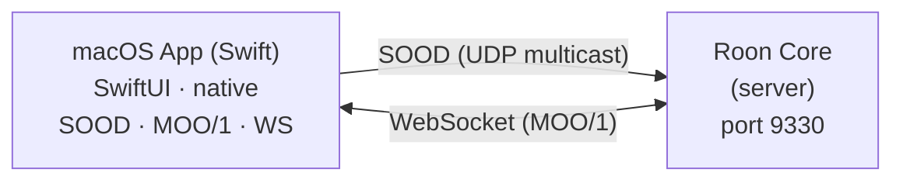

[](https://github.com/renesenses/roon-controller/actions/workflows/ci.yml)

> English | **[Version francaise](README.md)**

# Roon Controller

Native macOS application (SwiftUI) to control a [Roon](https://roon.app) audio system. The app connects directly to the Roon Core via native SOOD and MOO protocols, with no intermediary.

| English | Francais |
|---------|----------|
|  |  |

## Architecture



- **macOS App**: SwiftUI interface with native implementation of Roon protocols (SOOD discovery + MOO/1 over WebSocket)
- **Roon Core**: Roon server on the local network, discovered automatically (SOOD) or via manual IP

## Features

- Automatic Roon Core discovery via SOOD protocol or manual IP connection
- Display of all zones with playback state and volume
- Full player: play/pause, next/previous, seek, shuffle, repeat, radio
- Album artwork with blurred background
- Roon library browsing (Browse API)
- Search within browse results
- Specialized Browse views: Genres, TIDAL/streaming, Tracks, Composers
- TIDAL and Qobuz tabs in Player mode with compact carousels and disk cache
- Roon-style playlist view with full pagination (200+ playlists)
- My Live Radio grid view with station playback
- macOS Now Playing integration: track info, artwork and controls in Control Center
- Quick toggle between Roon mode and Player mode
- Default playback zone in settings (persisted by name)
- Queue with play-from-here
- Per-output volume control (slider + mute)
- Playback history with replay (tracks and live radio)
- Radio favorites: save tracks playing on live radio stations
- CSV export of favorites (compatible with Soundiiz for TIDAL, Spotify, etc. import)
- Automatic reconnection with exponential backoff
- Local seek interpolation for smooth progress bar
- Dark theme matching Roon style
- Localized UI in French and English (follows system language)

## Requirements

- **macOS 12.0** (Monterey) or later (tested on macOS 26 Tahoe)
- **Xcode 26** or later
- An active **Roon Core** on the local network
- **Roon Bridge** (recommended) to expose the Mac's audio outputs (DAC) to the Core

## Quick Install

### From DMG (recommended)

Download the **RoonController.dmg** file from the [Releases page](https://github.com/renesenses/roon-controller/releases), then:

1. Open the DMG and drag **Roon Controller.app** into `/Applications`
2. On first launch, **right-click > Open** (the app is not code-signed)
3. Authorize the extension in **Roon > Settings > Extensions**

### From source

```bash
# 1. Clone the repository
git clone https://github.com/renesenses/roon-controller.git
cd roon-controller

# 2. Open and run the app
cd RoonController
open RoonController.xcodeproj
# Then Build & Run (Cmd+R) in Xcode
```

> See [docs/INSTALL.en.md](docs/INSTALL.en.md) for detailed instructions.

## Usage

1. Launch the macOS app from Xcode (Cmd+R)
2. The app automatically discovers the Roon Core via SOOD on the local network
3. Authorize the "Roon Controller macOS" extension in **Roon > Settings > Extensions**
4. Zones appear in the sidebar — select one to start

> For manual connection: open **Settings** (Cmd+,) and enter the Core's IP address.

## Roon Bridge (audio output)

To use a DAC connected to the Mac as a Roon audio output, install **Roon Bridge** (free). It runs in the background and exposes the Mac's audio devices to the Core, without needing Roon.app.

```bash
# Download and install
curl -L -o ~/Downloads/RoonBridge.dmg https://download.roonlabs.net/builds/RoonBridge.dmg
open ~/Downloads/RoonBridge.dmg
# Drag RoonBridge.app into /Applications, then launch
```

For auto-start at login: **System Settings > General > Login Items > add RoonBridge**.

> See [docs/INSTALL.en.md](docs/INSTALL.en.md) for more details.

## Project Structure

```
Roon client/
+-- RoonController/
|   +-- RoonControllerApp.swift          # App entry point
|   +-- Localizable.xcstrings            # French/English translations (String Catalog)
|   +-- Models/
|   |   +-- RoonModels.swift             # Data models (Zone, NowPlaying, Queue, Browse...)
|   +-- Services/
|   |   +-- RoonService.swift            # Main orchestrator (@MainActor ObservableObject)
|   |   +-- Roon/
|   |       +-- Core/
|   |       |   +-- RoonConnection.swift     # Full lifecycle: discovery -> WS -> registration -> routing
|   |       |   +-- RoonRegistration.swift   # Registration handshake and token persistence
|   |       +-- Protocol/
|   |       |   +-- SOODDiscovery.swift      # SOOD discovery (UDP multicast, POSIX sockets)
|   |       |   +-- MOOTransport.swift       # Binary WebSocket transport (MOO/1)
|   |       |   +-- MOOMessage.swift         # MOO/1 message construction and parsing
|   |       +-- Services/
|   |       |   +-- RoonTransportService.swift   # Transport API (play, pause, seek, volume, queue)
|   |       |   +-- RoonBrowseService.swift      # Browse API (library navigation)
|   |       |   +-- RoonImageService.swift       # Image API (artwork)
|   |       |   +-- RoonStatusService.swift      # Status API
|   |       +-- Image/
|   |           +-- LocalImageServer.swift       # Local HTTP server for artwork
|   |           +-- RoonImageProvider.swift       # Async image provider
|   |           +-- RoonImageCache.swift         # LRU cache for artwork
|   +-- Views/
|   |   +-- ContentView.swift            # Root view (connection or player)
|   |   +-- ConnectionView.swift         # Connection screen
|   |   +-- PlayerView.swift             # Main player (artwork, controls, seek)
|   |   +-- SidebarView.swift            # Sidebar (zones, library, queue, history, TIDAL, Qobuz)
|   |   +-- QueueView.swift              # Queue
|   |   +-- HistoryView.swift            # Playback history
|   |   +-- FavoritesView.swift          # Radio favorites (save, CSV export)
|   |   +-- SettingsView.swift           # Settings (manual connection)
|   |   +-- Helpers/
|   |       +-- RoonColors.swift         # Roon color palette
|   |       +-- CompatibilityModifiers.swift  # macOS 12+ compatibility extensions
|   +-- Tests/
|       +-- RoonModelsTests.swift        # Data model tests
|       +-- RoonServiceTests.swift       # Service and MOO protocol tests
|       +-- ViewBehaviorTests.swift      # View behavior tests (278 tests total)
|
+-- docs/
    +-- INSTALL.md / INSTALL.en.md       # Installation guide
    +-- ARCHITECTURE.md / ARCHITECTURE.en.md  # Technical architecture
    +-- TESTING.md / TESTING.en.md       # Testing guide
    +-- TROUBLESHOOTING.md / TROUBLESHOOTING.en.md  # Troubleshooting
    +-- CICD.md / CICD.en.md            # CI/CD pipeline
```

## Documentation

| Document | Description |
|----------|-------------|
| [docs/PROJECT_MANAGEMENT.en.md](docs/PROJECT_MANAGEMENT.en.md) | **Project management index (lightweight PRINCE2)** |
| [docs/INSTALL.en.md](docs/INSTALL.en.md) | Installation guide |
| [docs/ARCHITECTURE.en.md](docs/ARCHITECTURE.en.md) | Technical architecture and protocols |
| [docs/TESTING.en.md](docs/TESTING.en.md) | Testing procedures and checklist |
| [docs/TROUBLESHOOTING.en.md](docs/TROUBLESHOOTING.en.md) | Troubleshooting |
| [docs/CICD.en.md](docs/CICD.en.md) | CI/CD pipeline (GitHub Actions + Claude Code) |
| [docs/CHANGELOG.en.md](docs/CHANGELOG.en.md) | Changelog (Keep a Changelog) |
| [docs/PROJECT_JOURNAL.en.md](docs/PROJECT_JOURNAL.en.md) | Project journal (PRINCE2 Daily Log) |
| [docs/ISSUES.en.md](docs/ISSUES.en.md) | Issue register (PRINCE2 Issue Register) |
| [docs/LESSONS_LEARNED.en.md](docs/LESSONS_LEARNED.en.md) | Lessons learned (PRINCE2 Lessons Log) |

## License

Personal project. The Roon API is provided by [Roon Labs](https://roon.app).
