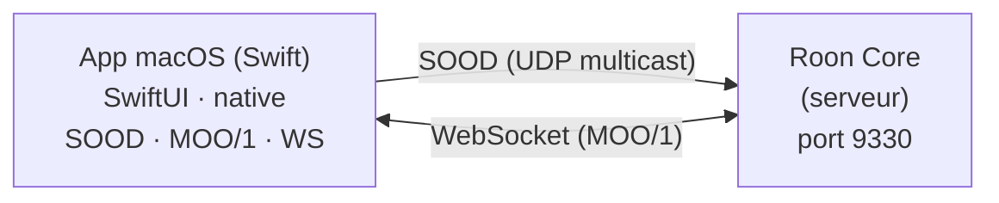

[](https://github.com/renesenses/roon-controller/actions/workflows/ci.yml)

> **[English version](README.en.md)** | Francais

# Roon Controller

Application macOS native (SwiftUI) pour controler un systeme audio [Roon](https://roon.app). L'app se connecte directement au Roon Core via les protocoles natifs SOOD et MOO, sans intermediaire.

| Francais | English |
|----------|---------|
|  |  |

## Architecture



- **App macOS** : interface SwiftUI avec implementation native des protocoles Roon (SOOD discovery + MOO/1 sur WebSocket)
- **Roon Core** : serveur Roon sur le reseau local, decouvert automatiquement (SOOD) ou par IP manuelle

## Fonctionnalites

- Decouverte automatique du Roon Core via protocole SOOD ou connexion manuelle par IP
- Affichage de toutes les zones avec etat de lecture et volume
- Lecteur complet : play/pause, next/previous, seek, shuffle, repeat, radio
- Pochette d'album avec fond flou en arriere-plan
- Navigation dans la bibliotheque Roon (Browse API)
- Recherche dans les resultats de navigation
- Vues Browse specialisees : Genres, TIDAL/streaming, Morceaux, Compositeurs
- Onglets TIDAL et Qobuz dans le mode Player avec carousels compacts et cache disque
- Vue playlists style Roon avec pagination complete (200+ playlists)
- Vue My Live Radio avec grille de stations et lecture directe
- Integration macOS Now Playing : infos piste, pochette et controles dans le Control Center
- Bascule rapide entre mode Roon et mode Player
- Zone de lecture par defaut dans les parametres (persistee par nom)
- File d'attente (queue) avec lecture depuis un morceau
- Controle du volume par sortie (slider + mute)
- Historique de lecture avec replay (morceaux et radios live)
- Favoris radio : sauvegarde des morceaux diffuses sur les radios live
- Export CSV des favoris (compatible Soundiiz pour import TIDAL, Spotify, etc.)
- Reconnexion automatique avec backoff exponentiel
- Interpolation locale du seek pour une barre de progression fluide
- Theme sombre style Roon
- Interface localisee en francais et anglais (suit la langue du systeme)

## Prerequis

- **macOS 15.0** (Sequoia) ou superieur (teste sur macOS 26 Tahoe)
- **Xcode 26** ou superieur
- Un **Roon Core** actif sur le reseau local
- **Roon Bridge** (recommande) pour exposer les sorties audio (DAC) du Mac au Core

## Installation rapide

### Depuis le DMG (recommande)

Telechargez le fichier **RoonController.dmg** depuis la [page Releases](https://github.com/renesenses/roon-controller/releases), puis :

1. Ouvrez le DMG et glissez **Roon Controller.app** dans `/Applications`
2. Au premier lancement, faites **clic droit > Ouvrir** (l'app n'est pas signee)
3. Autorisez l'extension dans **Roon > Parametres > Extensions**

### Depuis les sources

```bash
# 1. Cloner le depot
git clone https://github.com/renesenses/roon-controller.git
cd roon-controller

# 2. Ouvrir et lancer l'app
cd RoonController
open RoonController.xcodeproj
# Puis Build & Run (Cmd+R) dans Xcode
```

> Voir [docs/INSTALL.md](docs/INSTALL.md) pour les instructions detaillees.

## Utilisation

1. Lancez l'app macOS depuis Xcode (Cmd+R)
2. L'app decouvre automatiquement le Roon Core via SOOD sur le reseau local
3. Autorisez l'extension "Roon Controller macOS" dans **Roon > Parametres > Extensions**
4. Les zones apparaissent dans la barre laterale — selectionnez-en une pour commencer

> Pour une connexion manuelle : ouvrez **Parametres** (Cmd+,) et entrez l'adresse IP du Core.

## Roon Bridge (sortie audio)

Pour utiliser un DAC connecte au Mac comme sortie audio Roon, installez **Roon Bridge** (gratuit). Il tourne en arriere-plan et expose les peripheriques audio du Mac au Core, sans avoir besoin de Roon.app.

```bash
# Telecharger et installer
curl -L -o ~/Downloads/RoonBridge.dmg https://download.roonlabs.net/builds/RoonBridge.dmg
open ~/Downloads/RoonBridge.dmg
# Glisser RoonBridge.app dans /Applications, puis lancer
```

Pour le lancement automatique au demarrage : **Reglages Systeme > General > Ouverture > ajouter RoonBridge**.

> Voir [docs/INSTALL.md](docs/INSTALL.md) pour plus de details.

## Structure du projet

```
Roon client/
├── RoonController/
│   ├── RoonControllerApp.swift          # Point d'entree de l'app
│   ├── Localizable.xcstrings            # Traductions francais/anglais (String Catalog)
│   ├── Models/
│   │   └── RoonModels.swift             # Modeles de donnees (Zone, NowPlaying, Queue, Browse...)
│   ├── Services/
│   │   ├── RoonService.swift            # Orchestrateur principal (@MainActor ObservableObject)
│   │   └── Roon/
│   │       ├── Core/
│   │       │   ├── RoonConnection.swift     # Cycle de vie complet : discovery → WS → registration → routing
│   │       │   └── RoonRegistration.swift   # Handshake d'enregistrement et persistence du token
│   │       ├── Protocol/
│   │       │   ├── SOODDiscovery.swift      # Decouverte SOOD (UDP multicast, sockets POSIX)
│   │       │   ├── MOOTransport.swift       # Transport WebSocket binaire (MOO/1)
│   │       │   └── MOOMessage.swift         # Construction et parsing des messages MOO/1
│   │       ├── Services/
│   │       │   ├── RoonTransportService.swift   # API transport (play, pause, seek, volume, queue)
│   │       │   ├── RoonBrowseService.swift      # API browse (navigation bibliotheque)
│   │       │   ├── RoonImageService.swift       # API image (pochettes)
│   │       │   └── RoonStatusService.swift      # API status
│   │       └── Image/
│   │           ├── LocalImageServer.swift       # Serveur HTTP local pour les pochettes
│   │           ├── RoonImageProvider.swift      # Fournisseur d'images async
│   │           └── RoonImageCache.swift         # Cache LRU pour les pochettes
│   ├── Views/
│   │   ├── ContentView.swift            # Vue racine (connexion ou lecteur)
│   │   ├── ConnectionView.swift         # Ecran de connexion
│   │   ├── PlayerView.swift             # Lecteur principal (pochette, controles, seek)
│   │   ├── SidebarView.swift            # Barre laterale (zones, bibliotheque, queue, historique, TIDAL, Qobuz)
│   │   ├── QueueView.swift              # File d'attente
│   │   ├── HistoryView.swift            # Historique de lecture
│   │   ├── FavoritesView.swift          # Favoris radio (sauvegarde, export CSV)
│   │   ├── SettingsView.swift           # Preferences (connexion manuelle)
│   │   └── Helpers/
│   │       └── RoonColors.swift         # Palette de couleurs Roon
│   └── Tests/
│       ├── RoonModelsTests.swift        # Tests modeles de donnees
│       ├── RoonServiceTests.swift       # Tests service et protocole MOO
│       └── ViewBehaviorTests.swift      # Tests comportement des vues (273 tests au total)
│
└── docs/
    ├── INSTALL.md                   # Guide d'installation
    ├── ARCHITECTURE.md              # Architecture technique
    ├── TESTING.md                   # Guide de test
    └── TROUBLESHOOTING.md          # Depannage
```

## Documentation

| Document | Description |
|----------|-------------|
| [docs/PROJECT_MANAGEMENT.md](docs/PROJECT_MANAGEMENT.md) | **Index gestion de projet (PRINCE2 leger)** |
| [docs/INSTALL.md](docs/INSTALL.md) | Guide d'installation |
| [docs/ARCHITECTURE.md](docs/ARCHITECTURE.md) | Architecture technique et protocoles |
| [docs/TESTING.md](docs/TESTING.md) | Procedures de test et checklist |
| [docs/TROUBLESHOOTING.md](docs/TROUBLESHOOTING.md) | Depannage |
| [docs/CICD.md](docs/CICD.md) | Chaine CI/CD (GitHub Actions + Claude Code) |
| [docs/CHANGELOG.md](docs/CHANGELOG.md) | Journal des changements (Keep a Changelog) |
| [docs/PROJECT_JOURNAL.md](docs/PROJECT_JOURNAL.md) | Journal de projet (Daily Log PRINCE2) |
| [docs/ISSUES.md](docs/ISSUES.md) | Registre des incidents (Issue Register PRINCE2) |
| [docs/LESSONS_LEARNED.md](docs/LESSONS_LEARNED.md) | Lecons apprises (Lessons Log PRINCE2) |

## Licence

Projet personnel. L'API Roon est fournie par [Roon Labs](https://roon.app).
