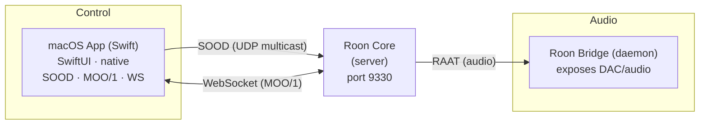
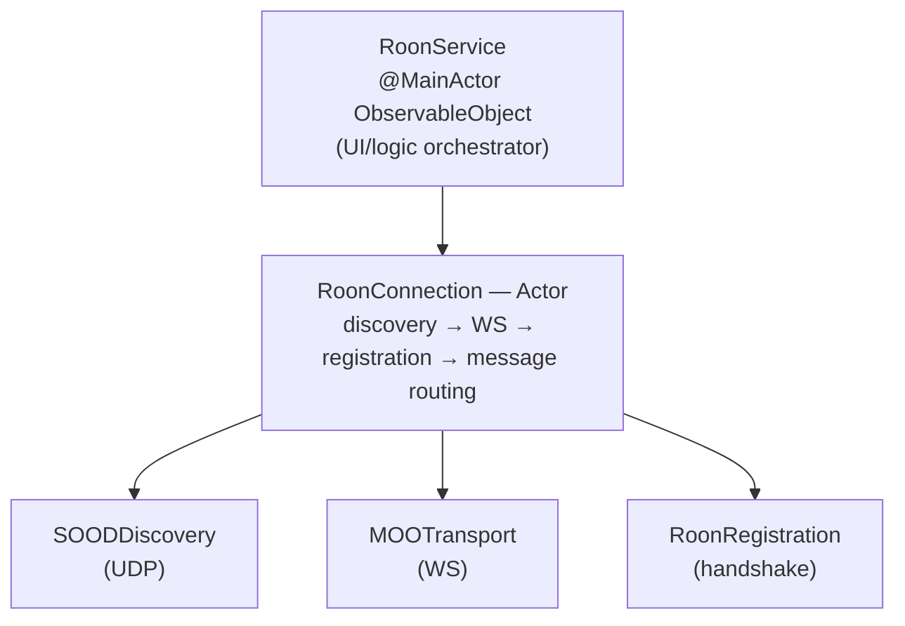
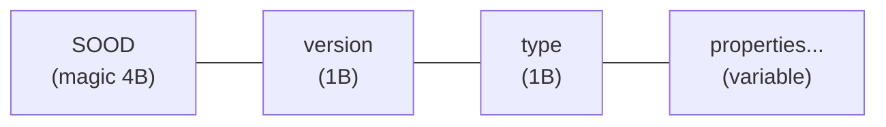
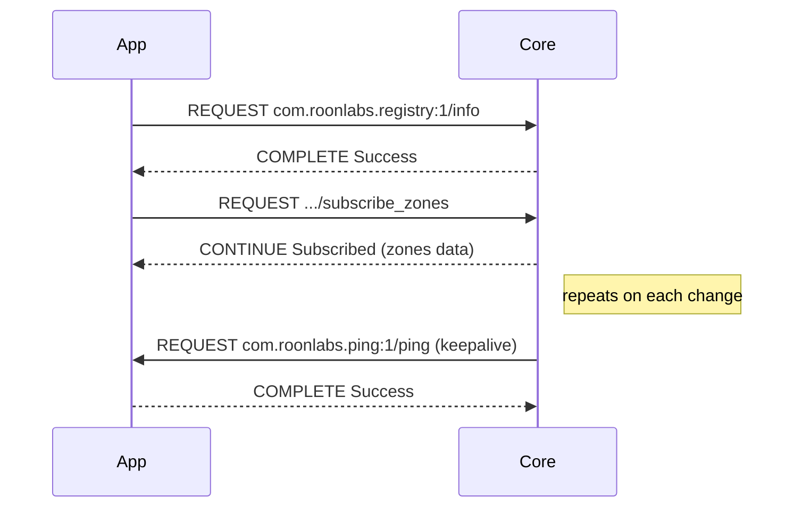
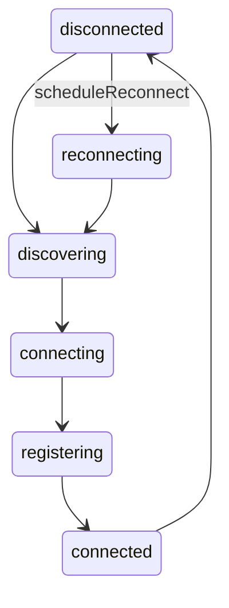
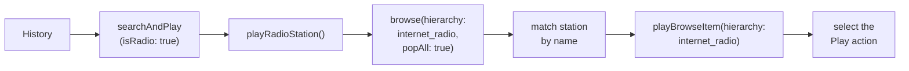
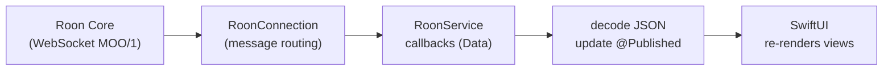
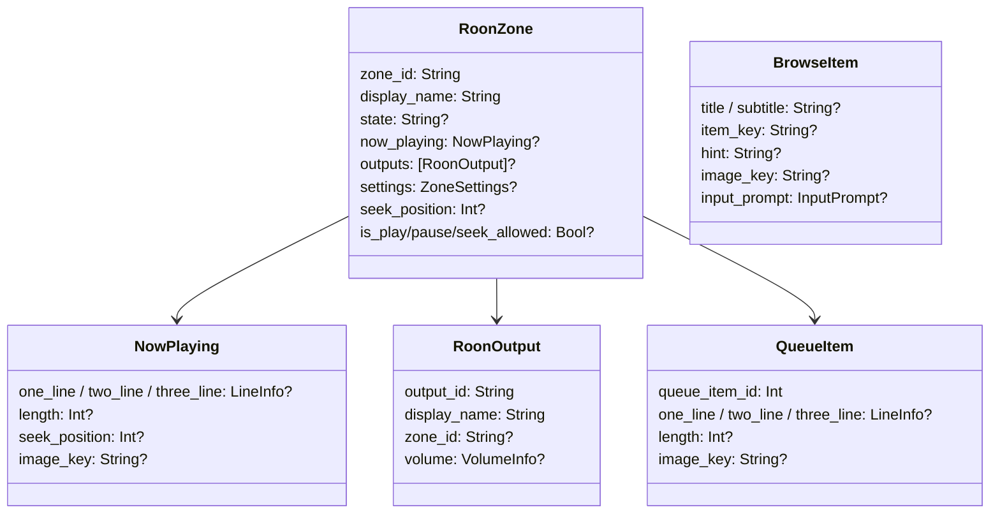
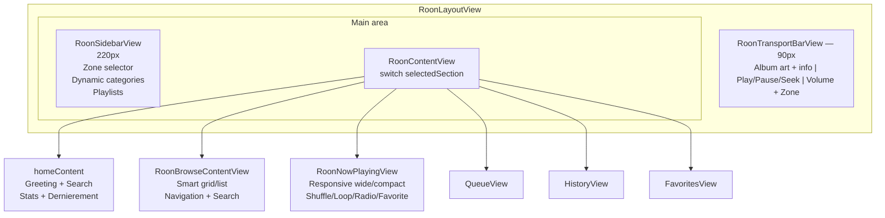

# Technical Architecture

## Overview



The app connects directly to the Roon Core with no intermediary. It natively implements the Roon protocols in Swift.
**Roon Bridge** (separate app) exposes the Mac's audio outputs (USB DAC, etc.) to the Core via the RAAT protocol:

1. **SOOD** — Core discovery via UDP multicast
2. **MOO/1** — Binary messaging protocol over WebSocket
3. **Registry** — Extension registration handshake

## Protocol Stack



## SOOD Protocol (Discovery)

### Format

SOOD uses UDP multicast on `239.255.90.90:9003` with a proprietary binary format:



- **Magic**: `0x53 0x4F 0x4F 0x44` ("SOOD")
- **Version**: `0x02`
- **Type**: `0x51` (Query) or `0x52` (Reply)

### Properties

Each property is encoded as:

```
key_length (1 byte) + key + value_length (2 bytes BE) + value
```

- `0xFFFF` for value_length = null sentinel
- `0x0000` for value_length = empty string

### Query

The app periodically sends (every 5s) a Query packet containing:

| Property | Value |
|----------|-------|
| `_tid` | Unique UUID per request |
| `query_service_id` | `00720724-5143-4a9b-abac-0e50cba674bb` |

The query is sent both as multicast (`239.255.90.90`) and broadcast on each network interface.

### Reply

The Core responds with a Reply packet containing:

| Property | Description |
|----------|-------------|
| `service_id` | Unique Core identifier |
| `display_name` | Core display name |
| `http_port` | WebSocket port (usually `9330`) |
| `_replyaddr` | Core IP address (optional) |

### Implementation (`SOODDiscovery.swift`)

- Uses POSIX (BSD) sockets instead of Network.framework to avoid needing the `com.apple.developer.networking.multicast` entitlement
- Send socket: `SOCK_DGRAM` with `SO_BROADCAST` and `IP_MULTICAST_TTL=1`
- Receive socket: bind on port 9003 with `SO_REUSEADDR`/`SO_REUSEPORT`, join multicast on all interfaces
- Also listens for unicast replies on the send socket (ephemeral port)

## MOO/1 Protocol (Messaging)

### Format

MOO/1 messages are sent as binary WebSocket frames:

```
MOO/1 {VERB} {name}\n
Request-Id: {id}\n
Content-Type: application/json\n     (optional, if body present)
Content-Length: {length}\n           (optional, if body present)
\n
{JSON body}
```

### Verbs

| Verb | Direction | Description |
|------|-----------|-------------|
| `REQUEST` | bidirectional | Request (app -> Core or Core -> app) |
| `COMPLETE` | response | Final response to a request |
| `CONTINUE` | response | Partial response / subscription notification |

### Request/Response Cycle



### Implementation (`MOOMessage.swift`, `MOOTransport.swift`)

- `MOOMessage`: binary message construction and parsing
- `MOOTransport`: actor managing the WebSocket (`URLSessionWebSocketTask`), ping/pong keepalive every 10s, async receive loop
- `MOORequestIdGenerator`: atomic request ID generator (thread-safe with `NSLock`)

## Registration (Registry)

### Handshake

1. **`registry:1/info`** -> receives Core info and available service names
2. **`registry:1/register`** -> sends extension info + saved token
3. The Core responds `Registered` (with token) or waits for user authorization

### Registration Payload

```json
{
    "extension_id": "com.bertrand.rooncontroller",
    "display_name": "Roon Controller macOS",
    "display_version": "1.0.0",
    "publisher": "Bertrand",
    "required_services": [
        "com.roonlabs.transport:2",
        "com.roonlabs.browse:1",
        "com.roonlabs.image:1"
    ],
    "optional_services": [],
    "provided_services": [
        "com.roonlabs.ping:1",
        "com.roonlabs.status:1"
    ],
    "token": "..."
}
```

### Token Persistence

The authorization token is saved in `UserDefaults` (`roon_core_token`). On restart, the extension is re-authorized automatically without user intervention.

## RoonConnection (Orchestrator)

### States



### Responsibilities

| Function | Description |
|----------|-------------|
| `connect()` | Starts SOOD discovery |
| `connectDirect(host:port:)` | Manual IP connection |
| `disconnect()` | Clean disconnection |
| `performRegistration()` | Handshake registry:1/info + registry:1/register |
| `handleMessage()` | Incoming message routing (responses, subscriptions, Core requests) |
| `subscribeZones()` | Subscribe to zone updates |
| `subscribeQueue(zoneId:)` | Subscribe to a zone's queue |
| `sendRequestData(name:bodyData:)` | Send a request with async continuation (10s timeout) |

### Reconnection

- Exponential backoff: delay = `min(2^attempt, 30)` seconds
- If host/port are known: direct reconnection
- Otherwise: restart SOOD discovery

## Roon Services

### RoonTransportService

Transport control via `com.roonlabs.transport:2`:

| Method | Endpoint | Description |
|--------|----------|-------------|
| `control()` | `/control` | play, pause, playpause, stop, previous, next |
| `seek()` | `/seek` | absolute or relative |
| `changeVolume()` | `/change_volume` | absolute, relative, relative_step |
| `mute()` | `/mute` | mute, unmute, toggle |
| `changeSettings()` | `/change_settings` | shuffle, loop, auto_radio |
| `playFromHere()` | `/play_from_here` | Play from a queue item |
| `subscribeQueue()` | via `RoonConnection` | Subscribe to a zone's queue |

### RoonBrowseService

Library navigation via `com.roonlabs.browse:1`:

| Method | Endpoint | Description |
|--------|----------|-------------|
| `browse()` | `/browse` | Navigate, search, execute actions |
| `load()` | `/load` | Load a results page (pagination) |

### RoonImageService

Artwork retrieval via `com.roonlabs.image:1`:

| Method | Endpoint | Description |
|--------|----------|-------------|
| `getImage()` | `/get_image` | Retrieve an image by key, size, and format |

Images are served locally via `LocalImageServer` (HTTP on port 9150) and cached by `RoonImageCache` (LRU).

## macOS App (SwiftUI)

### RoonService (`RoonService.swift`)

`@MainActor ObservableObject` class that orchestrates everything:

- **Connection**: creates `RoonConnection` and services (transport, browse, image)
- **Published state** (`@Published`):
  - `connectionState` — connection state to the Core
  - `zones` — list of all zones
  - `currentZone` — selected zone (updated in real time)
  - `queueItems` — current zone's queue
  - `browseResult` / `browseStack` — library browse state
  - `playbackHistory` — playback history (persistent)
  - `lastError` — last error
- **Actions**: play, pause, next, previous, seek, volume, mute, shuffle, loop, radio, browse, queue

### History Replay

History replay distinguishes two cases:

**Tracks**: `searchAndPlay()` performs a text search (album then title) via the Browse API and plays the first matching result.

**Live radio**: detected by `zone.is_seek_allowed == false` when recording to history (`isRadio` field). On replay, `playRadioStation()` navigates the `internet_radio` Browse API hierarchy, finds the station by name (in `album` or `title` depending on available metadata), and navigates the action menu to start playback.



### Data Flow



### Models (`RoonModels.swift`)



### Views

The app has two display modes selectable in Settings:

**Player mode** (default) — compact view with centered artwork:

| View | Role |
|------|------|
| `ContentView` | Routing: `ConnectionView` if disconnected, `RoonLayoutView` if Roon mode, otherwise `NavigationSplitView` Player |
| `PlayerView` | Player: artwork with blurred background, track info, seek bar, transport controls |
| `SidebarView` | Sidebar with tabs: Zones, Library, Queue, History, Favorites |

**Roon mode** — native Roon layout with sidebar, content and transport bar:



| View | Role |
|------|------|
| `RoonLayoutView` | Main container: sidebar + content + transport bar |
| `RoonSidebarView` | Zone selector (dropdown with state indicator), dynamic categories (Explorer, Library, Playlists) |
| `RoonContentView` | Content routing by selected section. Home: greeting, search, stats, Dernierement |
| `RoonBrowseContentView` | Library browsing with smart grid/list, search, lazy loading |
| `RoonNowPlayingView` | Now playing responsive (wide: side-by-side, compact: stacked), blur background, controls |
| `RoonTransportBarView` | Fixed bottom bar: artwork + track info, play/pause/prev/next, seek, volume, zone |
| `QueueView` | Queue list, current item highlighted |
| `HistoryView` | Playback history, tap to replay (tracks and radio) |
| `FavoritesView` | Radio favorites with CSV export and deletion |
| `SettingsView` | Display mode (Player/Roon), theme (Dark/Light/System), manual Core connection |

**Shared views:**

| View | Role |
|------|------|
| `RoonControllerApp` | Entry point, creates `RoonService`, applies theme |
| `ConnectionView` | Connection screen (status, reconnection) |

### Color Palette (`RoonColors.swift`)

Adaptive light/dark system using `NSColor(name:)`:

| Color | Light | Dark | Usage |
|-------|-------|------|-------|
| `roonBackground` | #FFFFFF | #181818 | Main background |
| `roonSurface` | #FFFFFF | #1E1E1E | Elevated surfaces |
| `roonSidebar` | #F7F8F9 | #181818 | Sidebar background |
| `roonPanel` | #FAFAFA | #242424 | Panels and cards |
| `roonAccent` | #7574F3 | #6B6ED9 | Accent (Roon Creamsicle purple) |
| `roonText` | #2C2C2E | #FFFFFF | Primary text |
| `roonSecondary` | #4A4A4A | #A8A8A8 | Secondary text |
| `roonTertiary` | #8E8E93 | #666666 | Tertiary text |
| `roonSeparator` | #E4E4E4 | #4D4E51 | Separators |

### Typography (`RoonFonts.swift`)

| Font | Usage |
|------|-------|
| Grifo M / Grifo S | Serif headings (greeting, now playing) |
| Lato / Lato Bold | Body text, labels |
| Inter Medium | Section headers |

### Entitlements

- `com.apple.security.app-sandbox`: enabled
- `com.apple.security.network.client`: outgoing connections (WebSocket, HTTP)
- `com.apple.security.network.server`: incoming connections (local image server)
