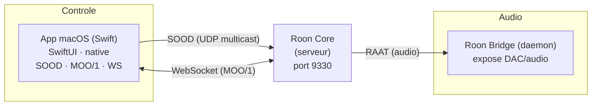
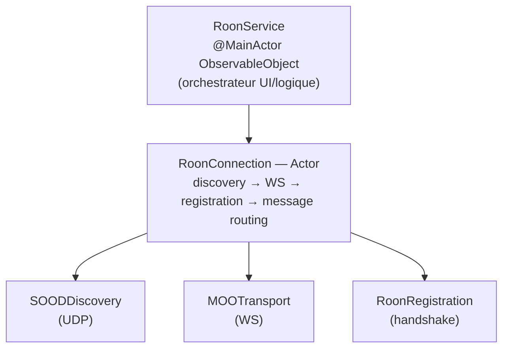
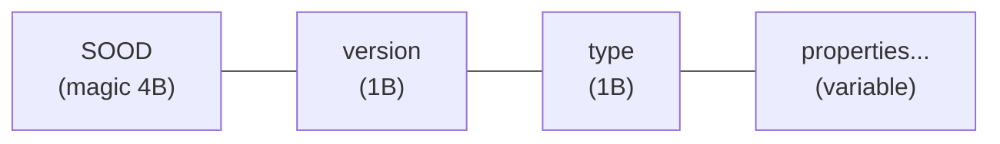
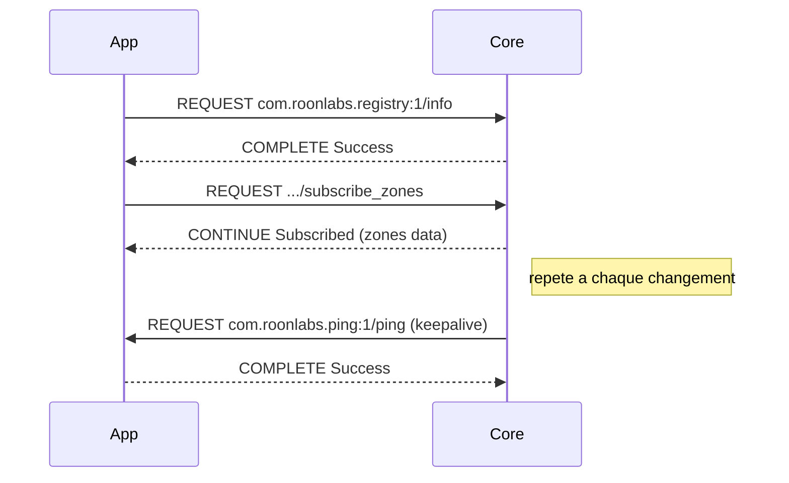
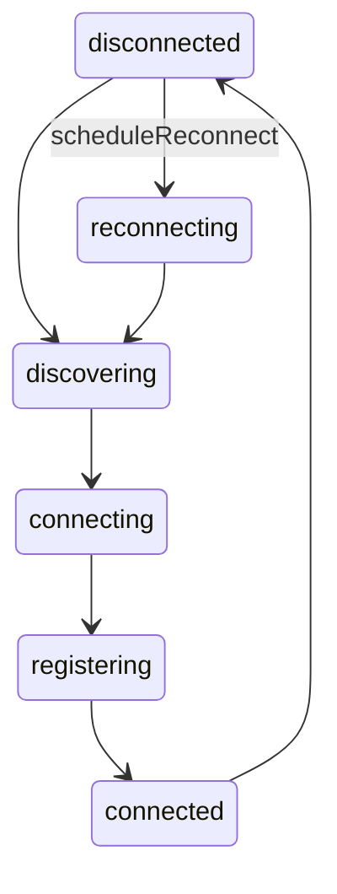
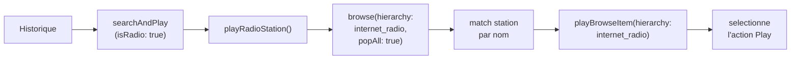
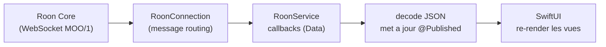
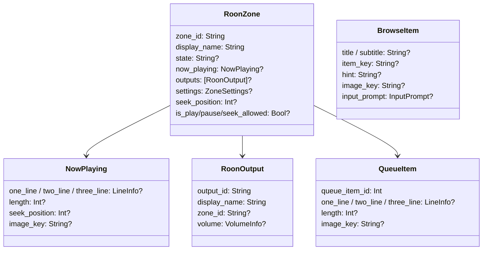

> **[English version](ARCHITECTURE.en.md)** | Francais

# Architecture technique

## Vue d'ensemble



L'app se connecte directement au Roon Core sans intermediaire. Elle implemente nativement en Swift les protocoles Roon.
**Roon Bridge** (app separee) expose les sorties audio du Mac (DAC USB, etc.) au Core via le protocole RAAT :

1. **SOOD** — decouverte du Core via UDP multicast
2. **MOO/1** — protocole de messagerie binaire sur WebSocket
3. **Registry** — handshake d'enregistrement de l'extension

## Pile protocolaire



## Protocole SOOD (decouverte)

### Format

SOOD utilise UDP multicast sur `239.255.90.90:9003` avec un format binaire proprietaire :



- **Magic** : `0x53 0x4F 0x4F 0x44` ("SOOD")
- **Version** : `0x02`
- **Type** : `0x51` (Query) ou `0x52` (Reply)

### Proprietes

Chaque propriete est encodee :

```
key_length (1 byte) + key + value_length (2 bytes BE) + value
```

- Valeur `0xFFFF` pour value_length = null sentinel
- Valeur `0x0000` pour value_length = chaine vide

### Query

L'app envoie periodiquement (toutes les 5s) un paquet Query contenant :

| Propriete | Valeur |
|-----------|--------|
| `_tid` | UUID unique par requete |
| `query_service_id` | `00720724-5143-4a9b-abac-0e50cba674bb` |

Le query est envoye a la fois en multicast (`239.255.90.90`) et en broadcast sur chaque interface reseau.

### Reply

Le Core repond avec un paquet Reply contenant :

| Propriete | Description |
|-----------|-------------|
| `service_id` | Identifiant unique du Core |
| `display_name` | Nom affiche du Core |
| `http_port` | Port WebSocket (generalement `9330`) |
| `_replyaddr` | Adresse IP du Core (optionnel) |

### Implementation (`SOODDiscovery.swift`)

- Utilise des sockets POSIX (BSD) au lieu de Network.framework pour eviter le besoin de l'entitlement `com.apple.developer.networking.multicast`
- Socket d'envoi : `SOCK_DGRAM` avec `SO_BROADCAST` et `IP_MULTICAST_TTL=1`
- Socket de reception : bind sur port 9003 avec `SO_REUSEADDR`/`SO_REUSEPORT`, join multicast sur toutes les interfaces
- Ecoute aussi les reponses unicast sur le socket d'envoi (port ephemere)

## Protocole MOO/1 (messages)

### Format

Les messages MOO/1 sont envoyes en frames binaires WebSocket :

```
MOO/1 {VERB} {name}\n
Request-Id: {id}\n
Content-Type: application/json\n     (optionnel, si body present)
Content-Length: {length}\n           (optionnel, si body present)
\n
{body JSON}
```

### Verbes

| Verbe | Direction | Description |
|-------|-----------|-------------|
| `REQUEST` | bidirectionnel | Requete (app → Core ou Core → app) |
| `COMPLETE` | reponse | Reponse finale a une requete |
| `CONTINUE` | reponse | Reponse partielle / notification de souscription |

### Cycle requete/reponse



### Implementation (`MOOMessage.swift`, `MOOTransport.swift`)

- `MOOMessage` : construction et parsing des messages binaires
- `MOOTransport` : actor gerant le WebSocket (`URLSessionWebSocketTask`), ping/pong keepalive toutes les 10s, boucle de reception async
- `MOORequestIdGenerator` : generateur atomique d'IDs de requete (thread-safe avec `NSLock`)

## Enregistrement (Registry)

### Handshake

1. **`registry:1/info`** → recoit les infos du Core et les noms des services disponibles
2. **`registry:1/register`** → envoie les infos de l'extension + token sauvegarde
3. Le Core repond `Registered` (avec token) ou attend l'autorisation de l'utilisateur

### Payload d'enregistrement

```json
{
    "extension_id": "com.bertrand.rooncontroller",
    "display_name": "Roon Controller macOS",
    "display_version": "1.0.0",
    "publisher": "Bertrand",
    "required_services": [
        "com.roonlabs.transport:2",
        "com.roonlabs.browse:1",
        "com.roonlabs.image:1"
    ],
    "optional_services": [],
    "provided_services": [
        "com.roonlabs.ping:1",
        "com.roonlabs.status:1"
    ],
    "token": "..."
}
```

### Persistence du token

Le token d'autorisation est sauvegarde dans `UserDefaults` (`roon_core_token`). Au redemarrage, l'extension est re-autorisee automatiquement sans intervention de l'utilisateur.

## RoonConnection (orchestrateur)

### Etats



### Responsabilites

| Fonction | Description |
|----------|-------------|
| `connect()` | Lance la decouverte SOOD |
| `connectDirect(host:port:)` | Connexion manuelle par IP |
| `disconnect()` | Deconnexion propre |
| `performRegistration()` | Handshake registry:1/info + registry:1/register |
| `handleMessage()` | Routage des messages entrants (reponses, souscriptions, requetes Core) |
| `subscribeZones()` | Souscription aux mises a jour des zones |
| `subscribeQueue(zoneId:)` | Souscription a la queue d'une zone |
| `sendRequestData(name:bodyData:)` | Envoi d'une requete avec continuation async (timeout 30s) |

### Reconnexion

- Backoff exponentiel : delai = `min(2^attempt, 30)` secondes
- Si le host/port sont connus : reconnexion directe
- Sinon : relance la decouverte SOOD

## Services Roon

### RoonTransportService

Controle du transport via `com.roonlabs.transport:2` :

| Methode | Endpoint | Description |
|---------|----------|-------------|
| `control()` | `/control` | play, pause, playpause, stop, previous, next |
| `seek()` | `/seek` | absolute ou relative |
| `changeVolume()` | `/change_volume` | absolute, relative, relative_step |
| `mute()` | `/mute` | mute, unmute, toggle |
| `changeSettings()` | `/change_settings` | shuffle, loop, auto_radio |
| `playFromHere()` | `/play_from_here` | Lire depuis un element de la queue |
| `subscribeQueue()` | via `RoonConnection` | Souscription a la queue d'une zone |

### RoonBrowseService

Navigation dans la bibliotheque via `com.roonlabs.browse:1` :

| Methode | Endpoint | Description |
|---------|----------|-------------|
| `browse()` | `/browse` | Naviguer, rechercher, executer des actions |
| `load()` | `/load` | Charger une page de resultats (pagination) |

### RoonImageService

Recuperation des pochettes via `com.roonlabs.image:1` :

| Methode | Endpoint | Description |
|---------|----------|-------------|
| `getImage()` | `/get_image` | Recuperer une image par cle, taille et format |

Les images sont servies localement via `LocalImageServer` (HTTP sur port 9150) et mises en cache par `RoonImageCache` (LRU).

## App macOS (SwiftUI)

### RoonService (`RoonService.swift`)

Classe `@MainActor ObservableObject` qui orchestre l'ensemble :

- **Connexion** : cree `RoonConnection` et les services (transport, browse, image)
- **Etat publie** (`@Published`) :
  - `connectionState` — etat de la connexion au Core
  - `zones` — liste de toutes les zones
  - `currentZone` — zone selectionnee (mise a jour en temps reel)
  - `queueItems` — file d'attente de la zone courante
  - `browseResult` / `browseStack` — etat de navigation bibliotheque
  - `playbackHistory` — historique de lecture (persistant)
  - `lastError` — derniere erreur
- **Actions** : play, pause, next, previous, seek, volume, mute, shuffle, loop, radio, browse, queue

### Replay depuis l'historique

Le replay depuis l'historique distingue deux cas :

**Morceaux** : `searchAndPlay()` effectue une recherche textuelle (album puis titre) via le Browse API et lance la lecture du premier resultat correspondant.

**Radios live** : detectees par `zone.is_seek_allowed == false` lors de l'enregistrement dans l'historique (champ `isRadio`). Au replay, `playRadioStation()` parcourt la hierarchie `internet_radio` du Browse API, trouve la station par nom (dans `album` ou `title` selon la metadata disponible), et navigue le menu d'actions pour lancer la lecture.



### Flux de donnees



### Modeles (`RoonModels.swift`)



### Vues

| Vue | Role |
|-----|------|
| `RoonControllerApp` | Point d'entree, cree `RoonService`, lance la connexion |
| `ContentView` | Routage : `ConnectionView` si deconnecte, sinon `NavigationSplitView` |
| `ConnectionView` | Ecran de connexion (status, reconnexion) |
| `PlayerView` | Lecteur : pochette avec fond flou, infos piste, seek bar, controles transport, shuffle/repeat/radio |
| `SidebarView` | Barre laterale avec 4 onglets : Zones, Bibliotheque, File d'attente, Historique |
| `QueueView` | Liste de la file d'attente, item en cours surbrille, tap pour jouer depuis un point |
| `HistoryView` | Historique de lecture avec pochette, titre, artiste, zone, heure. Tap pour rejouer (morceaux et radios) |
| `SettingsView` | Connexion manuelle au Core par IP |

### Palette de couleurs (`RoonColors.swift`)

| Couleur | Hex | Usage |
|---------|-----|-------|
| `roonBackground` | #141414 | Fond principal |
| `roonSurface` | #1E1E1E | Surfaces elevees |
| `roonSidebar` | #1A1A1A | Fond barre laterale |
| `roonAccent` | #4285F4 | Accent (bleu Google) |
| `roonText` | #FFFFFF | Texte principal |
| `roonSecondary` | #AAAAAA | Texte secondaire |
| `roonTertiary` | #666666 | Texte tertiaire |

### Entitlements

- `com.apple.security.app-sandbox` : desactive
- `com.apple.security.network.client` : connexions sortantes (WebSocket, HTTP)
- `com.apple.security.network.server` : connexions entrantes (serveur image local)
