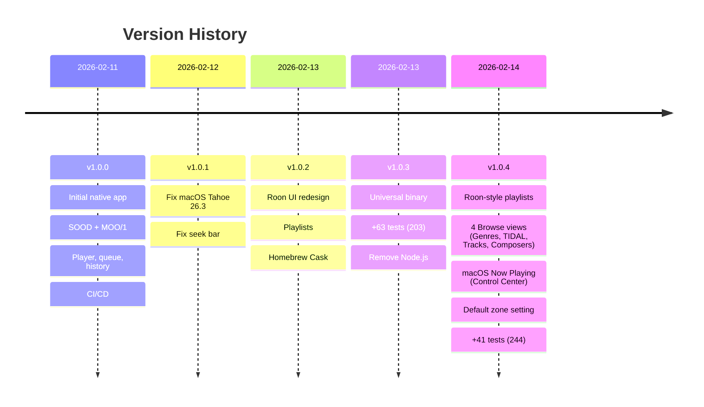

> English | **[Version francaise](CHANGELOG.md)**

# Changelog

All notable changes to this project are documented in this file.

The format is based on [Keep a Changelog](https://keepachangelog.com/en/1.1.0/),
and this project adheres to [Semantic Versioning](https://semver.org/).

## [Unreleased]

### Planned — v1.1.0

**Roon native UI**
- Artist detail pages (discography, bio) and album pages (tracks, hero header)
- Global library search (artists, albums, tracks, composers)
- Playlist management: create, rename, delete, reorder
- Tag and genre navigation
- Sort and filter options in grid/list views
- Keyboard shortcuts (space, arrows, Cmd+F, Cmd+L)

**Core Settings**
- Refactored SettingsView with tabs (Connection, Zones, Playback, Streaming, Extensions, About)
- Audio zone and output configuration (group/ungroup, volume)
- DSP chain display per zone
- Streaming account status (TIDAL, Qobuz)
- Installed extension management

**Radio Favorites**
- Model refactoring: Browse hierarchy for reliable replay
- Playback via Browse API `internet_radio` instead of text search
- Roon playlist creation from favorites
- Simplified UX: swipe-to-delete, sort, filter by station

## [1.0.4] - 2026-02-14

### Added

- Roon-style playlist list view (64px thumbnails, duration subtitles) (`d0c8438`)
- Full playlist pagination in sidebar and Browse (200+ playlists) (`d0c8438`)
- Default playback zone setting (persisted by `display_name`) (`5163eb9`)
- Sidebar playlist count setting (5/10/20/50/all) (`d0c8438`)
- Placeholder artwork for playlists without cover art (`d0c8438`)
- 4 specialized Browse views: Genres (gradient cards), TIDAL/streaming (carousel with sections), Tracks (table with cover prefetch), Composers (circular grid with initials) (`5caaaf8`)
- macOS Now Playing integration: track info, artwork and media controls in Control Center (`5caaaf8`)
- Mode toggle button (Roon → Player) in sidebar (`5caaaf8`)
- Cover art prefetch in Tracks view (NSCache + RoonImageProvider, 100 images ahead) (`5caaaf8`)
- `StreamingSection` model for streaming service categories (`5caaaf8`)
- 41 new unit tests (244 total): specialized Browse views, genre/streaming/tracks/composer detection, Now Playing, mode toggle (`5caaaf8`)

### Changed

- Default display mode: Roon UI (instead of Player) (`5163eb9`)
- Local playlist filtering in sidebar instead of global Browse search (`8b0932b`)
- Playlist detection no longer requires `image_key` at list level (`d0c8438`)
- Active Browse category tracked via `browseCategory` in RoonService (`5caaaf8`)

### Fixed

- Sidebar playlist search performed global Browse search instead of local filter (`8b0932b`)
- Only 100 playlists loaded (missing pagination) (`d0c8438`)
- Playlists displayed as grid instead of list (`d0c8438`)
- Playlist detection failed without list-level artwork (`d0c8438`)
- Track count mismatch (filter excluded tracks without subtitles) (`d0c8438`)
- "Play Playlist" appeared in the track list (`d0c8438`)
- Old track flash during track change (next/previous/searchAndPlay) (`d0c8438`)
- Startup crash: MPRemoteCommandCenter closures called @MainActor methods from internal queue (`5caaaf8`)
- Now Playing crash: MPMediaItemArtwork closure implicitly @MainActor-isolated, called from MPNowPlayingInfoCenter queue (`5caaaf8`)
- Tracks view incorrectly detected as playlist (unwanted playlist header on flat track list) (`5caaaf8`)

## [1.0.3] - 2026-02-13

### Added

- Universal binary (arm64 + x86_64) for Release configuration (`186a625`)
- Extended cover art cache to all screens (history, favorites, queue) (`a7f34ac`)
- 63 new unit tests (203 total): models, MOO protocol, cache, registration (`c37e604`, `a96672e`)

### Fixed

- WebSocket 15s resource timeout on reconnections (`45a3436`)
- Red/green flash during reconnection display (`0420e5b`)

### Removed

- Legacy Node.js backend (everything is native Swift) (`4294d49`)

## [1.0.2] - 2026-02-13

### Added

- Playlist detail view with hero header and track table (`581100b`, `ed8b75a`)
- Search within library browsing (`2a264d1`)
- Manual Core IP connection (persistent) (`07a245e`)
- Homebrew Cask for simplified installation (`b875642`)
- "Recently Added" tab from Roon Core (`40fb216`)

### Changed

- Complete UI redesign matching Roon native style (`ee2d5e6`, `24f569f`, `71cc27c`, `78b8588`)
- Zone selector moved to transport bar (`fdcd470`)
- Default display mode: player (`68aff5b`)

### Fixed

- Playlist track playback using session-bound keys (`9db489e`)
- First-pairing flow (waitingForApproval state) (`4e577d6`)
- Album art display and transport controls for playlists (`98f3b03`)

## [1.0.1] - 2026-02-12

### Fixed

- macOS Tahoe 26.3 compatibility: ATS, WebSocket handshake, logging (`a37d78f`)
- Seek bar not resetting to 0 on track change (`033ba0b`)

## [1.0.0] - 2026-02-11

### Added

- Native macOS application (SwiftUI) — zero external dependencies
- SOOD protocol: automatic Roon Core discovery (UDP multicast, POSIX sockets)
- MOO/1 protocol: binary WebSocket communication with the Core
- Full player: play/pause, next/prev, seek, shuffle, repeat, radio
- Album artwork with dynamic blurred background
- Roon library browsing (Browse API) with pagination
- Queue with play-from-here
- Per-output volume control (slider + mute)
- Playback history with replay (tracks and live radio)
- Radio favorites: save and CSV export (compatible with Soundiiz)
- Automatic reconnection with exponential backoff
- Local seek interpolation for smooth progress bar
- Dark theme matching Roon style
- French/English localization (follows system language)
- CI/CD with GitHub Actions and Claude Code integration
- Bilingual technical documentation

[Unreleased]: https://github.com/renesenses/roon-controller/compare/v1.0.4...HEAD
[1.0.4]: https://github.com/renesenses/roon-controller/compare/v1.0.3...v1.0.4
[1.0.3]: https://github.com/renesenses/roon-controller/compare/v1.0.2...v1.0.3
[1.0.2]: https://github.com/renesenses/roon-controller/compare/v1.0.1...v1.0.2
[1.0.1]: https://github.com/renesenses/roon-controller/compare/v1.0.0...v1.0.1
[1.0.0]: https://github.com/renesenses/roon-controller/releases/tag/v1.0.0
