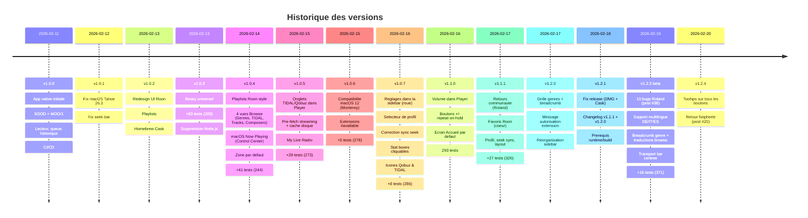

> **[English version](CHANGELOG.en.md)** | Francais

# Changelog

Tous les changements notables de ce projet sont documentes dans ce fichier.

Le format est base sur [Keep a Changelog](https://keepachangelog.com/fr/1.1.0/),
et ce projet adhere au [Semantic Versioning](https://semver.org/lang/fr/).

## [Unreleased]

## [1.2.4] - 2026-02-20

### Ajouts

- Infobulles (tooltips) sur tous les boutons icones de l'application (~35 boutons, 7 fichiers)
  - Barre de transport : Previous, Play/Pause, Next, Mute/Unmute, Select zone
  - Page d'accueil : fleches de defilement, bouton MORE, overlay Play
  - Navigation bibliotheque : Back, Library home, Clear search, Play now, overlays Play (grille, liste, streaming, radio)
  - Vue Player : Previous, Play/Pause, Next, Shuffle, Repeat, Roon Radio, Mute/Unmute, Volume down/up
  - Vue Now Playing : Shuffle, Repeat, Roon Radio, favoris radio/bibliotheque
  - Favoris radio : Export CSV, Clear all favorites, Delete
  - Historique : Clear history
- Pattern `.help("...")` avec localisation automatique via xcstrings

### Technique

- `settingButton()` dans `RoonNowPlayingView` accepte un parametre `tooltip`
- `VolumeRepeatButton` dans `PlayerView` accepte un parametre `tooltip`
- Version bumpee de 1.2.3 a 1.2.4 (registration, pbxproj, tests)

## [1.2.3-beta] - 2026-02-19

### Corrections

- #1 — Profil : retry (3x avec delai) pour `fetchProfileName` si le Browse API n'est pas pret a la connexion (`a70b5d6`)
- #2 — Section "Dernierement" visible quand au moins un onglet (LUS/AJOUTES) a du contenu (`a70b5d6`)
- #3 — Engrenage Settings : fallback via le menu app (Cmd+,) si `NSApp.sendAction` echoue silencieusement (`a70b5d6`)
- #4 — Stat boxes : `countKeyMap`, `libraryTitles`, `hiddenTitles` etendus avec DE/IT/ES/SV/NL/JA/KO (`a70b5d6`)
- #5 — Seek : appel de `updateNowPlayingInfo()` apres seek pour synchroniser le Media Center macOS (`a70b5d6`)
- #9 — Clic album : utilise `tile.album` au lieu de `tile.title` pour naviguer vers le bon album (`a70b5d6`)
- #12 — Vue de demarrage : `@SceneStorage` remplace par `@AppStorage` pour respecter le reglage utilisateur (`a70b5d6`)
- #13 — Breadcrumb genre : condition alternative via `stack.first` + traductions DE/IT dans `genreExitTitles` (`a70b5d6`)
- #17 — Bouton MORE : navigue vers Albums (browse) quand l'onglet AJOUTES est actif (`a70b5d6`)
- #19 — "My Live Radio" : utilise `String(localized:)` avec traductions DE/IT/ES/FR dans Localizable.xcstrings (`a70b5d6`)

### Ameliorations

- Fil d'ariane genre : la racine affiche "Genres" et reste dans la hierarchie genre (plus de retour a la bibliotheque) (`d41dc72`)
- `browsePopLevels()` : navigation multi-niveaux en un seul appel API (corrige les clics ancetres) (`d41dc72`)
- Traduction de tous les titres d'actions browse (Play Artist, Play Album, Add to Library, etc.) via `displayBrowseTitle()` (`d41dc72`)
- Grille affichee des 1 item avec image (seuil abaisse de 3 a 1) (`d41dc72`)
- Barre de transport : contenu centre verticalement dans la zone de 90px (`d41dc72`)

### Technique

- 16 nouveaux tests (355 → 371) couvrant les 10 corrections
- `categoryTitlesForKey` etendu a toutes les langues supportees par Roon
- `genreExitTitles` etendu avec les titres multilingues (DE/IT/ES/SV/NL/JA/KO)

## [1.2.1] - 2026-02-18

### Corrections

- DMG de la release GitHub reconstruit avec le binaire v1.2.0 (l'ancien contenait v1.0.2)
- Homebrew Cask mis a jour vers v1.2.0 : version, sha256, depends_on Monterey, caveats xattr (`654265b`)

### Documentation

- Prerequis separes en "Pour utiliser l'app" et "Pour compiler depuis les sources" dans les README et INSTALL (`654265b`)
- Version Xcode corrigee : 16 (etait "26" dans les README) (`654265b`)
- Section Utilisation : "Lancez depuis Applications" au lieu de "depuis Xcode (Cmd+R)" (`654265b`)
- Changelog rattrape pour v1.1.1 et v1.2.0

## [1.2.0] - 2026-02-17

### Ajouts

- Vue grille des genres avec breadcrumb de navigation et cartes pour les genres feuilles (`92110aa`)
- Breadcrumb complet dans la barre de navigation des genres (`05f6182`)
- Message explicite quand l'extension n'est pas autorisee dans le Roon Core (`d8aaedf`)

### Modifications

- Genres deplaces dans la section Bibliotheque de la sidebar (`77f1588`)
- My Live Radio deplace dans la section Explorateur de la sidebar (`77f1588`)
- Traduction de "My Live Radio" en francais dans la sidebar (`750b770`)

## [1.1.1] - 2026-02-17

### Ajouts

- Toggle coeur pour les favoris de la bibliotheque Roon via Browse API (`a246c80`)
- Support du bouton retour de la souris pour la navigation Browse (`607afd9`)
- Icone roue des reglages dans la barre d'outils du mode Player (Cmd+,) (`ef3d3b3`)
- Option echelle de volume 0-100 et choix de la vue de demarrage dans les reglages (`e74e12c`)
- 27 nouveaux tests unitaires (326 au total) (`9d033e7`)

### Modifications

- Section Favoris renommee en "Favoris Radio" pour plus de clarte (`0586287`)
- Repetition des boutons volume acceleree de 200ms a 100ms (`124d7a4`)
- `displayVersion` de l'extension mis a jour a 1.1.0 (`c4073bd`)

### Corrections

- Changement de profil : utilise la correspondance par titre au lieu de cles de session perimees (`4af4a6b`)
- Guard de deduplication Browse bloquait la re-navigation apres les reponses d'action (`f24da12`)
- Barre de transport et vue lecteur rendues responsives au redimensionnement de la fenetre (`96e1f42`)
- Synchronisation du seek : priorite aux mises a jour du serveur sur le timer local (`9d71c00`)
- Albums recemment joues : navigation vers le detail de l'album au lieu de lancer la lecture (`594061c`)
- Detection de layout pour Pistes/Compositeurs/colonne Album en multilingue (`3b8e87e`)
- Instructions d'installation de l'app non signee corrigees dans toute la documentation (`c24ae37`)

## [1.1.0] - 2026-02-16

### Ajouts

- Controle du volume dans la vue Player : bouton mute, slider custom, boutons +/- avec repeat-on-hold, affichage dB (`3e7ef78`)
- `adjustVolume(outputId:delta:)` : methode volume relatif pour les boutons +/- (`3e7ef78`)
- `VolumeRepeatButton` : composant bouton avec declenchement au tap et repetition toutes les 200ms tant qu'on maintient appuye (`3e7ef78`)

### Modifications

- L'app demarre toujours sur l'ecran Accueil (mode Roon UI, section Home) quel que soit le dernier etat (`060cdb4`)

### Corrections

- `changeVolume` : `Int(value.rounded())` au lieu de `Int(value)` pour eviter les erreurs de troncature (`3e7ef78`)

### Technique

- UI multilingue complete (anglais source + traductions fr/es/de/it) (`c7407a8`)
- Bouton sidebar toggle + raccourci Cmd+\ en mode Player (`00f20ed`)
- Clic sur tuile album ouvre le detail au lieu de lancer la lecture (`4dd34cc`)
- Suivi local des albums recemment ajoutes via scan complet Browse API (`b07eb29`)

## [1.0.7] - 2026-02-16

### Ajouts

- Icone roue dentee dans la sidebar (modes Player et Roon) (`37de864`)
- Selecteur de profil dans les Reglages : lister et changer de profil Roon (`450f05d`)
- Stat boxes cliquables sur la page d'accueil : navigation vers Artistes, Albums, Pistes (`2b39e57`)
- Bouton fermer et touche Echap pour quitter la vue Now Playing plein ecran (`40f8264`)
- Limite de taille du cache disque (200 Mo par defaut) avec eviction LRU, visible dans les Reglages (`c285d73`)
- Icones TIDAL et Qobuz dans la sidebar (`267a9b0`, `cf4da9a`)
- 8 nouveaux tests unitaires (286 au total)

### Modifications

- Icone Qobuz : design vinyle/Q personnalise remplacant le logo de marque (pas de souci copyright) (`cf4da9a`)
- Rendu de l'icone Qobuz passe de template a original (`cf4da9a`)
- Colonne album masquee lors de la consultation des pistes d'un album (`620a548`)

### Corrections

- Debordement du timer seek quand la position depasse la duree du morceau (`00348dd`)
- Synchronisation du seek depuis des controleurs externes : le timer local cede la priorite aux evenements `zones_seek_changed` du serveur (`00348dd`)

## [1.0.6] - 2026-02-15

### Changed

- Deployment target abaisse de macOS 15 (Sequoia) a macOS 12 (Monterey) (`730927d`)
- `.tint()` remplace par `.accentColor()` pour macOS 12 (11 occurrences) (`730927d`)
- `NavigationSplitView` remplace par `NavigationView` + `.navigationViewStyle(.columns)` (`730927d`)
- `.onChange(of:) { old, new in }` remplace par `.onChangeCompat(of:)` avec wrapper `#available` (`730927d`)
- `.tracking()` remplace par `.trackingCompat()` avec fallback `.kerning()` (14 occurrences) (`730927d`)
- `.scrollContentBackground(.hidden)` et `.formStyle(.grouped)` encapsules dans des extensions `#available` (`730927d`)
- `.defaultSize()` supprime (`.frame(minWidth:minHeight:)` suffisant) (`730927d`)
- `onTapGesture { location in }` remplace par `DragGesture(minimumDistance: 0)` (`730927d`)
- `String.split(separator: String)` remplace par `range(of:)` pour macOS 12 (`730927d`)

### Added

- `CompatibilityModifiers.swift` : extensions centralisees (`onChangeCompat`, `hideScrollBackground`, `groupedFormStyleCompat`, `trackingCompat`) (`730927d`)
- 5 nouveaux tests unitaires (278 au total) (`730927d`)

**UI Roon native**
- Pages detail artiste (discographie, bio) et album (pistes, header hero)
- Recherche globale dans la bibliotheque (artistes, albums, pistes, compositeurs)
- Gestion des playlists : creer, renommer, supprimer, reordonner
- Navigation par tags et genres
- Options de tri et filtres dans les vues grille/liste
- Raccourcis clavier (espace, fleches, Cmd+F, Cmd+L)

**Settings du Core**
- Refonte de SettingsView en onglets (Connexion, Zones, Lecture, Streaming, Extensions, A propos)
- Configuration des zones audio et sorties (grouper/degrouper, volume)
- Affichage de la chaine DSP par zone
- Etat des comptes streaming (TIDAL, Qobuz)
- Gestion des extensions installees

**Favoris radio**
- Refactoring du modele : hierarchie Browse pour replay fiable
- Lecture via Browse API `internet_radio` au lieu de recherche textuelle
- Creation de playlist Roon depuis les favoris
- UX simplifiee : swipe-to-delete, tri, filtre par station

## [1.0.5] - 2026-02-15

### Added

- Onglets TIDAL et Qobuz dans la sidebar du mode Player avec carousels compacts (`a157663`)
- Barre d'icones SF Symbols remplacant le Picker segmente (5 fixes + services dynamiques) (`a157663`)
- Vue streaming par service : sections en `LazyVStack`, carousels horizontaux de cartes 100px (`a157663`)
- Navigation tap carte → album dans la section Browse via `browseToStreamingAlbum()` (`a157663`)
- `cachedStreamingSectionsForService()` : lecture du cache streaming filtree par service (`a157663`)
- `streamingCacheVersion` : compteur reactif pour signaler les mises a jour du cache au UI (`a157663`)
- Pre-fetch des sections streaming avec cache disque 24h (`8744236`)
- Cache disque des categories sidebar pour affichage instantane au lancement (`8744236`)
- Vue My Live Radio avec grille de stations et lecture directe (`200b4e5`)
- 29 nouveaux tests unitaires (273 au total) : SidebarSection round-trip, cache streaming, navigation albums (`a157663`, `cb8218a`)

### Changed

- `SidebarSection` refactorise avec `associated value` `.streaming(serviceName:)` et `RawRepresentable` custom (`a157663`)
- Padding de la barre d'onglets reduit pour accueillir les icones dynamiques (`a157663`)

### Fixed

- Navigation TIDAL/Qobuz par titre au lieu de cles de session (cles expirees) (`d767492`)
- Lecture des playlists : utilise le niveau API au lieu de compter les pushes (`232f09b`)
- Retour album streaming : restauration des carousels sans rechargement (`cb8218a`)
- Correction du scintillement des pochettes lors du changement de piste (`8744236`)
- Serveur image : retry async sur le port avec test dynamique (`cdff283`)
- Fix pbxproj : suppression des references de groupe dupliquees (`a48060c`)

## [1.0.4] - 2026-02-14

### Added

- Vue liste des playlists style Roon (thumbnails 64px, sous-titres duree) (`d0c8438`)
- Pagination complete des playlists dans la sidebar et le Browse (200+ playlists) (`d0c8438`)
- Zone de lecture par defaut dans les parametres (persistance par `display_name`) (`5163eb9`)
- Reglage du nombre de playlists affichees dans la sidebar (5/10/20/50/toutes) (`d0c8438`)
- Placeholder pochette pour les playlists sans artwork (`d0c8438`)
- 4 vues Browse specialisees : Genres (cartes gradient), TIDAL/streaming (carousel par sections), Tracks (tableau avec prefetch pochettes), Composers (grille circulaire avec initiales) (`5caaaf8`)
- Integration macOS Now Playing : infos piste, pochette et controles media dans le Control Center (`5caaaf8`)
- Bouton bascule mode Roon → Player dans la sidebar (`5caaaf8`)
- Prefetch des pochettes dans la vue Tracks (NSCache + RoonImageProvider, 100 images en avance) (`5caaaf8`)
- Modele `StreamingSection` pour les categories des services de streaming (`5caaaf8`)
- 41 nouveaux tests unitaires (244 au total) : vues Browse specialisees, detection genres/streaming/tracks/composers, Now Playing, bascule mode (`5caaaf8`)

### Changed

- Mode d'affichage par defaut : Roon UI (au lieu de Player) (`5163eb9`)
- Filtrage local des playlists dans la sidebar au lieu de recherche globale Browse (`8b0932b`)
- Detection des playlists sans exiger `image_key` au niveau list (`d0c8438`)
- Suivi de la categorie Browse active via `browseCategory` dans RoonService (`5caaaf8`)

### Fixed

- Recherche playlists sidebar faisait une recherche globale Browse au lieu d'un filtre local (`8b0932b`)
- Seulement 100 playlists chargees (pas de pagination) (`d0c8438`)
- Playlists affichees en grille au lieu de liste (`d0c8438`)
- Detection playlist echouait sans pochette au niveau list (`d0c8438`)
- Compteur de morceaux incorrect (filtre excluait les morceaux sans sous-titre) (`d0c8438`)
- "Play Playlist" apparaissait dans la liste de morceaux (`d0c8438`)
- Flash de l'ancien morceau lors du changement de piste (next/previous/searchAndPlay) (`d0c8438`)
- Crash au demarrage : closures MPRemoteCommandCenter appelaient des methodes @MainActor depuis une queue interne (`5caaaf8`)
- Crash Now Playing : closure MPMediaItemArtwork marquee @MainActor implicitement, appelée depuis la queue MPNowPlayingInfoCenter (`5caaaf8`)
- Vue Tracks detectee a tort comme playlist (header playlist inutile sur liste plate de morceaux) (`5caaaf8`)

## [1.0.3] - 2026-02-13

### Added

- Binary universel (arm64 + x86_64) pour la configuration Release (`186a625`)
- Cache pochettes etendu a tous les ecrans (historique, favoris, queue) (`a7f34ac`)
- 63 nouveaux tests unitaires (203 au total) : modeles, protocole MOO, cache, registration (`c37e604`, `a96672e`)

### Fixed

- WebSocket timeout ressource 15s lors des reconnexions (`45a3436`)
- Affichage flash rouge/vert lors de la reconnexion (`0420e5b`)

### Removed

- Backend Node.js legacy (tout est natif Swift) (`4294d49`)

## [1.0.2] - 2026-02-13

### Added

- Vue detail playlist avec header hero et tableau de pistes (`581100b`, `ed8b75a`)
- Recherche dans la navigation bibliotheque (`2a264d1`)
- Connexion manuelle par IP du Core (persistante) (`07a245e`)
- Homebrew Cask pour installation simplifiee (`b875642`)
- Onglet "Ajoutes recemment" depuis le Roon Core (`40fb216`)

### Changed

- Redesign complet de l'UI style Roon natif (`ee2d5e6`, `24f569f`, `71cc27c`, `78b8588`)
- Selecteur de zone deplace dans la barre de transport (`fdcd470`)
- Mode d'affichage par defaut : lecteur (`68aff5b`)

### Fixed

- Lecture des pistes playlist utilisant les cles de session (`9db489e`)
- Flux de premiere connexion (etat waitingForApproval) (`4e577d6`)
- Affichage pochettes et controles transport pour les playlists (`98f3b03`)

## [1.0.1] - 2026-02-12

### Fixed

- Compatibilite macOS Tahoe 26.3 : ATS, handshake WebSocket, logging (`a37d78f`)
- Seek bar pas remise a zero au changement de piste (`033ba0b`)

## [1.0.0] - 2026-02-11

### Added

- Application macOS native (SwiftUI) — zero dependances externes
- Protocole SOOD : decouverte automatique du Roon Core (UDP multicast, sockets POSIX)
- Protocole MOO/1 : communication WebSocket binaire avec le Core
- Lecteur complet : play/pause, next/prev, seek, shuffle, repeat, radio
- Pochette d'album avec fond flou dynamique
- Navigation dans la bibliotheque Roon (Browse API) avec pagination
- File d'attente (queue) avec lecture depuis un morceau
- Controle du volume par sortie (slider + mute)
- Historique de lecture avec replay (morceaux et radios)
- Favoris radio : sauvegarde et export CSV (compatible Soundiiz)
- Reconnexion automatique avec backoff exponentiel
- Interpolation locale du seek pour barre de progression fluide
- Theme sombre style Roon
- Localisation francais/anglais (suit la langue systeme)
- CI/CD GitHub Actions avec integration Claude Code
- Documentation technique bilingue

[Unreleased]: https://github.com/renesenses/roon-controller/compare/v1.2.4...HEAD
[1.2.4]: https://github.com/renesenses/roon-controller/compare/v1.2.3...v1.2.4
[1.2.3-beta]: https://github.com/renesenses/roon-controller/compare/v1.2.1...v1.2.3
[1.2.1]: https://github.com/renesenses/roon-controller/compare/v1.2.0...v1.2.1
[1.2.0]: https://github.com/renesenses/roon-controller/compare/v1.1.0...v1.2.0
[1.1.1]: https://github.com/renesenses/roon-controller/compare/v1.1.0...v1.1.1
[1.1.0]: https://github.com/renesenses/roon-controller/compare/v1.0.7...v1.1.0
[1.0.7]: https://github.com/renesenses/roon-controller/compare/v1.0.6...v1.0.7
[1.0.6]: https://github.com/renesenses/roon-controller/compare/v1.0.5...v1.0.6
[1.0.5]: https://github.com/renesenses/roon-controller/compare/v1.0.4...v1.0.5
[1.0.4]: https://github.com/renesenses/roon-controller/compare/v1.0.3...v1.0.4
[1.0.3]: https://github.com/renesenses/roon-controller/compare/v1.0.2...v1.0.3
[1.0.2]: https://github.com/renesenses/roon-controller/compare/v1.0.1...v1.0.2
[1.0.1]: https://github.com/renesenses/roon-controller/compare/v1.0.0...v1.0.1
[1.0.0]: https://github.com/renesenses/roon-controller/releases/tag/v1.0.0
