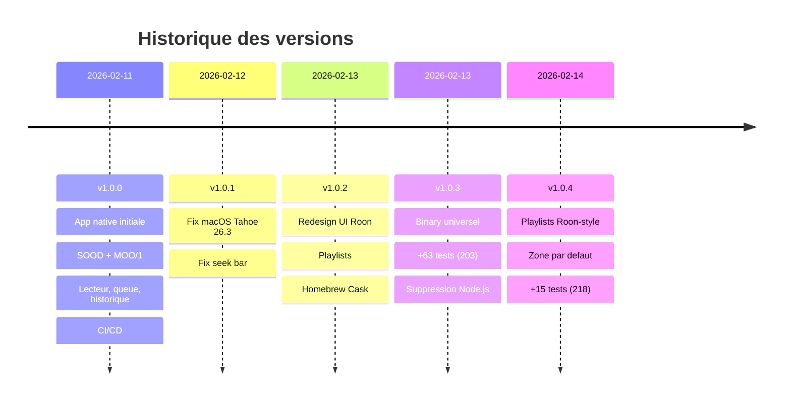

> **[English version](CHANGELOG.en.md)** | Francais

# Changelog

Tous les changements notables de ce projet sont documentes dans ce fichier.

Le format est base sur [Keep a Changelog](https://keepachangelog.com/fr/1.1.0/),
et ce projet adhere au [Semantic Versioning](https://semver.org/lang/fr/).

## [Unreleased]

### Planned — v1.1.0

**UI Roon native**
- Pages detail artiste (discographie, bio) et album (pistes, header hero)
- Recherche globale dans la bibliotheque (artistes, albums, pistes, compositeurs)
- Gestion des playlists : creer, renommer, supprimer, reordonner
- Navigation par tags et genres
- Options de tri et filtres dans les vues grille/liste
- Raccourcis clavier (espace, fleches, Cmd+F, Cmd+L)

**Settings du Core**
- Refonte de SettingsView en onglets (Connexion, Zones, Lecture, Streaming, Extensions, A propos)
- Configuration des zones audio et sorties (grouper/degrouper, volume)
- Affichage de la chaine DSP par zone
- Etat des comptes streaming (TIDAL, Qobuz)
- Gestion des extensions installees

**Favoris radio**
- Refactoring du modele : hierarchie Browse pour replay fiable
- Lecture via Browse API `internet_radio` au lieu de recherche textuelle
- Creation de playlist Roon depuis les favoris
- UX simplifiee : swipe-to-delete, tri, filtre par station

## [1.0.4] - 2026-02-14

### Added

- Vue liste des playlists style Roon (thumbnails 64px, sous-titres duree) (`d0c8438`)
- Pagination complete des playlists dans la sidebar et le Browse (200+ playlists) (`d0c8438`)
- Zone de lecture par defaut dans les parametres (persistance par `display_name`) (`5163eb9`)
- Reglage du nombre de playlists affichees dans la sidebar (5/10/20/50/toutes) (`d0c8438`)
- Placeholder pochette pour les playlists sans artwork (`d0c8438`)
- 15 nouveaux tests unitaires (218 au total) : zone par defaut, filtrage playlists, mode UI (`5163eb9`, `d0c8438`)

### Changed

- Mode d'affichage par defaut : Roon UI (au lieu de Player) (`5163eb9`)
- Filtrage local des playlists dans la sidebar au lieu de recherche globale Browse (`8b0932b`)
- Detection des playlists sans exiger `image_key` au niveau list (`d0c8438`)

### Fixed

- Recherche playlists sidebar faisait une recherche globale Browse au lieu d'un filtre local (`8b0932b`)
- Seulement 100 playlists chargees (pas de pagination) (`d0c8438`)
- Playlists affichees en grille au lieu de liste (`d0c8438`)
- Detection playlist echouait sans pochette au niveau list (`d0c8438`)
- Compteur de morceaux incorrect (filtre excluait les morceaux sans sous-titre) (`d0c8438`)
- "Play Playlist" apparaissait dans la liste de morceaux (`d0c8438`)
- Flash de l'ancien morceau lors du changement de piste (next/previous/searchAndPlay) (`d0c8438`)

## [1.0.3] - 2026-02-13

### Added

- Binary universel (arm64 + x86_64) pour la configuration Release (`186a625`)
- Cache pochettes etendu a tous les ecrans (historique, favoris, queue) (`a7f34ac`)
- 63 nouveaux tests unitaires (203 au total) : modeles, protocole MOO, cache, registration (`c37e604`, `a96672e`)

### Fixed

- WebSocket timeout ressource 15s lors des reconnexions (`45a3436`)
- Affichage flash rouge/vert lors de la reconnexion (`0420e5b`)

### Removed

- Backend Node.js legacy (tout est natif Swift) (`4294d49`)

## [1.0.2] - 2026-02-13

### Added

- Vue detail playlist avec header hero et tableau de pistes (`581100b`, `ed8b75a`)
- Recherche dans la navigation bibliotheque (`2a264d1`)
- Connexion manuelle par IP du Core (persistante) (`07a245e`)
- Homebrew Cask pour installation simplifiee (`b875642`)
- Onglet "Ajoutes recemment" depuis le Roon Core (`40fb216`)

### Changed

- Redesign complet de l'UI style Roon natif (`ee2d5e6`, `24f569f`, `71cc27c`, `78b8588`)
- Selecteur de zone deplace dans la barre de transport (`fdcd470`)
- Mode d'affichage par defaut : lecteur (`68aff5b`)

### Fixed

- Lecture des pistes playlist utilisant les cles de session (`9db489e`)
- Flux de premiere connexion (etat waitingForApproval) (`4e577d6`)
- Affichage pochettes et controles transport pour les playlists (`98f3b03`)

## [1.0.1] - 2026-02-12

### Fixed

- Compatibilite macOS Tahoe 26.3 : ATS, handshake WebSocket, logging (`a37d78f`)
- Seek bar pas remise a zero au changement de piste (`033ba0b`)

## [1.0.0] - 2026-02-11

### Added

- Application macOS native (SwiftUI) — zero dependances externes
- Protocole SOOD : decouverte automatique du Roon Core (UDP multicast, sockets POSIX)
- Protocole MOO/1 : communication WebSocket binaire avec le Core
- Lecteur complet : play/pause, next/prev, seek, shuffle, repeat, radio
- Pochette d'album avec fond flou dynamique
- Navigation dans la bibliotheque Roon (Browse API) avec pagination
- File d'attente (queue) avec lecture depuis un morceau
- Controle du volume par sortie (slider + mute)
- Historique de lecture avec replay (morceaux et radios)
- Favoris radio : sauvegarde et export CSV (compatible Soundiiz)
- Reconnexion automatique avec backoff exponentiel
- Interpolation locale du seek pour barre de progression fluide
- Theme sombre style Roon
- Localisation francais/anglais (suit la langue systeme)
- CI/CD GitHub Actions avec integration Claude Code
- Documentation technique bilingue

[Unreleased]: https://github.com/renesenses/roon-controller/compare/v1.0.4...HEAD
[1.0.4]: https://github.com/renesenses/roon-controller/compare/v1.0.3...v1.0.4
[1.0.3]: https://github.com/renesenses/roon-controller/compare/v1.0.2...v1.0.3
[1.0.2]: https://github.com/renesenses/roon-controller/compare/v1.0.1...v1.0.2
[1.0.1]: https://github.com/renesenses/roon-controller/compare/v1.0.0...v1.0.1
[1.0.0]: https://github.com/renesenses/roon-controller/releases/tag/v1.0.0
