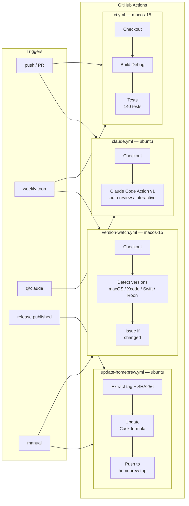
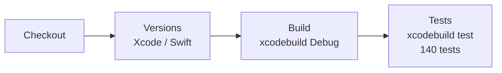
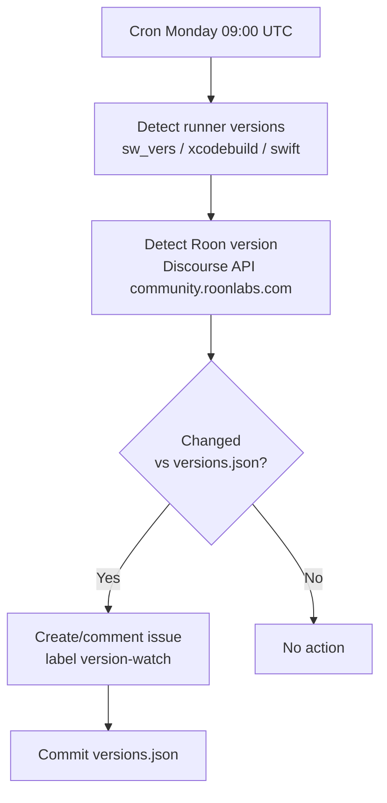
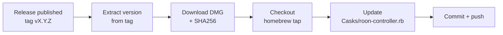

# CI/CD — Roon Controller

## Overview

The CI/CD pipeline is based on **GitHub Actions** with four workflows:

| Workflow | File | Runner | Triggers |
|----------|------|--------|----------|
| **CI** (build + tests) | `.github/workflows/ci.yml` | `macos-15` (Sequoia) | push, PR, weekly cron |
| **Claude Code** (AI review) | `.github/workflows/claude.yml` | `ubuntu-latest` | PR, `@claude` mentions |
| **Version Watch** (version tracking) | `.github/workflows/version-watch.yml` | `macos-15` (Sequoia) | weekly cron, manual |
| **Update Homebrew** (distribution) | `.github/workflows/update-homebrew.yml` | `ubuntu-latest` | release, manual |



## CI Workflow — Build & Tests

### Triggers

| Event | Condition | Reason |
|-------|-----------|--------|
| `push` | `main` branch | Validate each merge |
| `pull_request` | targeting `main` | Verify before merge |
| `schedule` | Monday 08:00 UTC | Detect regressions from macOS/Xcode runner updates |

The weekly cron build is essential: Apple updates Xcode on GitHub runners without notice. An update from Xcode 16.3 to 16.4 for example introduced Swift 6 concurrency errors that didn't exist locally.

### Steps



```yaml
jobs:
  build-and-test:
    runs-on: macos-15          # Sequoia — matches deployment target 15.0
    steps:
      - Code checkout
      - Display Xcode/Swift versions    # diagnostics in case of regression
      - Build (xcodebuild, scheme RoonController, Debug)
      - Tests (xcodebuild test, scheme RoonControllerTests, 140 tests)
```

### No Code Signing

The project uses "Sign to Run Locally" — no certificate or provisioning profile is needed on the CI runner. Tests don't require a signed app either.

### Status Badge

The CI badge is displayed at the top of `README.md`:

```markdown
[]
```

## Claude Code Workflow — AI Review

### Triggers

| Event | Condition | Behavior |
|-------|-----------|----------|
| `pull_request` | `opened` or `synchronize` | Automatic review of each PR |
| `issue_comment` | contains `@claude` | Interactive response on an issue |
| `pull_request_review_comment` | contains `@claude` | Interactive response on a PR comment |

### Configuration

```yaml
- uses: anthropics/claude-code-action@v1
  with:
    anthropic_api_key: ${{ secrets.ANTHROPIC_API_KEY }}
    claude_args: "--max-turns 5"
    timeout-minutes: 10
```

- **`--max-turns 5`**: limits the number of iterations to control API costs
- **`timeout-minutes: 10`**: circuit breaker if execution runs away

### Review Guidelines

The prompt configures Claude to focus on:

- Swift best practices and SwiftUI patterns
- Potential regressions in SOOD/MOO protocols
- Thread safety (`@MainActor`, `Sendable` conformance)
- Error handling and edge cases

### Permissions

The workflow has the minimum required permissions:

| Permission | Level | Usage |
|------------|-------|-------|
| `contents` | write | Modify files if needed |
| `pull-requests` | write | Comment and push on PRs |
| `issues` | write | Respond to `@claude` mentions |

### Prerequisites

1. **Claude GitHub App** installed on the repository (via [github.com/apps/claude](https://github.com/apps/claude))
2. **`ANTHROPIC_API_KEY` secret** configured in Settings > Secrets > Actions

## Version Watch Workflow — Version Tracking

### Purpose

Detect updates to macOS, Xcode, Swift (on GitHub runners) and Roon (via the community forum) and open an issue when a new version is detected.

### Triggers

| Event | Condition | Reason |
|-------|-----------|--------|
| `schedule` | Monday 09:00 UTC | After the CI build (08:00), check versions |
| `workflow_dispatch` | manual | On-demand check |

### How It Works



1. **Runner versions**: `sw_vers`, `xcodebuild -version`, `swift --version` on `macos-15`
2. **Roon version**: Discourse API request to `community.roonlabs.com` (Roon Software category), extracts the latest title containing "Release" and a build number
3. **Comparison**: reads `.github/versions.json` and compares with detected versions
4. **Alert**: creates a GitHub issue with `version-watch` label (or comments if an issue is already open)
5. **Update**: automatic commit of the new `versions.json`

### Reference File

`.github/versions.json` stores the last known versions:

```json
{
  "macos": "15.2",
  "xcode": "16.2",
  "swift": "6.0.3",
  "roon": "Roon 2.0 (Build 1456) Release Notes"
}
```

### Limitations

- Roon detection relies on the Discourse community forum — if the structure changes, the check will return `unknown` (no false positive)
- Runner versions depend on when GitHub updates its `macos-15` images

## Update Homebrew Workflow — Cask Distribution

### Purpose

Automatically update the Homebrew Cask formula in the `renesenses/homebrew-roon-controller` tap on each GitHub release.

### Triggers

| Event | Condition | Reason |
|-------|-----------|--------|
| `release` | `published` | New tagged version |
| `workflow_dispatch` | tag as input | Manual update |

### How It Works



1. **Extraction**: version number extracted from tag (e.g. `v1.0.1` → `1.0.1`)
2. **DMG**: the DMG is downloaded from the release and its SHA256 is computed
3. **Update**: the `Casks/roon-controller.rb` file in the Homebrew tap is updated with the new version, SHA256 and download URL
4. **Push**: automatic commit to the `renesenses/homebrew-roon-controller` repository

### Prerequisites

- **`HOMEBREW_TAP_TOKEN` secret**: GitHub token with write access to the `renesenses/homebrew-roon-controller` repository

### User Installation

```bash
brew tap renesenses/roon-controller
brew install --cask roon-controller
```

## Secrets

| Secret | Required by | Description |
|--------|------------|-------------|
| `ANTHROPIC_API_KEY` | `claude.yml` | Anthropic API key (from [console.anthropic.com](https://console.anthropic.com)) |
| `HOMEBREW_TAP_TOKEN` | `update-homebrew.yml` | GitHub token with write access to the Homebrew tap |

The CI workflow requires no secrets — no code signing, no deployment.

## Environment Matrix

| Component | CI version | Local version |
|-----------|-----------|---------------|
| Runner | `macos-15` (Sequoia) | macOS 15.x |
| Xcode | 16.4 (managed by GitHub) | 16.x |
| Swift | 6.1 | 6.x |
| Deployment target | macOS 12.0 | macOS 12.0 |

> **Note**: The runner's Xcode version may be newer than the local version. This is intentional — the weekly cron build detects incompatibilities early.

## Known Issues and Solutions

### Swift 6 Strict Concurrency (Xcode 16.4+)

Xcode 16.4 on CI runners enforces stricter concurrency rules than earlier versions. Applied fixes:

| Issue | File | Solution |
|-------|------|----------|
| `BrowseResponse` / `LoadResponse` not `Sendable` | `RoonBrowseService.swift` | `@unchecked Sendable` (immutable structs with `[String: Any]`) |
| Data race in `sendPacket` | `SOODDiscovery.swift` | Capture `sendFd` in local `let`, pass `dst` as immutable |
| `@MainActor` isolation in `setUp()` | `RoonServiceTests.swift` | `override func setUp() async throws` |

### Phantom profraw File

The `default.profraw` file (local profiling artifact) was referenced in the Xcode project but absent from the repository. Removed from `.pbxproj` references.

### Duplicate Xcode Groups

The `Models`, `Services`, and `Views` groups were referenced both in the root group and in the `RoonController` group. Fixed by removing duplicates from the root group.

## Daily Usage

### Check CI Status

```bash
# Recent runs
gh run list --limit 5

# Watch a running build
gh run watch <run-id>

# Logs of a failed run
gh run view <run-id> --log-failed
```

### Interact with Claude on an Issue or PR

Comment with `@claude` followed by your question:

```
@claude could this change break the WebSocket reconnection?
```

### Manually Trigger a Build

From the Actions tab on GitHub, click "Re-run all jobs" on the latest run, or:

```bash
gh workflow run ci.yml
```

## Costs

- **CI**: free (macOS minutes included in the GitHub plan)
- **Claude Code**: consumes Anthropic API tokens on each PR and `@claude` mention. Budget is controlled by `--max-turns 5` and `timeout-minutes: 10`. Track usage on [console.anthropic.com/usage](https://console.anthropic.com/usage)
- **Update Homebrew**: free (ubuntu-latest runner, a few seconds per release)
