> English | **[Version francaise](ISSUES.md)**

# Issue Register

Adapted from the PRINCE2 "Issue Register". Active tracking is done on [GitHub Issues](https://github.com/renesenses/roon-controller/issues); this file is the consolidated register.

```mermaid
timeline
    title Issue Timeline
    2026-02-10 : ISS-001 SOOD multicast 🔴
               : ISS-002 SOOD Big Endian 🟠
               : ISS-003 SOOD unicast 🟠
               : ISS-004 MOO services 🟠
               : ISS-006 Browse decoding 🟡
               : ISS-007 History duplicates 🟡
               : ISS-010 CI Xcode 🟡
    2026-02-11 : ISS-005 Queue param 🟠
    2026-02-12 : ISS-008 Tahoe ATS 🔴
               : ISS-009 Seek bar 🟡
               : ISS-011 Connection loop 🟠
    2026-02-13 : ISS-012 Browse session keys 🟠
               : ISS-013 WS timeout 🔴
               : ISS-014 Reconnection flash 🟡
               : ISS-015 Cover art null 🟡
               : ISS-016 CI permissions 🟡
```

| ID | Date | Description | Severity | Status | Resolution | Ref. |
|----|------|-------------|----------|--------|------------|------|
| ISS-001 | 2026-02-10 | SOOD: Network.framework requires an Apple-signed multicast entitlement, blocking UDP discovery | Critical | Resolved | Replaced with POSIX sockets (`dfb29d2`) | [L-006](LESSONS_LEARNED.en.md#l-006) |
| ISS-002 | 2026-02-10 | SOOD: Big Endian port encoding in query packet, undocumented | Major | Resolved | Fixed packet format with BE encoding (`dfb29d2`) | [L-002](LESSONS_LEARNED.en.md#l-002) |
| ISS-003 | 2026-02-10 | SOOD: Unicast replies not received because sent to a different socket than the listening one | Major | Resolved | Listen on send socket for unicast replies (`c61c94a`) | [L-003](LESSONS_LEARNED.en.md#l-003) |
| ISS-004 | 2026-02-10 | MOO: Hardcoded service names incorrect, preventing registration | Major | Resolved | Reverse-engineered exact names from the protocol (`221393c`) | [L-004](LESSONS_LEARNED.en.md#l-004) |
| ISS-005 | 2026-02-11 | Queue: Missing `zone_or_output_id` parameter in subscription body | Major | Resolved | Added parameter to JSON body (`cd6a3dc`) | — |
| ISS-006 | 2026-02-10 | Browse: `input_prompt` decoded as string instead of object + duplicate requests | Minor | Resolved | Polymorphic decoding + request deduplication (`7dfbc43`) | — |
| ISS-007 | 2026-02-10 | History: Duplicate entries on app restart | Minor | Resolved | Deduplication by ID on load (`abb0db4`) | — |
| ISS-008 | 2026-02-12 | macOS Tahoe 26.3: WebSocket connection fails silently (ATS blocks local HTTP) | Critical | Resolved | Added ATS localhost exception + WS handshake fix (`a37d78f`) | [L-010](LESSONS_LEARNED.en.md#l-010) |
| ISS-009 | 2026-02-12 | Seek bar not resetting to 0 on track change | Minor | Resolved | Reset seek to 0 on each track change (`033ba0b`) | — |
| ISS-010 | 2026-02-10 | CI: Xcode 16.4 build errors on GitHub runners | Minor | Resolved | Fixed build flags and module name (`a587c83`) | [L-016](LESSONS_LEARNED.en.md#l-016) |
| ISS-011 | 2026-02-12 | First connection: connect/disconnect loop when extension is not yet approved | Major | Resolved | Handle `waitingForApproval` state (`4e577d6`) | — |
| ISS-012 | 2026-02-13 | Browse: API keys (`item_key`) bound to session, invalid after reconnection | Major | Resolved | Use fresh session keys for each request (`9db489e`) | [L-005](LESSONS_LEARNED.en.md#l-005) |
| ISS-013 | 2026-02-13 | WebSocket: 15s resource timeout cuts connection during idle periods | Critical | Resolved | Set URLSession resource timeout to 300s (`45a3436`) | — |
| ISS-014 | 2026-02-13 | Reconnection: Red/green status indicator flash on each reconnection | Minor | Resolved | Smoothed connection state display (`0420e5b`) | — |
| ISS-015 | 2026-02-13 | Cover art: `image_key` null in history and favorites (not in cache) | Minor | Resolved | Extended cover art cache to all screens (`a7f34ac`) | — |
| ISS-016 | 2026-02-13 | CI: Claude Code workflow fails — missing `id-token` permission, misplaced timeout | Minor | Resolved | Added `id-token: write` permission and moved timeout to job level (`d1b75a5`) | [L-015](LESSONS_LEARNED.en.md#l-015) |
