> **[English version](ISSUES.en.md)** | Francais

# Registre des incidents

Adapte du "Issue Register" PRINCE2. Le suivi actif se fait sur [GitHub Issues](https://github.com/renesenses/roon-controller/issues) ; ce fichier est le registre consolide.

```mermaid
timeline
    title Chronologie des incidents
    2026-02-10 : ISS-001 SOOD multicast 🔴
               : ISS-002 SOOD Big Endian 🟠
               : ISS-003 SOOD unicast 🟠
               : ISS-004 MOO services 🟠
               : ISS-006 Browse decodage 🟡
               : ISS-007 Historique doublons 🟡
               : ISS-010 CI Xcode 🟡
    2026-02-11 : ISS-005 Queue param 🟠
    2026-02-12 : ISS-008 Tahoe ATS 🔴
               : ISS-009 Seek bar 🟡
               : ISS-011 Boucle connexion 🟠
    2026-02-13 : ISS-012 Browse cles session 🟠
               : ISS-013 WS timeout 🔴
               : ISS-014 Flash reconnexion 🟡
               : ISS-015 Pochettes null 🟡
               : ISS-016 CI permissions 🟡
```

| ID | Date | Description | Severite | Statut | Resolution | Ref. |
|----|------|-------------|----------|--------|------------|------|
| ISS-001 | 2026-02-10 | SOOD : Network.framework necessite un entitlement multicast signe Apple, bloquant la decouverte UDP | Critique | Resolu | Remplacement par sockets POSIX (`dfb29d2`) | [L-006](LESSONS_LEARNED.md#l-006) |
| ISS-002 | 2026-02-10 | SOOD : encodage Big Endian du port dans le paquet query, non documente | Majeur | Resolu | Correction du format paquet avec encodage BE (`dfb29d2`) | [L-002](LESSONS_LEARNED.md#l-002) |
| ISS-003 | 2026-02-10 | SOOD : reponses unicast non recues car envoyees sur un socket different de celui d'ecoute | Majeur | Resolu | Ecoute sur le socket d'envoi pour les reponses unicast (`c61c94a`) | [L-003](LESSONS_LEARNED.md#l-003) |
| ISS-004 | 2026-02-10 | MOO : noms de services codes en dur incorrects, empechant la registration | Majeur | Resolu | Reverse-engineering des noms exacts depuis le protocole (`221393c`) | [L-004](LESSONS_LEARNED.md#l-004) |
| ISS-005 | 2026-02-11 | Queue : parametre `zone_or_output_id` manquant dans le body de subscription | Majeur | Resolu | Ajout du parametre dans le body JSON (`cd6a3dc`) | — |
| ISS-006 | 2026-02-10 | Browse : decodage `input_prompt` comme string au lieu d'objet + requetes en double | Mineur | Resolu | Decodage polymorphe + deduplication des requetes (`7dfbc43`) | — |
| ISS-007 | 2026-02-10 | Historique : entrees dupliquees au redemarrage de l'app | Mineur | Resolu | Deduplication par ID au chargement (`abb0db4`) | — |
| ISS-008 | 2026-02-12 | macOS Tahoe 26.3 : connexion WebSocket echoue silencieusement (ATS bloque HTTP local) | Critique | Resolu | Ajout exception ATS localhost + fix handshake WS (`a37d78f`) | [L-010](LESSONS_LEARNED.md#l-010) |
| ISS-009 | 2026-02-12 | Seek bar pas remise a zero au changement de piste | Mineur | Resolu | Reset du seek a 0 sur chaque changement de piste (`033ba0b`) | — |
| ISS-010 | 2026-02-10 | CI : erreurs de build Xcode 16.4 sur les runners GitHub | Mineur | Resolu | Correction des flags de build et du nom de module (`a587c83`) | [L-016](LESSONS_LEARNED.md#l-016) |
| ISS-011 | 2026-02-12 | Premiere connexion : boucle connect/disconnect quand l'extension n'est pas encore approuvee | Majeur | Resolu | Gestion de l'etat `waitingForApproval` (`4e577d6`) | — |
| ISS-012 | 2026-02-13 | Browse : cles API (`item_key`) liees a la session, invalides apres reconnexion | Majeur | Resolu | Utilisation de cles de session fraiche pour chaque requete (`9db489e`) | [L-005](LESSONS_LEARNED.md#l-005) |
| ISS-013 | 2026-02-13 | WebSocket : timeout ressource de 15s coupe la connexion lors de periodes d'inactivite | Critique | Resolu | Configuration du timeout ressource URLSession a 300s (`45a3436`) | — |
| ISS-014 | 2026-02-13 | Reconnexion : flash rouge/vert de l'indicateur de statut a chaque reconnexion | Mineur | Resolu | Lissage de l'affichage de l'etat de connexion (`0420e5b`) | — |
| ISS-015 | 2026-02-13 | Pochettes : `image_key` null dans historique et favoris (pas dans le cache) | Mineur | Resolu | Extension du cache pochettes a tous les ecrans (`a7f34ac`) | — |
| ISS-016 | 2026-02-13 | CI : workflow Claude Code echoue — permission `id-token` manquante, timeout mal place | Mineur | Resolu | Ajout permission `id-token: write` et deplacement du timeout au niveau job (`d1b75a5`) | [L-015](LESSONS_LEARNED.md#l-015) |
