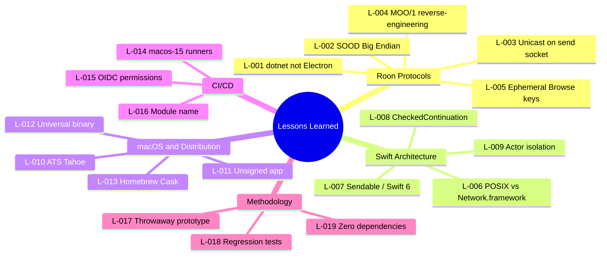

> English | **[Version francaise](LESSONS_LEARNED.md)**

# Lessons Learned

Adapted from the PRINCE2 "Lessons Log". Organized by theme.

---

## Roon Protocols

### L-001: Roon Core is dotnet, not Electron {#l-001}

- **Context**: The initial assumption was that Roon Core used Electron (like many audio apps). Network traffic analysis revealed a dotnet server.
- **Lesson**: Don't assume the tech stack of a third-party product. Analyze network traffic before coding.
- **Impact**: Reoriented the reverse-engineering approach from day one.

### L-002: SOOD encodes port in Big Endian {#l-002}

- **Context**: The SOOD protocol (UDP discovery) encodes the response port in Big Endian in the query packet. No public documentation exists.
- **Lesson**: Always verify endianness of binary fields in proprietary network protocols.
- **Impact**: Several hours of debugging resolved by comparison with a Wireshark capture of the official client.

### L-003: SOOD replies via unicast on the send socket {#l-003}

- **Context**: SOOD responses are sent as unicast to the source address. The multicast listening socket doesn't receive them.
- **Lesson**: Listen on the send socket for unicast replies, not only on the multicast socket.
- **Impact**: ISS-003 — discovery impossible until fix (`c61c94a`).

### L-004: MOO/1 requires full reverse-engineering {#l-004}

- **Context**: The MOO/1 protocol (binary WebSocket) is not documented anywhere. Service names, message format, and registration handshake were reversed from dotnet sources and network traffic.
- **Lesson**: Document each discovery immediately. Reverse-engineering proprietary protocols requires a methodical approach: capture → hypothesis → test → validation.
- **Impact**: ISS-004 — hardcoded service names were incorrect, preventing registration.

### L-005: Browse API keys are ephemeral and session-bound {#l-005}

- **Context**: The `item_key` values returned by the Browse API are only valid for the current WebSocket session. After reconnection, all keys are invalid.
- **Lesson**: Never persist Browse navigation keys. Always re-traverse the hierarchy after reconnection.
- **Impact**: ISS-012 — playlist playback broken after reconnection, resolved by using fresh session keys.

---

## Swift Architecture

### L-006: POSIX sockets vs Network.framework for multicast {#l-006}

- **Context**: Network.framework (NWConnection) requires an Apple-signed multicast entitlement for UDP multicast send/receive. Not available to third-party developers without a special request.
- **Lesson**: For UDP multicast on macOS without Apple signing, use POSIX sockets directly. Network.framework is preferable for TCP/unicast only.
- **Impact**: ISS-001 — SOOD discovery blocked, resolved by complete Network.framework replacement (`dfb29d2`).

### L-007: Sendable and strict concurrency in Swift 6 {#l-007}

- **Context**: Swift 6 enforces strict concurrency checking (Sendable). Closures capturing mutable objects trigger compile errors.
- **Lesson**: Design data models as `Sendable` from the start (structs, enums). Use `@MainActor` for UI state and actors for shared state.
- **Impact**: Significant refactoring when switching to strict concurrency, but zero data races in production.

### L-008: CheckedContinuation for async/callback bridging {#l-008}

- **Context**: WebSocket APIs (URLSessionWebSocketTask) use callbacks. Bridging to async/await requires `CheckedContinuation`.
- **Lesson**: Use `withCheckedContinuation` / `withCheckedThrowingContinuation` to convert callback APIs to async. Be careful to never resume twice.
- **Impact**: Clean, testable WebSocket code without nested callbacks.

### L-009: Actor isolation for shared state {#l-009}

- **Context**: Connection state, subscriptions, and cache are shared across multiple concurrent tasks (UI, network, timers).
- **Lesson**: Isolate shared state in dedicated actors. `@MainActor` for UI state, custom actors for network and cache.
- **Impact**: Elimination of race conditions without explicit locks.

---

## macOS and Distribution

### L-010: ATS blocks local connections on macOS Tahoe {#l-010}

- **Context**: macOS Tahoe 26.3 strengthened App Transport Security (ATS). HTTP/WS connections to localhost are blocked by default, even in dev.
- **Lesson**: Always add an ATS exception for localhost in Info.plist. Test on the latest macOS version before each release.
- **Impact**: ISS-008 — WebSocket connection silently blocked, resolved by adding ATS exception (`a37d78f`).

### L-011: Unsigned app — user workaround required {#l-011}

- **Context**: Without a Developer ID ($99/year), the app is unsigned. macOS Gatekeeper blocks launch by default.
- **Lesson**: Clearly document the installation procedure for unsigned apps. On macOS Sequoia/Tahoe, "right-click > Open" no longer works — users must use `xattr -cr` or go to System Settings > Privacy & Security > Open Anyway. Consider signing if the user base grows.
- **Impact**: Installation friction for new users, mitigated by documentation.

### L-012: Universal binary to support Intel and Apple Silicon {#l-012}

- **Context**: Apple Silicon (M1+) and Intel (x86_64) Macs coexist. An arm64-only binary excludes Intel Macs.
- **Lesson**: Always build universal (`ARCHS="arm64 x86_64"`) for distribution. The size cost is negligible.
- **Impact**: Extended support to all Macs compatible with macOS 15+ (`186a625`).

### L-013: Homebrew Cask simplifies distribution {#l-013}

- **Context**: Manual DMG requires download, mount, drag-and-drop. Homebrew Cask automates everything.
- **Lesson**: Create a Homebrew tap with Cask as soon as the app is stable. Automate updates with a GitHub Actions workflow.
- **Impact**: One-command install (`brew install --cask renesenses/tap/roon-controller`), automatic updates.

---

## CI/CD

### L-014: macos-15 runners are unstable on GitHub Actions {#l-014}

- **Context**: GitHub Actions `macos-15` runners have availability and performance issues. Pre-installed Xcode 16.4 may have bugs.
- **Lesson**: Plan for retries in CI workflows. Specify exact Xcode version with `xcode-select`. Monitor GitHub Actions incidents.
- **Impact**: ISS-010 — CI builds failing intermittently, stabilized with explicit configuration.

### L-015: GitHub Actions permissions for OIDC tokens {#l-015}

- **Context**: The Claude Code action requires `id-token: write` for OIDC authentication. This permission is not included by default.
- **Lesson**: Verify required permissions for each third-party action. Read action documentation before integration.
- **Impact**: ISS-016 — Claude Code workflow failing, resolved by adding permission (`d1b75a5`).

### L-016: Xcode module name with space breaks CI build {#l-016}

- **Context**: The project name "Roon Controller" (with space) generates a module name `Roon_Controller`, incompatible with some test flags.
- **Lesson**: Avoid spaces in Xcode project names, or explicitly configure `PRODUCT_MODULE_NAME` without spaces.
- **Impact**: ISS-010 — CI build errors, resolved by fixing module name (`a587c83`).

---

## Methodology

### L-017: Throwaway prototype accelerates understanding {#l-017}

- **Context**: Day one started with a Node.js backend (PR #1) to explore Roon protocols, before reimplementing everything in native Swift.
- **Lesson**: A throwaway prototype in a fast language (JS/Python) helps understand a proprietary protocol before implementing it properly. The investment pays off through reduced errors.
- **Impact**: The Node.js backend was removed within 24 hours, but the knowledge gained enabled a solid Swift implementation.

### L-018: Systematic regression tests {#l-018}

- **Context**: Every bug fix (SOOD, MOO, queue, browse) was covered by a regression test to prevent regressions.
- **Lesson**: Write a regression test before or immediately after each fix. The test must fail without the fix and pass with it.
- **Impact**: 203 tests total, zero regressions observed since systematic adoption.

### L-019: Zero external dependencies = zero supply chain issues {#l-019}

- **Context**: The app uses no external dependencies (no SPM, CocoaPods, or Carthage). Everything is implemented with native Apple frameworks.
- **Lesson**: For a moderately sized app, Apple frameworks (Foundation, SwiftUI, URLSession) cover 100% of needs. Avoiding dependencies reduces attack surface, simplifies builds, and guarantees compatibility with new macOS versions.
- **Impact**: Fast builds, zero dependency conflicts, zero third-party CVEs to monitor.
