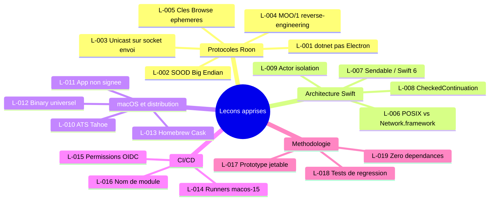

> **[English version](LESSONS_LEARNED.en.md)** | Francais

# Lecons apprises

Adapte du "Lessons Log" PRINCE2. Organise par theme.

---

## Protocoles Roon

### L-001 : Roon Core est en dotnet, pas Electron {#l-001}

- **Contexte** : L'hypothese initiale etait que le Roon Core utilisait Electron (comme beaucoup d'apps audio). L'analyse du trafic reseau a revele un serveur dotnet.
- **Lecon** : Ne pas supposer la stack technique d'un produit tiers. Analyser le trafic reseau avant de coder.
- **Impact** : Reorientation de l'approche de reverse-engineering des le premier jour.

### L-002 : SOOD encode le port en Big Endian {#l-002}

- **Contexte** : Le protocole SOOD (decouverte UDP) encode le port de reponse en Big Endian dans le paquet query. Aucune documentation publique.
- **Lecon** : Toujours verifier l'endianness des champs binaires dans les protocoles reseau proprietaires.
- **Impact** : Plusieurs heures de debug resolues par comparaison avec une capture Wireshark du client officiel.

### L-003 : SOOD repond en unicast sur le socket d'envoi {#l-003}

- **Contexte** : Les reponses SOOD sont envoyees en unicast a l'adresse source. Le socket d'ecoute multicast ne les recoit pas.
- **Lecon** : Ecouter sur le socket d'envoi pour les reponses unicast, pas uniquement sur le socket multicast.
- **Impact** : ISS-003 — decouverte impossible jusqu'a la correction (`c61c94a`).

### L-004 : MOO/1 necessite un reverse-engineering complet {#l-004}

- **Contexte** : Le protocole MOO/1 (WebSocket binaire) n'est documente nulle part. Les noms de services, le format des messages et le handshake d'enregistrement ont ete reverses depuis les sources dotnet et le trafic reseau.
- **Lecon** : Documenter chaque decouverte immediatement. Le reverse-engineering de protocoles proprietaires demande une approche methodique : capture → hypothese → test → validation.
- **Impact** : ISS-004 — les noms de services codes en dur etaient incorrects, empechant la registration.

### L-005 : Les cles Browse API sont ephemeres et liees a la session {#l-005}

- **Contexte** : Les `item_key` retournees par le Browse API sont valides uniquement pour la session WebSocket courante. Apres reconnexion, toutes les cles sont invalides.
- **Lecon** : Ne jamais persister les cles de navigation Browse. Toujours re-parcourir la hierarchie apres reconnexion.
- **Impact** : ISS-012 — lecture des playlists cassee apres reconnexion, resolu en utilisant des cles de session fraiche.

---

## Architecture Swift

### L-006 : POSIX sockets vs Network.framework pour le multicast {#l-006}

- **Contexte** : Network.framework (NWConnection) necessite un entitlement multicast signe par Apple pour l'envoi/reception UDP multicast. Non disponible pour les developpeurs tiers sans demande speciale.
- **Lecon** : Pour le multicast UDP sur macOS sans signature Apple, utiliser directement les sockets POSIX. Network.framework est preferable pour TCP/unicast uniquement.
- **Impact** : ISS-001 — decouverte SOOD bloquee, resolue par remplacement complet de Network.framework (`dfb29d2`).

### L-007 : Sendable et concurrence stricte en Swift 6 {#l-007}

- **Contexte** : Swift 6 impose la verification stricte de la concurrence (Sendable). Les closures capturant des objets mutables declenchent des erreurs de compilation.
- **Lecon** : Concevoir les modeles de donnees comme `Sendable` des le depart (structs, enums). Utiliser `@MainActor` pour l'etat UI et les actors pour l'etat partage.
- **Impact** : Refactoring significatif lors du passage a la concurrence stricte, mais zero data race en production.

### L-008 : CheckedContinuation pour le bridge async/callback {#l-008}

- **Contexte** : Les APIs WebSocket (URLSessionWebSocketTask) utilisent des callbacks. Le bridge vers async/await necessite `CheckedContinuation`.
- **Lecon** : Utiliser `withCheckedContinuation` / `withCheckedThrowingContinuation` pour convertir les APIs callback en async. Attention a ne jamais resumer deux fois.
- **Impact** : Code WebSocket propre et testable, sans callbacks imbriques.

### L-009 : Actor isolation pour l'etat partage {#l-009}

- **Contexte** : L'etat de connexion, les subscriptions et le cache sont partages entre plusieurs taches concurrentes (UI, reseau, timers).
- **Lecon** : Isoler l'etat partage dans des actors dedies. `@MainActor` pour l'etat UI, actors custom pour le reseau et le cache.
- **Impact** : Elimination des races conditions sans verrous explicites.

---

## macOS et distribution

### L-010 : ATS bloque les connexions locales sur macOS Tahoe {#l-010}

- **Contexte** : macOS Tahoe 26.3 a renforce App Transport Security (ATS). Les connexions HTTP/WS vers localhost sont bloquees par defaut, meme en dev.
- **Lecon** : Toujours ajouter une exception ATS pour localhost dans Info.plist. Tester sur la derniere version de macOS avant chaque release.
- **Impact** : ISS-008 — connexion WebSocket silencieusement bloquee, resolue par ajout d'exception ATS (`a37d78f`).

### L-011 : App non signee — contournement utilisateur necessaire {#l-011}

- **Contexte** : Sans Developer ID (99$/an), l'app n'est pas signee. macOS Gatekeeper bloque le lancement par defaut.
- **Lecon** : Documenter clairement la procedure "clic droit > Ouvrir" pour les utilisateurs. Envisager la signature si le nombre d'utilisateurs augmente.
- **Impact** : Friction a l'installation pour les nouveaux utilisateurs, attenuee par la documentation.

### L-012 : Binary universel pour supporter Intel et Apple Silicon {#l-012}

- **Contexte** : Les Mac Apple Silicon (M1+) et Intel (x86_64) coexistent. Un binary arm64 seul exclut les Mac Intel.
- **Lecon** : Toujours builder en universel (`ARCHS="arm64 x86_64"`) pour la distribution. Le cout en taille est negligeable.
- **Impact** : Support elargi a tous les Mac compatibles macOS 15+ (`186a625`).

### L-013 : Homebrew Cask simplifie la distribution {#l-013}

- **Contexte** : Le DMG manuel necessite telechargement, montage, glisser-deposer. Homebrew Cask automatise tout.
- **Lecon** : Creer un tap Homebrew avec Cask des que l'app est stable. Automatiser la mise a jour avec un workflow GitHub Actions.
- **Impact** : Installation en une commande (`brew install --cask renesenses/tap/roon-controller`), mise a jour automatique.

---

## CI/CD

### L-014 : Runners macos-15 instables sur GitHub Actions {#l-014}

- **Contexte** : Les runners `macos-15` GitHub Actions ont des problemes de disponibilite et de performance. Xcode 16.4 pre-installe peut avoir des bugs.
- **Lecon** : Prevoir des retries dans les workflows CI. Specifier la version exacte de Xcode avec `xcode-select`. Monitorer les incidents GitHub Actions.
- **Impact** : ISS-010 — builds CI echouant de maniere intermittente, stabilises par configuration explicite.

### L-015 : Permissions GitHub Actions pour les tokens OIDC {#l-015}

- **Contexte** : L'action Claude Code necessite `id-token: write` pour l'authentification OIDC. Cette permission n'est pas incluse par defaut.
- **Lecon** : Verifier les permissions requises par chaque action tierce. Lire la documentation des actions avant integration.
- **Impact** : ISS-016 — workflow Claude Code echouant, resolu par ajout de permission (`d1b75a5`).

### L-016 : Nom de module Xcode avec espace casse le build CI {#l-016}

- **Contexte** : Le nom du projet "Roon Controller" (avec espace) genere un nom de module `Roon_Controller`, incompatible avec certains flags de test.
- **Lecon** : Eviter les espaces dans les noms de projet Xcode, ou configurer explicitement `PRODUCT_MODULE_NAME` sans espace.
- **Impact** : ISS-010 — erreurs de build CI, resolues par correction du nom de module (`a587c83`).

---

## Methodologie

### L-017 : Le prototype jetable accelere la comprehension {#l-017}

- **Contexte** : Le premier jour a commence par un backend Node.js (PR #1) pour explorer les protocoles Roon, avant de tout reimplementer en Swift natif.
- **Lecon** : Un prototype jetable dans un langage rapide (JS/Python) permet de comprendre un protocole proprietaire avant de l'implementer proprement. L'investissement est rentabilise par la reduction des erreurs.
- **Impact** : Le backend Node.js a ete supprime en 24h, mais les connaissances acquises ont permis une implementation Swift solide.

### L-018 : Tests de regression systematiques {#l-018}

- **Contexte** : Chaque bug corrige (SOOD, MOO, queue, browse) a ete couvert par un test de regression pour eviter les regressions.
- **Lecon** : Ecrire un test de regression avant ou immediatement apres chaque fix. Le test doit echouer sans le fix et passer avec.
- **Impact** : 203 tests au total, zero regression constatee depuis la mise en place systematique.

### L-019 : Zero dependances externes = zero problemes de supply chain {#l-019}

- **Contexte** : L'app n'utilise aucune dependance externe (pas de SPM, CocoaPods ou Carthage). Tout est implemente avec les frameworks Apple natifs.
- **Lecon** : Pour une app de taille moderee, les frameworks Apple (Foundation, SwiftUI, URLSession) couvrent 100% des besoins. Eviter les dependances reduit la surface d'attaque, simplifie le build et garantit la compatibilite avec les nouvelles versions de macOS.
- **Impact** : Build rapide, zero conflit de dependances, zero CVE tiers a surveiller.
