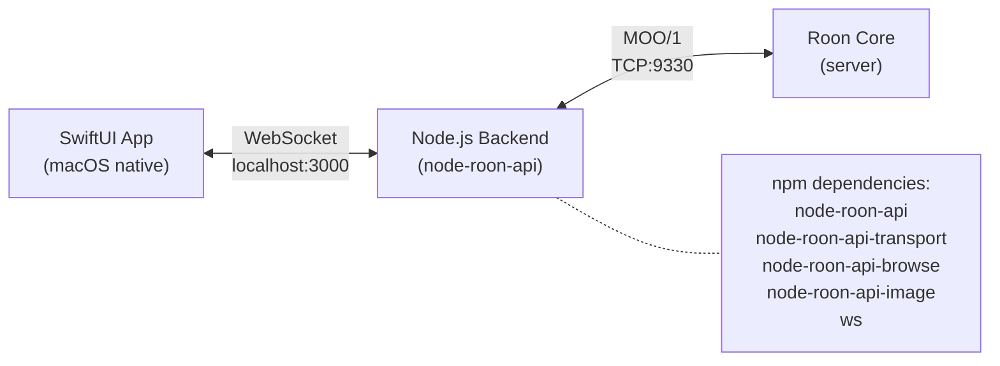
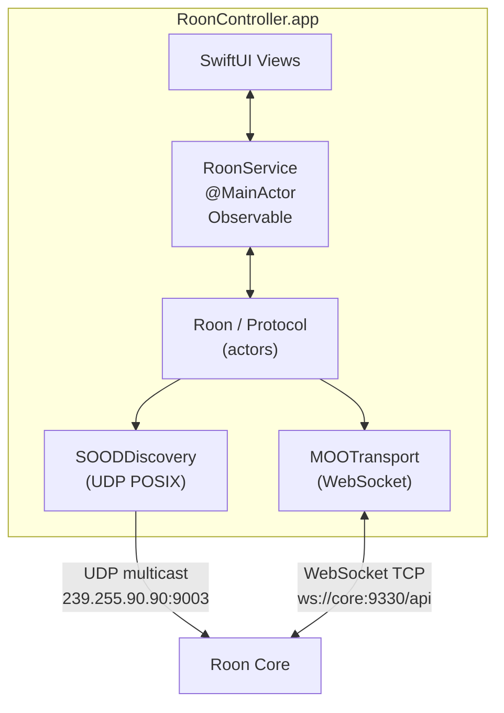
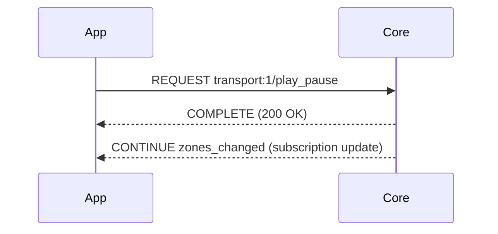
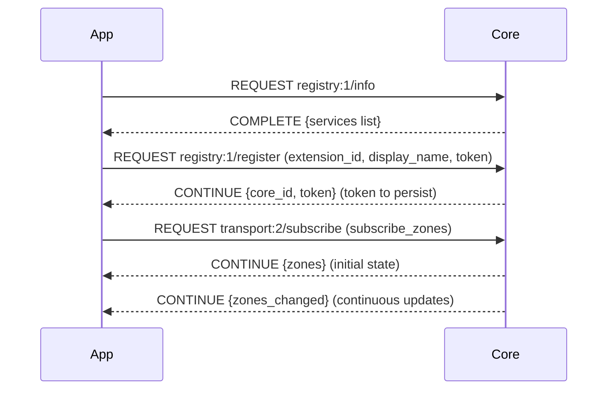
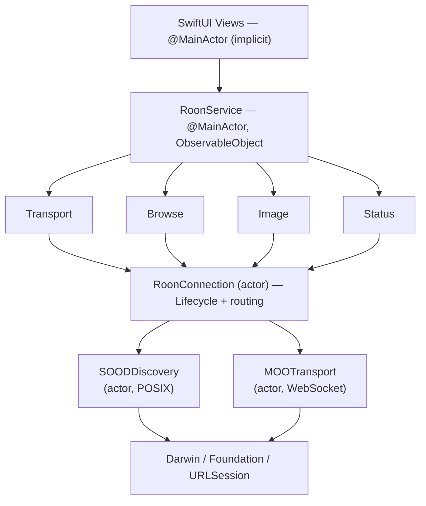
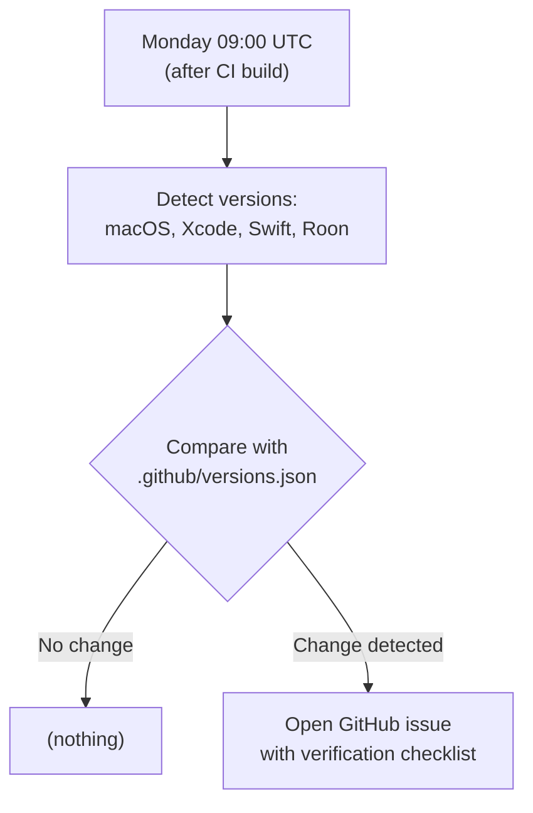
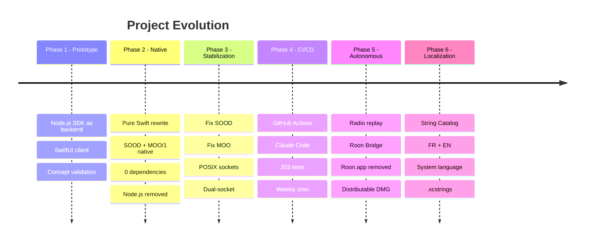

# Roon Controller: A Native macOS App to Control Roon

Technical presentation — February 2026

---

## 1. The Need

### Roon: A Closed Audio Ecosystem

[Roon](https://roon.app) is a high-end audio server for audiophiles. It manages a music library, streaming (Tidal, Qobuz), and drives DACs/endpoints on the network. Roon's architecture relies on a **Roon Core** (server) and **control clients** (remotes).

### The Problem: No Native macOS Client

Roon provides an official client... but it's a **dotnet application**. On macOS:
- ~500 MB disk space
- High memory consumption (~300-400 MB RAM)
- Slow startup
- Interface that doesn't follow macOS conventions

### The Goal

Build a **lightweight, native Roon controller** in SwiftUI:
- Instant startup
- Minimal memory footprint
- Native macOS interface
- Zero external dependencies
- Bilingual UI (French/English) following system language

### The Technical Challenge

The Roon protocols (**SOOD** for discovery, **MOO/1** for communication) are **not publicly documented**. The only official SDK is in Node.js. We chose to reverse-engineer and reimplement the protocols in native Swift, eliminating any dependency on Node.js.

---

## 2. Context: The Initial Prototype (Node.js + SwiftUI)

### The Pragmatic Initial Choice

Before reimplementing the protocols, an initial prototype used the official Node.js SDK (`node-roon-api`) as a backend:



### How It Worked

1. The Node.js backend starts, discovers the Roon Core via SOOD
2. It opens a MOO/1 connection to the Core and registers as an extension
3. The SwiftUI app connects to the backend via WebSocket on `localhost:3000`
4. The backend acts as a relay: translates SwiftUI commands into Roon API calls

### What Worked

This architecture allowed rapid prototyping of all features:
- Automatic Core discovery
- Playback controls (play/pause, next, prev, seek)
- Library browsing (Browse API)
- Queue and playback history
- Album artwork display

### Discovered Limitations

| Problem | Impact |
|---------|--------|
| **Dual process** | User must launch Node.js + the SwiftUI app |
| **Added latency** | Every command goes App -> Node -> Core -> Node -> App |
| **Single point of failure** | If Node.js crashes, the app loses connection |
| **npm dependencies** | 5 npm packages, potentially fragile |
| **Complex deployment** | Requires Node.js installed on the machine |
| **No App Store distribution** | Impossible to bundle a Node.js runtime |

This prototype validated the concept. But for a real macOS app, the backend had to go. The Node.js code has since been entirely removed from the project.

---

## 3. Architecture v2: Native Swift

### The Decision: Reimplement Everything

Rather than seeking a compromise (embed Node.js, use a C bridge...), the decision was radical: **reimplement the SOOD and MOO/1 protocols in pure Swift**.

### The New Architecture



### What Changed

| Aspect | v1 (Node.js) | v2 (Native Swift) |
|--------|-------------|-------------------|
| Processes | 2 (Node + App) | 1 (App only) |
| Dependencies | 5 npm packages | 0 |
| Latency | App -> Node -> Core | App -> Core |
| Deployment | Node.js required | Just the app |
| Distribution | App Store impossible | Possible |
| Size | ~100 MB (with node_modules) | ~5 MB |

---

## 4. The Roon Protocols

### SOOD — Service-Oriented Object Discovery

SOOD is Roon's discovery protocol. It's a proprietary, undocumented UDP multicast protocol.

**How it works**:
1. The client sends a **Query** via UDP multicast on `239.255.90.90:9003`
2. The Roon Core responds with a **Reply** containing its address and HTTP port
3. The client can then connect via WebSocket

**Binary packet format**:

```
Offset  Size    Content
------  ------  ----------------------------
0       4       Magic: "SOOD" (0x53 0x4F 0x4F 0x44)
4       1       Version: 0x02
5       1       Type: 0x51 (Query) / 0x52 (Reply)
6       N       Encoded properties:
                  - 1 byte: key length
                  - N bytes: key (ASCII)
                  - 2 bytes: value length (Big Endian)
                  - N bytes: value (UTF-8)
```

**Query properties**:
- `query_service_id`: `"00720724-5143-4a9b-abac-0e50cba674bb"` (fixed Roon service ID)
- `_tid`: unique UUID to correlate request/response

**Reply properties**:
- `name`: Core name (e.g. "My Roon Core")
- `display_version`: version (e.g. "2.0")
- `http_port`: HTTP/WebSocket port (usually `9330`)
- `tid`: UUID of the original Query

### MOO/1 — Message-Oriented Objects

MOO/1 is the communication protocol between client and Core. It operates over WebSocket in binary mode.

**Message format**:

```
MOO/1 {VERB} {service:version/method}
Request-Id: {id}
Content-Type: application/json

{JSON body}
```

**The three verbs**:

| Verb | Direction | Usage |
|------|-----------|-------|
| `REQUEST` | Bidirectional | Send a request (app -> Core or Core -> app) |
| `COMPLETE` | Response | Final response to a REQUEST |
| `CONTINUE` | Response | Partial response (subscription streaming) |

**Typical flow — playback control**:



**Registration flow**:



### Reverse Engineering

Since these protocols are not documented, they were reverse-engineered from the Node.js SDK source code (`node-roon-api`). Critical points:
- SOOD property encoding (key length on 1 byte, value length on 2 bytes Big Endian)
- The header/body separator in MOO/1 (`\n\n`)
- The exact registration payload format (required/provided service names)
- Dynamic service names (e.g. `com.roonlabs.transport:2` may vary)

---

## 5. Problems Encountered and Solutions

### 5.1 Network.framework vs POSIX Sockets

**Problem**: The initial SOOD implementation used `Network.framework` (NWConnection, NWListener). But receiving UDP multicast requires the `com.apple.developer.networking.multicast` entitlement, which requires a formal request to Apple and a paid Developer account.

**Solution**: Replace Network.framework with **POSIX sockets** (Berkeley sockets via Darwin). BSD sockets don't need a multicast entitlement. The implementation uses `socket()`, `bind()`, `setsockopt()` with `IP_ADD_MEMBERSHIP`, and `recvfrom()`.

```swift
// Join the multicast group on all interfaces
var mreq = ip_mreq()
mreq.imr_multiaddr.s_addr = inet_addr("239.255.90.90")
mreq.imr_interface.s_addr = inet_addr(iface.address)
setsockopt(recvFd, IPPROTO_IP, IP_ADD_MEMBERSHIP, &mreq, socklen_t(MemoryLayout.size(ofValue: mreq)))
```

### 5.2 SOOD Packet Format

**Problem**: The first SOOD packets sent were not recognized by the Core. Value lengths were encoded in Little Endian while the protocol expects **Big Endian**.

**Solution**: Use `UInt16(value.count).bigEndian` to encode lengths. A subtle error since short keys (< 256 bytes) work the same in LE and BE.

### 5.3 SOOD Unicast Replies

**Problem**: After fixing the format, the Core received queries but replies were never received. The Core replies in **unicast** to the source port of the query, not on the multicast port 9003.

**Solution**: Listen on **two sockets** simultaneously:
1. The receive socket (port 9003, multicast) — for broadcast announcements
2. The send socket (ephemeral port) — for unicast replies from the Core

```swift
// Two receive loops in parallel
startReceiveLoop(on: recvFd, label: "multicast")  // port 9003
startReceiveLoop(on: sendFd, label: "unicast")     // ephemeral port
```

### 5.4 MOO Registration

**Problem**: Registration with the Core failed silently. The Core didn't return a token.

**Solution**: Two fixes:
1. Service names (`required_services`, `provided_services`) must be dynamically extracted from the `registry:1/info` response, not hardcoded
2. The expected format is `com.roonlabs.transport:2` (with full namespace), not just `transport:2`

### 5.5 Swift 6 Strict Concurrency

**Problem**: Swift 6 enables `strict concurrency checking` by default. Every data transfer between actors must be `Sendable`. `[String: Any]` dictionaries are not Sendable.

**Applied solutions**:

| Pattern | Usage |
|---------|-------|
| `actor` | Isolation of network components (SOODDiscovery, MOOTransport, RoonConnection) |
| `@MainActor` | RoonService — UI updates from the main thread |
| `@Sendable` closures | Callbacks between actors (onZonesData, onMessage) |
| `@unchecked Sendable` | Types wrapping `[String: Any]` (BrowseResponse, LoadResponse) |
| `NSLock` + `@unchecked Sendable` | Atomic ID generator (MOORequestIdGenerator) |
| `Data` passing | Callbacks pass raw `Data` (Sendable) rather than non-Sendable structs |

### 5.6 CI: Xcode 16.4 vs Local Xcode 16.x

**Problem**: GitHub `macos-15` runners have Xcode 16.4 beta while development is done on Xcode 16.2. Some warnings become errors with newer versions.

**Solution**: The weekly cron (Monday 8am UTC) detects these regressions before they block development. CI uses the runner's default Xcode without pinning to a specific version.

---

## 6. Swift 6 Architecture

### Protocol Stack



### The 4 Actors

| Actor | Responsibility | Communication |
|-------|---------------|---------------|
| `SOODDiscovery` | UDP multicast discovery | `onCoreDiscovered` callback |
| `MOOTransport` | Binary WebSocket | `onMessage`, `onStateChange` callbacks |
| `RoonConnection` | Full lifecycle | `onZonesData`, `onQueueData`, `onStateChange` callbacks |
| `LocalImageServer` | HTTP image server :9150 | Direct HTTP requests |

### Async/Await Pattern with CheckedContinuation

The central pattern for MOO/1 requests: transform a WebSocket callback into an async/await call:

```swift
// In RoonConnection (actor)
func sendRequestData(name: String, bodyData: Data?) async throws -> MOOMessage {
    let requestId = idGenerator.next()
    let data = MOOMessage.request(name: name, requestId: requestId, body: bodyData)

    return try await withCheckedThrowingContinuation { continuation in
        pendingRequests[requestId] = continuation

        Task { try await transport.send(data) }

        // 30s timeout
        Task {
            try await Task.sleep(nanoseconds: 30_000_000_000)
            if let cont = pendingRequests.removeValue(forKey: requestId) {
                cont.resume(throwing: MOOTransportError.timeout)
            }
        }
    }
}
```

### Reconnection with Exponential Backoff

```swift
private func scheduleReconnect() {
    let delay = min(pow(2.0, Double(reconnectAttempt)), 30.0)  // 1, 2, 4, 8, 16, 30, 30...
    reconnectAttempt += 1
    Task {
        try await Task.sleep(nanoseconds: UInt64(delay * 1_000_000_000))
        if shouldReconnect {
            await connect()
        }
    }
}
```

---

## 7. Tests and CI/CD

### 203 Unit Tests

Tests cover three levels:

**Models** (RoonModelsTests — 30 tests):
- JSON decoding of all types (Zone, QueueItem, BrowseItem, NowPlaying, VolumeInfo, ZoneSettings)
- WebSocket types (WSStateMessage, WSZonesMessage, WSQueueMessage, WSErrorMessage)
- `InputPrompt` decoded as object (not as string — fixed bug)
- Zone equality (includes `now_playing`, excludes `seek_position`)
- ISO 8601 date encoding/decoding for history
- BrowseResult/BrowseList, RoonState enum, edge cases

**Services** (RoonServiceTests — 100 tests):
- Browse duplicate guard (`pendingBrowseKey`)
- Navigation reset (back, home)
- Playback history deduplication
- Image URL generation
- Zone selection clears queue
- Radio detection via `is_seek_allowed` and `isRadio` flag
- Station name resolution (fallback to `title` when `album` is empty)
- Backward-compatible JSON decoding (history without `isRadio` field)
- `subscribe_queue` body format (regression `zone_or_output_id`)
- Image key cache (resolvedImageKey, disk persistence, queue fallback)
- Registration (edge cases, statusBody, version)

**Protocol** (in RoonServiceTests):
- MOO/1 message parsing (REQUEST, COMPLETE, CONTINUE)
- MOO/1 message construction
- Parse/build round-trip, large payloads
- Headers with colons, unknown verbs, wrong version
- isSuccess, isJSON, decodeBody<T>
- Concurrent ID generator atomicity (1000 IDs test)
- RoonImageCache (store/retrieve, clearAll, cacheKey format)

### GitHub Actions

**CI Workflow** (`ci.yml`):
```yaml
on:
  push: { branches: [main] }
  pull_request: { branches: [main] }
  schedule:
    - cron: '0 8 * * 1'  # Monday 8am UTC

runs-on: macos-15
steps:
  - xcodebuild build -scheme RoonController
  - xcodebuild test -scheme RoonControllerTests
```

**Claude Code Workflow** (`claude.yml`):
- Automatic AI review on each PR
- Focus: Swift best practices, SOOD/MOO regressions, thread safety
- Trigger: PR open/sync, `@claude` mention in a comment

### Why a Weekly Cron?

GitHub `macos-15` runners are regularly updated with new Xcode versions. A build that passes today may break next week if Apple introduces new warnings. The Monday morning cron detects these regressions proactively.

### Version Watch (`version-watch.yml`)

A third workflow monitors environment version changes:



This addresses a blind spot in classic CI: the build may pass while the environment has changed (new macOS minor version, Roon update that modifies protocols). The watch alerts proactively.

---

## 8. Key Metrics

| Metric | Value |
|--------|-------|
| Lines of Swift | ~6,000 |
| Swift files | 27 |
| Unit tests | 203 |
| External dependencies | **0** |
| Commits | 31 |
| Swift actors | 4 |
| @MainActor classes | 1 (RoonService) |
| App size | ~5 MB |
| async/await calls | ~128 occurrences |
| UI languages | 2 (French, English) |
| CI workflows | 3 (build + Claude + version-watch) |
| Audio stack | Roon Controller + Roon Bridge (without Roon.app) |

### Evolution in 6 Phases



### What Was Built

- **Native SOOD**: UDP multicast discovery with POSIX sockets, multi-interface, dual-socket
- **Native MOO/1**: complete binary WebSocket protocol with 3 verbs
- **Registration**: full handshake with token persistence
- **Transport**: play, pause, next, prev, seek, shuffle, repeat, radio
- **Browse**: hierarchical library navigation, search, pagination
- **Queue**: real-time display, play-from-here
- **History**: automatic tracking, deduplication, JSON persistence, live radio replay via `internet_radio`
- **Images**: local HTTP server :9150, LRU cache, async loading
- **Reconnection**: exponential backoff, disconnection detection
- **Localization**: String Catalog (.xcstrings) with French and English, follows system language

---

## Conclusion

This project demonstrates that it's possible to build a complete, performant Roon client without any external dependencies, by reimplementing undocumented proprietary protocols in pure Swift. The architecture based on Swift 6 actors guarantees thread-safety at compile time, and the CI/CD pipeline with AI review ensures continuous code quality.

Reverse-engineering the SOOD and MOO/1 protocols made it possible to eliminate all external dependencies, including the initial Node.js prototype, while improving the application's performance, reliability, and distributability.

Combined with **Roon Bridge** (free audio daemon), the app completely replaces the official Roon.app client (~500 MB) with a lightweight, native solution: **Roon Controller** (~5 MB) for control and **Roon Bridge** (~37 MB) for audio output.
