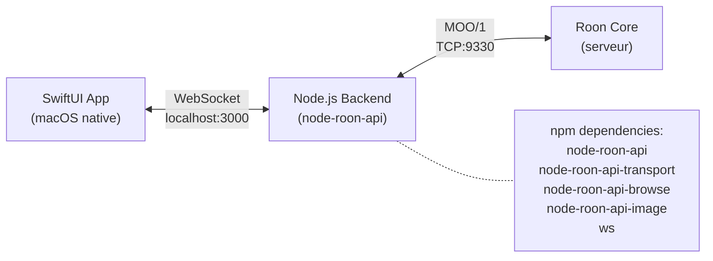
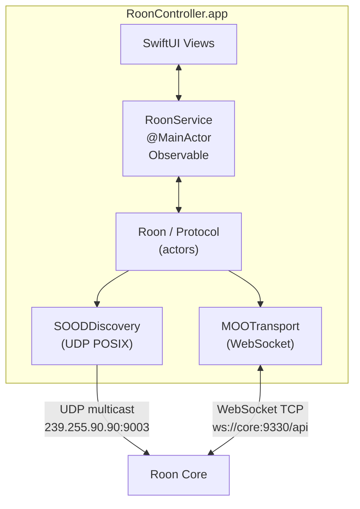
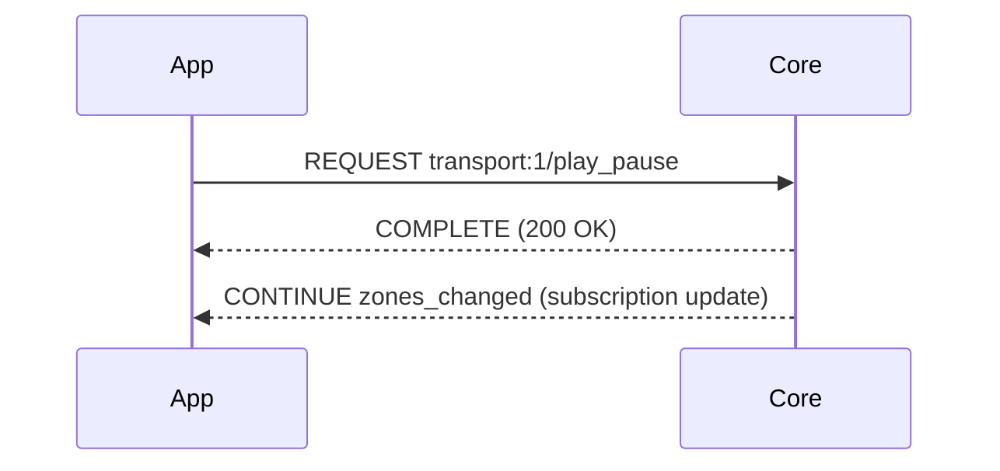
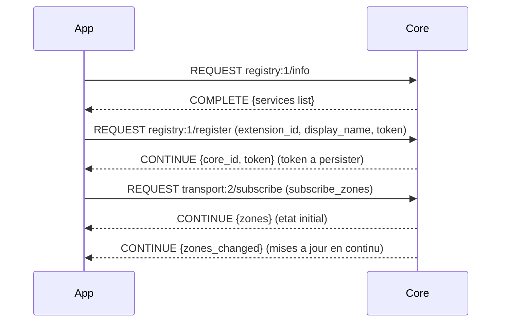
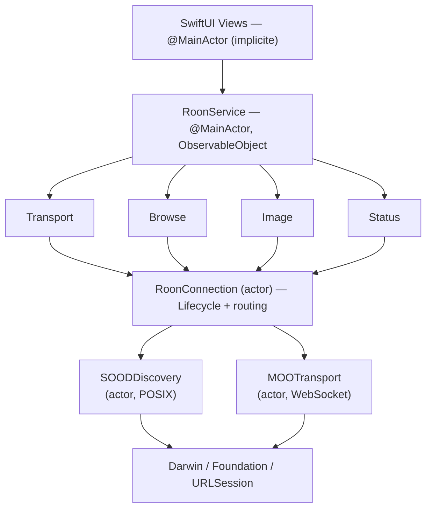
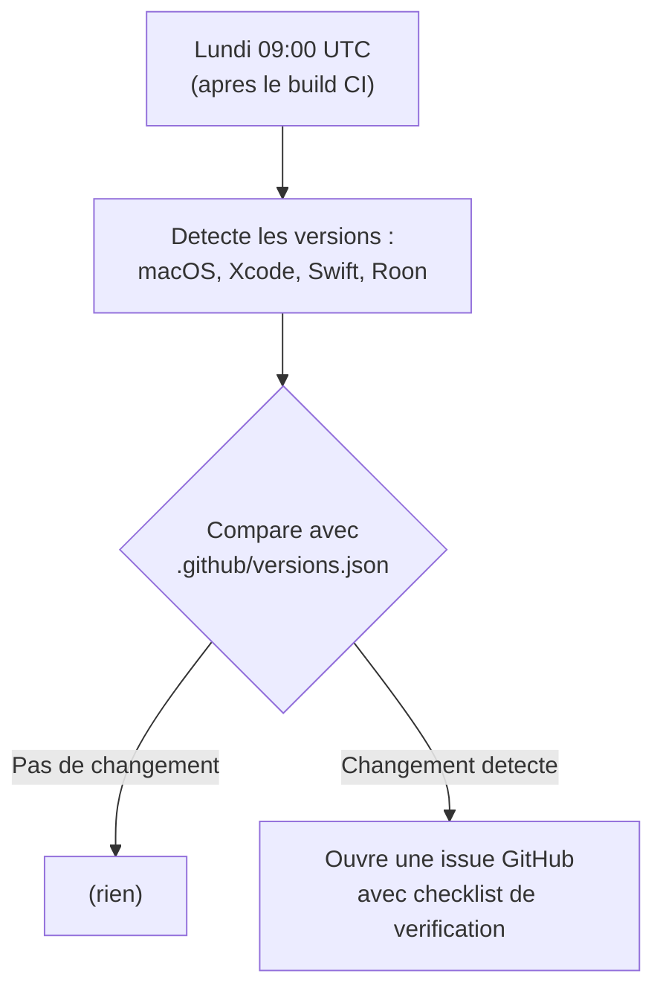
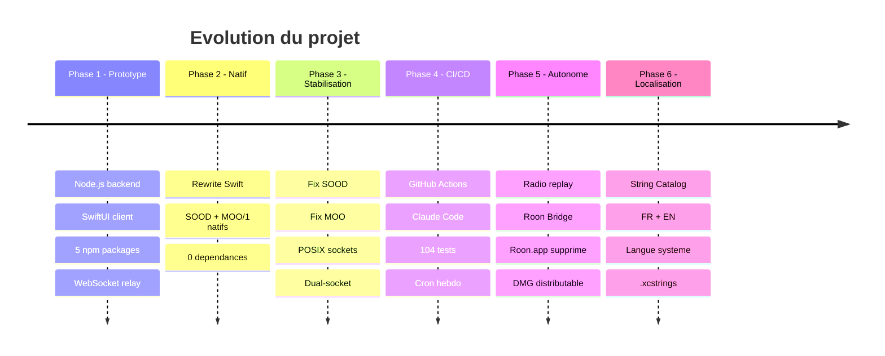

> **[English version](PRESENTATION.en.md)** | Francais

# Roon Controller : d'un prototype Node.js a une app macOS native

Presentation technique du projet — Fevrier 2026

---

## 1. Le besoin

### Roon : un ecosysteme audio ferme

[Roon](https://roon.app) est un serveur audio haut de gamme pour audiophiles. Il gere une bibliotheque musicale, le streaming (Tidal, Qobat), et pilote des DAC/endpoints sur le reseau. L'architecture Roon repose sur un **Roon Core** (serveur) et des **clients de controle** (telecommandes).

### Le probleme : pas de client macOS natif

Roon fournit un client officiel... mais c'est une **application Electron**. Sur macOS :
- ~500 Mo d'espace disque
- Consommation memoire elevee (~300-400 Mo RAM)
- Demarrage lent
- Interface qui ne respecte pas les conventions macOS

### L'objectif

Construire un **controleur Roon leger et natif** en SwiftUI :
- Demarrage instantane
- Empreinte memoire minimale
- Interface macOS native
- Zero dependances externes
- Interface bilingue (francais/anglais) suivant la langue du systeme

### Le defi technique

Les protocoles Roon (**SOOD** pour la decouverte, **MOO/1** pour la communication) ne sont **pas documentes publiquement**. Le seul SDK officiel est en Node.js. Il faut donc soit utiliser ce SDK comme backend, soit faire du reverse-engineering pour reimplementer les protocoles.

---

## 2. Architecture v1 : Node.js + SwiftUI

### Le choix initial pragmatique

Le SDK officiel Roon etant en Node.js (`node-roon-api`), la premiere approche a ete de l'utiliser comme backend :



### Comment ca marchait

1. Le backend Node.js demarre, decouvre le Roon Core via SOOD
2. Il ouvre une connexion MOO/1 vers le Core et s'enregistre comme extension
3. L'app SwiftUI se connecte au backend via WebSocket sur `localhost:3000`
4. Le backend fait le relais : traduit les commandes SwiftUI en appels Roon API

### Ce qui fonctionnait

Cette architecture a permis de prototyper rapidement toutes les fonctionnalites :
- Decouverte automatique du Core
- Controles de lecture (play/pause, next, prev, seek)
- Navigation dans la bibliotheque (Browse API)
- File d'attente et historique de lecture
- Affichage des pochettes d'albums

### Les limitations decouvertes

| Probleme | Impact |
|----------|--------|
| **Double processus** | L'utilisateur doit lancer Node.js + l'app SwiftUI |
| **Latence ajoutee** | Chaque commande fait App → Node → Core → Node → App |
| **Point de defaillance unique** | Si Node.js crash, l'app perd la connexion |
| **Dependances npm** | 5 packages npm, potentiellement fragiles |
| **Deploiement complexe** | Necessite Node.js installe sur la machine |
| **Pas de distribution App Store** | Impossible de bundler un runtime Node.js |

La v1 a valide le concept. Mais pour une vraie app macOS, il fallait eliminer le backend.

---

## 3. Architecture v2 : Swift natif

### La decision : tout reimplementer

Plutot que de chercher un compromis (embarquer Node.js, utiliser un bridge C...), la decision a ete radicale : **reimplementer les protocoles SOOD et MOO/1 en Swift pur**.

### La nouvelle architecture



### Ce que ca change

| Aspect | v1 (Node.js) | v2 (Swift natif) |
|--------|-------------|-----------------|
| Processus | 2 (Node + App) | 1 (App seule) |
| Dependances | 5 packages npm | 0 |
| Latence | App → Node → Core | App → Core |
| Deploiement | Node.js requis | Juste l'app |
| Distribution | Impossible App Store | Possible |
| Taille | ~100 Mo (avec node_modules) | ~5 Mo |

---

## 4. Les protocoles Roon

### SOOD — Service-Oriented Object Discovery

SOOD est le protocole de decouverte de Roon. C'est un protocole UDP multicast proprietaire, non documente.

**Fonctionnement** :
1. Le client envoie un **Query** en UDP multicast sur `239.255.90.90:9003`
2. Le Roon Core repond avec un **Reply** contenant son adresse et son port HTTP
3. Le client peut alors se connecter via WebSocket

**Format binaire des paquets** :

```
Offset  Taille  Contenu
──────  ──────  ────────────────────────────
0       4       Magic: "SOOD" (0x53 0x4F 0x4F 0x44)
4       1       Version: 0x02
5       1       Type: 0x51 (Query) / 0x52 (Reply)
6       N       Proprietes encodees:
                  - 1 octet : longueur de la cle
                  - N octets : cle (ASCII)
                  - 2 octets : longueur de la valeur (Big Endian)
                  - N octets : valeur (UTF-8)
```

**Proprietes d'un Query** :
- `query_service_id` : `"00720724-5143-4a9b-abac-0e50cba674bb"` (ID fixe du service Roon)
- `_tid` : UUID unique pour corréler requete/reponse

**Proprietes d'un Reply** :
- `name` : nom du Core (ex. "Mon Roon Core")
- `display_version` : version (ex. "2.0")
- `http_port` : port HTTP/WebSocket (generalement `9330`)
- `tid` : UUID du Query original

### MOO/1 — Message-Oriented Objects

MOO/1 est le protocole de communication entre le client et le Core. Il fonctionne sur WebSocket en mode binaire.

**Format des messages** :

```
MOO/1 {VERB} {service:version/method}
Request-Id: {id}
Content-Type: application/json

{JSON body}
```

**Les trois verbes** :

| Verbe | Direction | Usage |
|-------|-----------|-------|
| `REQUEST` | Bidirectionnel | Envoyer une requete (app → Core ou Core → app) |
| `COMPLETE` | Reponse | Reponse finale a un REQUEST |
| `CONTINUE` | Reponse | Reponse partielle (subscription streaming) |

**Flux typique — controle de lecture** :



**Flux d'enregistrement** :



### Reverse-engineering

Ces protocoles n'etant pas documentes, ils ont ete reverses a partir du code source du SDK Node.js (`node-roon-api`). Les points critiques :
- L'encodage des proprietes SOOD (longueur cle sur 1 octet, longueur valeur sur 2 octets Big Endian)
- Le separateur headers/body dans MOO/1 (`\n\n`)
- Le format exact du payload d'enregistrement (noms des services requis/fournis)
- Les noms dynamiques des services (ex. `com.roonlabs.transport:2` peut varier)

---

## 5. Problemes rencontres et solutions

### 5.1 Network.framework vs POSIX sockets

**Probleme** : La premiere implementation SOOD utilisait `Network.framework` (NWConnection, NWListener). Mais la reception multicast UDP necessite l'entitlement `com.apple.developer.networking.multicast`, qui requiert une demande formelle a Apple et un compte Developer payant.

**Solution** : Remplacer Network.framework par des **sockets POSIX** (Berkeley sockets via Darwin). Les sockets BSD n'ont pas besoin d'entitlement multicast. L'implementation utilise `socket()`, `bind()`, `setsockopt()` avec `IP_ADD_MEMBERSHIP`, et `recvfrom()`.

```swift
// Joindre le groupe multicast sur toutes les interfaces
var mreq = ip_mreq()
mreq.imr_multiaddr.s_addr = inet_addr("239.255.90.90")
mreq.imr_interface.s_addr = inet_addr(iface.address)
setsockopt(recvFd, IPPROTO_IP, IP_ADD_MEMBERSHIP, &mreq, socklen_t(MemoryLayout.size(ofValue: mreq)))
```

### 5.2 Format des paquets SOOD

**Probleme** : Les premiers paquets SOOD envoyes n'etaient pas reconnus par le Core. La longueur des valeurs etait encodee en Little Endian alors que le protocole attend du **Big Endian**.

**Solution** : Utiliser `UInt16(value.count).bigEndian` pour encoder les longueurs. Erreur subtile car les cles courtes (< 256 octets) fonctionnent pareil en LE et BE.

### 5.3 Reponses unicast SOOD

**Probleme** : Apres correction du format, le Core recevait les queries mais les reponses (replies) n'etaient jamais recues. Le Core repond en **unicast** vers le port source du query, pas sur le port multicast 9003.

**Solution** : Ecouter sur **deux sockets** simultanement :
1. Le socket de reception (port 9003, multicast) — pour les annonces broadcast
2. Le socket d'envoi (port ephemere) — pour les reponses unicast du Core

```swift
// Deux boucles de reception en parallele
startReceiveLoop(on: recvFd, label: "multicast")  // port 9003
startReceiveLoop(on: sendFd, label: "unicast")     // port ephemere
```

### 5.4 Enregistrement MOO

**Probleme** : L'enregistrement aupres du Core echouait silencieusement. Le Core ne renvoyait pas de token.

**Solution** : Deux corrections :
1. Les noms de services (`required_services`, `provided_services`) doivent etre extraits dynamiquement de la reponse `registry:1/info`, pas codes en dur
2. Le format attendu est `com.roonlabs.transport:2` (avec le namespace complet), pas juste `transport:2`

### 5.5 Swift 6 strict concurrency

**Probleme** : Swift 6 active le `strict concurrency checking` par defaut. Chaque passage de donnees entre acteurs doit etre `Sendable`. Les dictionnaires `[String: Any]` ne sont pas Sendable.

**Solutions appliquees** :

| Pattern | Utilisation |
|---------|------------|
| `actor` | Isolation des composants reseau (SOODDiscovery, MOOTransport, RoonConnection) |
| `@MainActor` | RoonService — mise a jour de l'UI depuis le thread principal |
| `@Sendable` closures | Callbacks entre actors (onZonesData, onMessage) |
| `@unchecked Sendable` | Types wrappant `[String: Any]` (BrowseResponse, LoadResponse) |
| `NSLock` + `@unchecked Sendable` | Generateur atomique d'IDs (MOORequestIdGenerator) |
| Passage de `Data` | Les callbacks passent du `Data` brut (Sendable) plutot que des structs non-Sendable |

### 5.6 CI : Xcode 16.4 vs Xcode 16.x local

**Probleme** : Les runners GitHub `macos-15` ont Xcode 16.4 beta tandis que le developpement se fait en Xcode 16.2. Certains warnings deviennent des erreurs avec les versions plus recentes.

**Solution** : Le cron hebdomadaire (lundi 8h UTC) detecte ces regressions avant qu'elles ne bloquent le developpement. Le CI utilise le Xcode par defaut du runner sans le fixer a une version specifique.

---

## 6. Architecture Swift 6

### Pile protocolaire



### Les 4 actors du projet

| Actor | Responsabilite | Communication |
|-------|---------------|---------------|
| `SOODDiscovery` | Decouverte UDP multicast | Callback `onCoreDiscovered` |
| `MOOTransport` | WebSocket binaire | Callbacks `onMessage`, `onStateChange` |
| `RoonConnection` | Cycle de vie complet | Callbacks `onZonesData`, `onQueueData`, `onStateChange` |
| `LocalImageServer` | Serveur HTTP images :9150 | Requetes HTTP directes |

### Pattern async/await avec CheckedContinuation

Le pattern central pour les requetes MOO/1 : transformer un callback WebSocket en appel async/await :

```swift
// Dans RoonConnection (actor)
func sendRequestData(name: String, bodyData: Data?) async throws -> MOOMessage {
    let requestId = idGenerator.next()
    let data = MOOMessage.request(name: name, requestId: requestId, body: bodyData)

    return try await withCheckedThrowingContinuation { continuation in
        pendingRequests[requestId] = continuation

        Task { try await transport.send(data) }

        // Timeout 30s
        Task {
            try await Task.sleep(nanoseconds: 30_000_000_000)
            if let cont = pendingRequests.removeValue(forKey: requestId) {
                cont.resume(throwing: MOOTransportError.timeout)
            }
        }
    }
}
```

### Reconnexion avec backoff exponentiel

```swift
private func scheduleReconnect() {
    let delay = min(pow(2.0, Double(reconnectAttempt)), 30.0)  // 1, 2, 4, 8, 16, 30, 30...
    reconnectAttempt += 1
    Task {
        try await Task.sleep(nanoseconds: UInt64(delay * 1_000_000_000))
        if shouldReconnect {
            await connect()
        }
    }
}
```

---

## 7. Tests et CI/CD

### 104 tests unitaires

Les tests couvrent trois niveaux :

**Modeles** (RoonModelsTests — 11 tests) :
- Decodage JSON de tous les types (Zone, QueueItem, BrowseItem, NowPlaying)
- `InputPrompt` decode comme objet (pas comme string — bug corrige)
- Egalite des zones (inclut `now_playing` et `seek_position`)
- Encodage/decodage ISO 8601 des dates d'historique

**Services** (RoonServiceTests — 33 tests) :
- Garde anti-doublon du browse (`pendingBrowseKey`)
- Reset de navigation (retour, home)
- Deduplication de l'historique de lecture
- Generation d'URLs d'images
- Selection de zone vide la queue
- Detection radio via `is_seek_allowed` et flag `isRadio`
- Resolution du nom de station (fallback `title` quand `album` est vide)
- Backward-compatibility du decodage JSON (historique sans champ `isRadio`)
- Format du body `subscribe_queue` (regression `zone_or_output_id`)

**Protocole** (dans RoonServiceTests) :
- Parsing de messages MOO/1 (REQUEST, COMPLETE, CONTINUE)
- Construction de messages MOO/1
- Round-trip parse/build
- Atomicite du generateur d'IDs (`MOORequestIdGenerator`)

### GitHub Actions

**Workflow CI** (`ci.yml`) :
```yaml
on:
  push: { branches: [main] }
  pull_request: { branches: [main] }
  schedule:
    - cron: '0 8 * * 1'  # Lundi 8h UTC

runs-on: macos-15
steps:
  - xcodebuild build -scheme RoonController
  - xcodebuild test -scheme RoonControllerTests
```

**Workflow Claude Code** (`claude.yml`) :
- Revue IA automatique sur chaque PR
- Focus : bonnes pratiques Swift, regressions SOOD/MOO, thread safety
- Declenchement : ouverture/sync de PR, mention `@claude` dans un commentaire

### Pourquoi un cron hebdomadaire ?

Les runners `macos-15` de GitHub sont mis a jour regulierement avec les nouvelles versions de Xcode. Un build qui passe aujourd'hui peut casser la semaine prochaine si Apple introduit de nouveaux warnings. Le cron du lundi matin detecte ces regressions proactivement.

### Veille des versions (`version-watch.yml`)

Un troisieme workflow surveille les changements de versions de l'environnement :



Cela repond a un angle mort du CI classique : le build peut passer alors que l'environnement a change (nouvelle version macOS mineure, mise a jour Roon qui modifie les protocoles). La veille alerte proactivement.

---

## 8. Chiffres cles

| Metrique | Valeur |
|----------|--------|
| Lignes de Swift | ~6 000 |
| Fichiers Swift | 27 |
| Tests unitaires | 104 |
| Dependances externes | **0** |
| Commits | 31 |
| Acteurs Swift | 4 |
| Classes @MainActor | 1 (RoonService) |
| Taille de l'app | ~5 Mo |
| Appels async/await | ~128 occurrences |
| Langues UI | 2 (francais, anglais) |
| Workflows CI | 3 (build + Claude + version-watch) |
| Stack audio | Roon Controller + Roon Bridge (sans Roon.app) |

### Evolution en 6 phases



### Ce qui a ete construit

- **SOOD natif** : decouverte UDP multicast avec sockets POSIX, multi-interface, dual-socket
- **MOO/1 natif** : protocole WebSocket binaire complet avec 3 verbes
- **Enregistrement** : handshake complet avec persistance du token
- **Transport** : play, pause, next, prev, seek, shuffle, repeat, radio
- **Browse** : navigation hierarchique dans la bibliotheque, recherche, pagination
- **Queue** : affichage en temps reel, play-from-here
- **Historique** : tracking automatique, deduplication, persistance JSON, replay de radios live via `internet_radio`
- **Images** : serveur HTTP local :9150, cache LRU, chargement asynchrone
- **Reconnexion** : backoff exponentiel, detection de deconnexion
- **Localisation** : String Catalog (.xcstrings) avec francais et anglais, suit la langue du systeme

---

## Conclusion

Ce projet demontre qu'il est possible de construire un client Roon complet et performant sans aucune dependance externe, en reimplementant des protocoles proprietaires non documentes en Swift pur. L'architecture basee sur les actors Swift 6 garantit la thread-safety a la compilation, et le pipeline CI/CD avec revue IA assure la qualite du code en continu.

Le passage de l'architecture Node.js a Swift natif a elimine une couche complete de complexite tout en ameliorant les performances, la fiabilite et la distribuabilite de l'application.

Combine avec **Roon Bridge** (daemon audio gratuit), l'app remplace completement le client officiel Roon.app (~500 Mo) par une solution legere et native : **Roon Controller** (~5 Mo) pour le controle et **Roon Bridge** (~37 Mo) pour la sortie audio.
