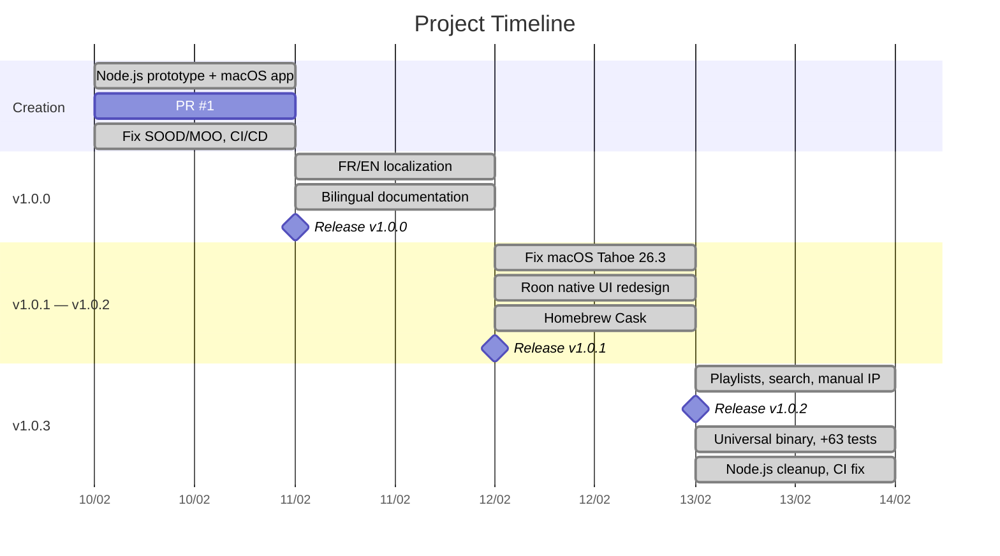

> English | **[Version francaise](PROJECT_JOURNAL.md)**

# Project Journal

Adapted from the PRINCE2 "Daily Log". Entries by date, most recent first.

---

## 2026-02-13 (session 2 — planning)

### Activities

- Created lightweight PRINCE2 documentation: changelog, journal, issue register, lessons learned (`e3404d4`)
- Project management index with PRINCE2 methodology explanation
- Mermaid diagrams in all documents (timeline, gantt, pie, mindmap, flowchart, xychart)
- Planned v1.1.0 roadmap: 3 workstreams, 16 tasks

### Decisions

- Adopt lightweight PRINCE2 methodology with 4 artifacts (instead of the official 26)
- Structure v1.1.0 into 3 workstreams: Roon UI, Core Settings, Radio Favorites
- Prioritize artist/album pages (UI-01) and Browse API favorites playback (FAV-02) as high-priority tasks

### Issues

- No new issues

---

## 2026-02-13 (session 1)

### Activities

- Added playlist detail view with hero header and track table (`581100b`, `ed8b75a`)
- Search in browsing and manual Core IP connection (`07a245e`, `2a264d1`)
- Released v1.0.2: playlists, UI redesign, Homebrew Cask (`68aff5b`, `167713b`)
- Built universal binary arm64 + x86_64 (`186a625`)
- Extended cover art cache to all screens (`a7f34ac`)
- Added 63 unit tests (203 total) (`c37e604`, `a96672e`)
- Bumped v1.0.3: fix WebSocket timeout, reconnection (`0420e5b`)
- Removed legacy Node.js backend (`4294d49`)
- Fixed CI Claude Code workflow: id-token permissions, timeout (`d1b75a5`)

### Decisions

- Switch to universal binary to support both Intel and Apple Silicon Macs
- Completely remove Node.js code (everything is native Swift now)
- Extend image cache to all screens to prevent missing cover art

### Issues

- ISS-013: WebSocket 15s resource timeout on reconnections — resolved (`45a3436`)
- ISS-014: Red/green flash during reconnection — resolved (`0420e5b`)
- ISS-015: Cover art image_key null in history/favorites — resolved (`a7f34ac`)
- ISS-016: CI Claude Code workflow id-token permissions — resolved (`d1b75a5`)

---

## 2026-02-12

### Activities

- Fixed macOS Tahoe 26.3 compatibility: ATS, WebSocket handshake (`a37d78f`)
- Fixed seek bar not resetting on track change (`033ba0b`)
- Released v1.0.1 (`1c686a1`)
- Complete UI redesign matching Roon native style: home, sidebar, now playing, queue, history, favorites (`ee2d5e6`, `24f569f`, `71cc27c`, `78b8588`, `520deb3`)
- Added Homebrew Cask tap with auto-update workflow (`b875642`)
- Localized hardcoded UI strings (`8a83d7b`)
- Added "Recently Added" tab (`40fb216`)
- Home search, click-to-play, scroll arrows (`2a264d1`)
- Updated documentation with Mermaid diagrams (`08875a6`, `1978825`)

### Decisions

- Redesign UI to match Roon native style (grid, typography, colors)
- Move zone selector to transport bar
- Distribute via Homebrew Cask in addition to DMG

### Issues

- ISS-008: macOS Tahoe 26.3 WebSocket connection — resolved (`a37d78f`)
- ISS-009: Seek bar not resetting on track change — resolved (`033ba0b`)
- ISS-011: First connection connect/disconnect loop — resolved (`4e577d6`)

---

## 2026-02-11

### Activities

- Fixed queue subscription: missing zone_or_output_id parameter (`cd6a3dc`)
- Added regression tests for queue subscription body format (`8393fb6`)
- French/English localization via String Catalog (`235fca2`)
- Added English documentation alongside French originals (`6ba8347`)
- Added double-click to play and fixed radio replay from history (`e22394e`)
- Published Melaudia forum post for beta tester recruitment (`6f08111`)
- Updated docs: Mermaid diagrams, localization, prerequisites (`184a860`)
- Released v1.0.0

### Decisions

- Release v1.0.0 with complete bilingual documentation
- Recruit beta testers via the Melaudia forum

### Issues

- ISS-005: Queue missing zone_or_output_id parameter — resolved (`cd6a3dc`)
- ISS-007: Duplicate history entries — resolved (`abb0db4`)

---

## 2026-02-10

### Activities

- Project creation: macOS app + Node.js backend (`f4c59fa`, `ad32137`)
- PR #1: replaced Node.js backend with native Swift Roon protocol implementation (`f2bd0ca`, `88133d9`)
- Fixed SOOD discovery: replaced Network.framework with POSIX sockets (`dfb29d2`)
- Fixed SOOD unicast replies: listen on send socket (`c61c94a`)
- Fixed MOO registration and updated docs (`221393c`)
- Fixed browse navigation: input_prompt decoding, duplicates (`7dfbc43`)
- Fixed history: duplicate entries on app restart (`abb0db4`)
- Added CI/CD with GitHub Actions + Claude Code integration (`ba3b3c9`)
- Added Marp technical presentation (`32de450`)
- Added browse pagination, search, history (`5fc1ea6`, `0abc495`, `5a3a76b`)
- Added unit tests and play-from-history (`9619ad8`)
- Added app icon (`fb411f3`)

### Decisions

- Replace Node.js backend with 100% native Swift implementation
- Use POSIX sockets instead of Network.framework for SOOD (multicast entitlement issues)
- Set up CI/CD from day one

### Issues

- ISS-001: SOOD Network.framework multicast entitlement — resolved (`dfb29d2`)
- ISS-002: SOOD Big Endian encoding — resolved (`dfb29d2`)
- ISS-003: SOOD unicast replies not received — resolved (`c61c94a`)
- ISS-004: MOO hardcoded service names — resolved (`221393c`)
- ISS-006: Browse input_prompt decoding + duplicates — resolved (`7dfbc43`)
- ISS-010: CI Xcode 16.4 build errors — resolved (`a587c83`)
