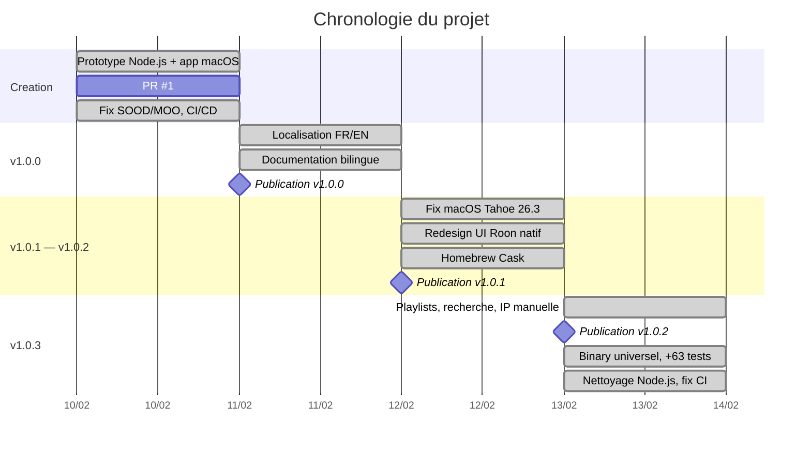

> **[English version](PROJECT_JOURNAL.en.md)** | Francais

# Journal de projet

Adapte du "Daily Log" PRINCE2. Entrees par date, les plus recentes en premier.

---

## 2026-02-13

### Activites

- Ajout de la vue detail playlist avec header hero et tableau de pistes (`581100b`, `ed8b75a`)
- Recherche dans la navigation et connexion manuelle par IP (`07a245e`, `2a264d1`)
- Publication v1.0.2 : playlists, redesign UI, Homebrew Cask (`68aff5b`, `167713b`)
- Build binary universel arm64 + x86_64 (`186a625`)
- Extension du cache pochettes a tous les ecrans (`a7f34ac`)
- Ajout de 63 tests unitaires (203 au total) (`c37e604`, `a96672e`)
- Bump v1.0.3 : fix WebSocket timeout, reconnexion (`0420e5b`)
- Suppression du backend Node.js legacy (`4294d49`)
- Fix workflow CI Claude Code : permissions id-token, timeout (`d1b75a5`)

### Decisions

- Passer au binary universel pour supporter les Mac Intel et Apple Silicon
- Supprimer completement le code Node.js (tout est natif Swift desormais)
- Etendre le cache d'images a tous les ecrans pour eviter les pochettes manquantes

### Problemes

- ISS-013 : WebSocket timeout ressource 15s lors des reconnexions — resolu (`45a3436`)
- ISS-014 : Flash rouge/vert lors de la reconnexion — resolu (`0420e5b`)
- ISS-015 : Pochettes image_key null dans historique/favoris — resolu (`a7f34ac`)
- ISS-016 : CI workflow Claude Code permissions id-token — resolu (`d1b75a5`)

---

## 2026-02-12

### Activites

- Fix compatibilite macOS Tahoe 26.3 : ATS, handshake WebSocket (`a37d78f`)
- Fix seek bar pas remise a zero au changement de piste (`033ba0b`)
- Publication v1.0.1 (`1c686a1`)
- Refonte UI complete style Roon natif : home, sidebar, now playing, queue, historique, favoris (`ee2d5e6`, `24f569f`, `71cc27c`, `78b8588`, `520deb3`)
- Ajout Homebrew Cask tap avec workflow auto-update (`b875642`)
- Localisation des chaines UI hardcodees (`8a83d7b`)
- Ajout onglet "Ajoutes recemment" (`40fb216`)
- Recherche sur l'ecran d'accueil, click-to-play, scroll arrows (`2a264d1`)
- Mise a jour documentation avec diagrammes Mermaid (`08875a6`, `1978825`)

### Decisions

- Redesigner l'UI pour coller au style natif de Roon (grille, typographie, couleurs)
- Deplacer le selecteur de zone dans la barre de transport
- Distribuer via Homebrew Cask en plus du DMG

### Problemes

- ISS-008 : macOS Tahoe 26.3 connexion WebSocket — resolu (`a37d78f`)
- ISS-009 : Seek bar pas reset au changement de piste — resolu (`033ba0b`)
- ISS-011 : Premiere connexion boucle connect/disconnect — resolu (`4e577d6`)

---

## 2026-02-11

### Activites

- Fix queue subscription : parametre zone_or_output_id manquant (`cd6a3dc`)
- Ajout tests de regression pour le format du body queue (`8393fb6`)
- Localisation francais/anglais via String Catalog (`235fca2`)
- Documentation anglaise ajoutee aux originaux francais (`6ba8347`)
- Ajout double-click to play et fix radio replay depuis historique (`e22394e`)
- Publication post Melaudia pour recrutement beta-testeurs (`6f08111`)
- Mise a jour docs : diagrammes Mermaid, localisation, prerequis (`184a860`)
- Publication v1.0.0

### Decisions

- Publier v1.0.0 avec documentation bilingue complete
- Recruter des beta-testeurs via le forum Melaudia

### Problemes

- ISS-005 : Queue parametre zone_or_output_id manquant — resolu (`cd6a3dc`)
- ISS-007 : Historique entrees dupliquees — resolu (`abb0db4`)

---

## 2026-02-10

### Activites

- Creation du projet : app macOS + backend Node.js (`f4c59fa`, `ad32137`)
- PR #1 : remplacement du backend Node.js par implementation native Swift (`f2bd0ca`, `88133d9`)
- Fix SOOD discovery : remplacement Network.framework par sockets POSIX (`dfb29d2`)
- Fix reponses unicast SOOD : ecoute sur le socket d'envoi (`c61c94a`)
- Fix MOO registration et mise a jour docs (`221393c`)
- Fix browse navigation : decodage input_prompt, doublons (`7dfbc43`)
- Fix historique : entrees dupliquees au redemarrage (`abb0db4`)
- Ajout CI/CD GitHub Actions + integration Claude Code (`ba3b3c9`)
- Ajout presentation technique Marp (`32de450`)
- Ajout pagination browse, recherche, historique (`5fc1ea6`, `0abc495`, `5a3a76b`)
- Ajout tests unitaires et play-from-history (`9619ad8`)
- Ajout icone app (`fb411f3`)

### Decisions

- Remplacer le backend Node.js par une implementation 100% native Swift
- Utiliser les sockets POSIX au lieu de Network.framework pour SOOD (problemes d'entitlement multicast)
- Mettre en place CI/CD des le premier jour

### Problemes

- ISS-001 : SOOD Network.framework entitlement multicast — resolu (`dfb29d2`)
- ISS-002 : SOOD encodage Big Endian — resolu (`dfb29d2`)
- ISS-003 : SOOD reponses unicast non recues — resolu (`c61c94a`)
- ISS-004 : MOO noms de services codes en dur — resolu (`221393c`)
- ISS-006 : Browse decodage input_prompt + doublons — resolu (`7dfbc43`)
- ISS-010 : CI erreurs build Xcode 16.4 — resolu (`a587c83`)
