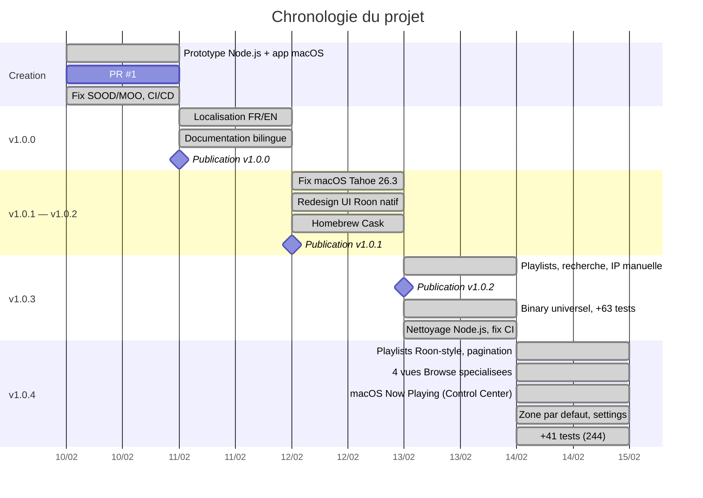

> **[English version](PROJECT_JOURNAL.en.md)** | Francais

# Journal de projet

Adapte du "Daily Log" PRINCE2. Entrees par date, les plus recentes en premier.

---

## 2026-02-14 (session 2)

### Activites

- 4 vues Browse specialisees dans RoonBrowseContentView (`5caaaf8`) :
  - **Genres** : grille adaptive de cartes avec gradient colore deterministe (hash du titre)
  - **TIDAL/streaming** : carousel par sections avec navigation par onglets et cartes icones
  - **Tracks** : tableau de morceaux avec prefetch pochettes (100 images en avance via NSCache)
  - **Composers** : grille circulaire avec initiales et police GrifoM
- Integration macOS Now Playing dans le Control Center (`5caaaf8`) :
  - Infos piste (titre, artiste, album, duree, position)
  - Pochette d'album (fetch async, mise a jour au changement de piste)
  - Controles media : play/pause, next/prev, seek via MPRemoteCommandCenter
- Bouton bascule mode Roon → Player dans la sidebar (`5caaaf8`)
- Modele `StreamingSection` pour structurer les categories des services de streaming
- Propriete `browseCategory` dans RoonService pour identifier la categorie racine
- 26 nouveaux tests unitaires (244 au total) : vues Browse specialisees, detection genres/streaming/tracks/composers, bascule mode

### Decisions

- Rester dans l'architecture existante de `RoonBrowseContentView` avec heuristiques de detection (pas de vues separees)
- Utiliser `nonisolated static func` pour creer `MPMediaItemArtwork` en dehors du contexte `@MainActor`
- Dispatcher les closures `MPRemoteCommandCenter` via `Task { @MainActor in }` pour respecter l'isolation d'acteur

### Problemes

- ISS-024 : Crash au demarrage — closures MPRemoteCommandCenter appelaient des methodes @MainActor depuis une queue interne — resolu (`5caaaf8`)
- ISS-025 : Crash Now Playing — closure MPMediaItemArtwork marquee @MainActor implicitement par le contexte du Task parent — resolu (`5caaaf8`)
- ISS-026 : Vue Tracks detectee a tort comme playlist (header playlist inutile) — resolu (`5caaaf8`)

### Commits

- `5caaaf8` — Fix Roon UI: browse navigation, playlist display, and transport bar improvements

---

## 2026-02-14 (session 1)

### Activites

- Ajout zone de lecture par defaut dans les parametres (Cmd+,), persistee par `display_name` (`5163eb9`)
- Mode d'affichage par defaut passe de Player a Roon UI (`5163eb9`)
- Correction du filtrage des playlists sidebar : filtre local au lieu de recherche globale Browse (`8b0932b`)
- Pagination complete des playlists : chargement de 200+ playlists dans la sidebar et le Browse (`d0c8438`)
- Reglage du nombre de playlists affichees dans la sidebar (5/10/20/50/toutes) (`d0c8438`)
- Vue liste des playlists style Roon avec thumbnails 64px et sous-titres de duree (`d0c8438`)
- Detection playlist corrigee (ne necessite plus `image_key` au niveau list) (`d0c8438`)
- Filtrage des morceaux par `hint == "action_list"` au lieu de sous-titre non vide (`d0c8438`)
- Suppression de "Play Playlist" de la liste de morceaux dans la vue playlist (`d0c8438`)
- Transition de lecture : dimming de l'ancien morceau lors du changement de piste (`d0c8438`)
- 15 nouveaux tests unitaires (218 au total) : zone par defaut, filtrage playlists, mode UI

### Decisions

- Utiliser `display_name` pour la zone par defaut (stable entre les redemarrages du Core, contrairement a `zone_id`)
- Roon UI comme mode par defaut (la majorite des utilisateurs preferent la vue complete)
- Filtrage local des playlists dans la sidebar (plus reactif que la recherche Browse API)
- Limiter l'affichage a 10 playlists par defaut dans la sidebar (configurable)

### Problemes

- ISS-017 : Recherche playlists sidebar effectuait une recherche globale Browse — resolu (`8b0932b`)
- ISS-018 : Seulement 100 playlists chargees (pagination manquante) — resolu (`d0c8438`)
- ISS-019 : Playlists affichees en grille au lieu de liste — resolu (`d0c8438`)
- ISS-020 : Detection playlist echouait sans pochette au niveau list — resolu (`d0c8438`)
- ISS-021 : Compteur de morceaux incorrect (filtre base sur sous-titre) — resolu (`d0c8438`)
- ISS-022 : "Play Playlist" apparaissait dans la liste de morceaux — resolu (`d0c8438`)
- ISS-023 : Flash de l'ancien morceau lors du changement de piste — resolu (`d0c8438`)

### Commits

- `5163eb9` — Add default zone setting and set Roon UI as default mode
- `8b0932b` — Fix sidebar playlist search to filter locally instead of global browse
- `d0c8438` — Improve playlist UI, pagination, and playback transitions

---

## 2026-02-13 (session 2 — planification)

### Activites

- Creation de 10 fichiers de documentation PRINCE2 legere bilingue (FR/EN) (`e3404d4`) :
  - **CHANGELOG** : 4 versions (v1.0.0 a v1.0.3) au format Keep a Changelog
  - **PROJECT_JOURNAL** : 4 jours d'entrees retroactives (10-13 fev.)
  - **ISSUES** : registre consolide de 16 incidents (3 critiques, 6 majeurs, 7 mineurs)
  - **LESSONS_LEARNED** : 19 lecons en 5 themes (protocoles, Swift, macOS, CI/CD, methodologie)
  - **PROJECT_MANAGEMENT** : index methodologique expliquant l'adaptation PRINCE2
- Ajout de diagrammes Mermaid dans tous les documents : timeline, gantt, pie, mindmap, flowchart, xychart
- Mise a jour des tables Documentation dans README.md et README.en.md (6 nouvelles entrees)
- Planification de la roadmap v1.1.0 : 3 chantiers, 16 taches avec priorite et complexite (`fab0b02`)
- Peuplement de la section `[Unreleased]` du changelog

### Decisions

- Adopter une methodologie PRINCE2 legere avec 5 artefacts (au lieu des 26 officiels)
- Structurer la v1.1.0 en 3 chantiers : UI Roon native (6 taches), Settings Core (6 taches), Favoris radio (4 taches)
- Prioriser les pages artiste/album et la lecture Browse API des favoris comme taches haute priorite
- Utiliser GitHub Issues pour le suivi actif et les fichiers markdown pour la consolidation

### Problemes

- Aucun nouveau probleme

### Commits

- `e3404d4` — Add PRINCE2 lightweight project management docs with Mermaid diagrams (10 fichiers, +1286 lignes)
- `fab0b02` — Add v1.1.0 roadmap: 3 workstreams, 16 tasks with Mermaid Gantt (6 fichiers, +262 lignes)

---

## 2026-02-13 (session 1)

### Activites

- Ajout de la vue detail playlist avec header hero et tableau de pistes (`581100b`, `ed8b75a`)
- Recherche dans la navigation et connexion manuelle par IP (`07a245e`, `2a264d1`)
- Publication v1.0.2 : playlists, redesign UI, Homebrew Cask (`68aff5b`, `167713b`)
- Build binary universel arm64 + x86_64 (`186a625`)
- Extension du cache pochettes a tous les ecrans (`a7f34ac`)
- Ajout de 63 tests unitaires (203 au total) (`c37e604`, `a96672e`)
- Bump v1.0.3 : fix WebSocket timeout, reconnexion (`0420e5b`)
- Suppression du backend Node.js legacy (`4294d49`)
- Fix workflow CI Claude Code : permissions id-token, timeout (`d1b75a5`)

### Decisions

- Passer au binary universel pour supporter les Mac Intel et Apple Silicon
- Supprimer completement le code Node.js (tout est natif Swift desormais)
- Etendre le cache d'images a tous les ecrans pour eviter les pochettes manquantes

### Problemes

- ISS-013 : WebSocket timeout ressource 15s lors des reconnexions — resolu (`45a3436`)
- ISS-014 : Flash rouge/vert lors de la reconnexion — resolu (`0420e5b`)
- ISS-015 : Pochettes image_key null dans historique/favoris — resolu (`a7f34ac`)
- ISS-016 : CI workflow Claude Code permissions id-token — resolu (`d1b75a5`)

---

## 2026-02-12

### Activites

- Fix compatibilite macOS Tahoe 26.3 : ATS, handshake WebSocket (`a37d78f`)
- Fix seek bar pas remise a zero au changement de piste (`033ba0b`)
- Publication v1.0.1 (`1c686a1`)
- Refonte UI complete style Roon natif : home, sidebar, now playing, queue, historique, favoris (`ee2d5e6`, `24f569f`, `71cc27c`, `78b8588`, `520deb3`)
- Ajout Homebrew Cask tap avec workflow auto-update (`b875642`)
- Localisation des chaines UI hardcodees (`8a83d7b`)
- Ajout onglet "Ajoutes recemment" (`40fb216`)
- Recherche sur l'ecran d'accueil, click-to-play, scroll arrows (`2a264d1`)
- Mise a jour documentation avec diagrammes Mermaid (`08875a6`, `1978825`)

### Decisions

- Redesigner l'UI pour coller au style natif de Roon (grille, typographie, couleurs)
- Deplacer le selecteur de zone dans la barre de transport
- Distribuer via Homebrew Cask en plus du DMG

### Problemes

- ISS-008 : macOS Tahoe 26.3 connexion WebSocket — resolu (`a37d78f`)
- ISS-009 : Seek bar pas reset au changement de piste — resolu (`033ba0b`)
- ISS-011 : Premiere connexion boucle connect/disconnect — resolu (`4e577d6`)

---

## 2026-02-11

### Activites

- Fix queue subscription : parametre zone_or_output_id manquant (`cd6a3dc`)
- Ajout tests de regression pour le format du body queue (`8393fb6`)
- Localisation francais/anglais via String Catalog (`235fca2`)
- Documentation anglaise ajoutee aux originaux francais (`6ba8347`)
- Ajout double-click to play et fix radio replay depuis historique (`e22394e`)
- Publication post Melaudia pour recrutement beta-testeurs (`6f08111`)
- Mise a jour docs : diagrammes Mermaid, localisation, prerequis (`184a860`)
- Publication v1.0.0

### Decisions

- Publier v1.0.0 avec documentation bilingue complete
- Recruter des beta-testeurs via le forum Melaudia

### Problemes

- ISS-005 : Queue parametre zone_or_output_id manquant — resolu (`cd6a3dc`)
- ISS-007 : Historique entrees dupliquees — resolu (`abb0db4`)

---

## 2026-02-10

### Activites

- Creation du projet : app macOS + backend Node.js (`f4c59fa`, `ad32137`)
- PR #1 : remplacement du backend Node.js par implementation native Swift (`f2bd0ca`, `88133d9`)
- Fix SOOD discovery : remplacement Network.framework par sockets POSIX (`dfb29d2`)
- Fix reponses unicast SOOD : ecoute sur le socket d'envoi (`c61c94a`)
- Fix MOO registration et mise a jour docs (`221393c`)
- Fix browse navigation : decodage input_prompt, doublons (`7dfbc43`)
- Fix historique : entrees dupliquees au redemarrage (`abb0db4`)
- Ajout CI/CD GitHub Actions + integration Claude Code (`ba3b3c9`)
- Ajout presentation technique Marp (`32de450`)
- Ajout pagination browse, recherche, historique (`5fc1ea6`, `0abc495`, `5a3a76b`)
- Ajout tests unitaires et play-from-history (`9619ad8`)
- Ajout icone app (`fb411f3`)

### Decisions

- Remplacer le backend Node.js par une implementation 100% native Swift
- Utiliser les sockets POSIX au lieu de Network.framework pour SOOD (problemes d'entitlement multicast)
- Mettre en place CI/CD des le premier jour

### Problemes

- ISS-001 : SOOD Network.framework entitlement multicast — resolu (`dfb29d2`)
- ISS-002 : SOOD encodage Big Endian — resolu (`dfb29d2`)
- ISS-003 : SOOD reponses unicast non recues — resolu (`c61c94a`)
- ISS-004 : MOO noms de services codes en dur — resolu (`221393c`)
- ISS-006 : Browse decodage input_prompt + doublons — resolu (`7dfbc43`)
- ISS-010 : CI erreurs build Xcode 16.4 — resolu (`a587c83`)
