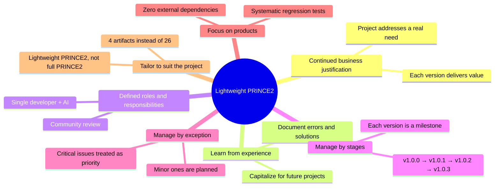
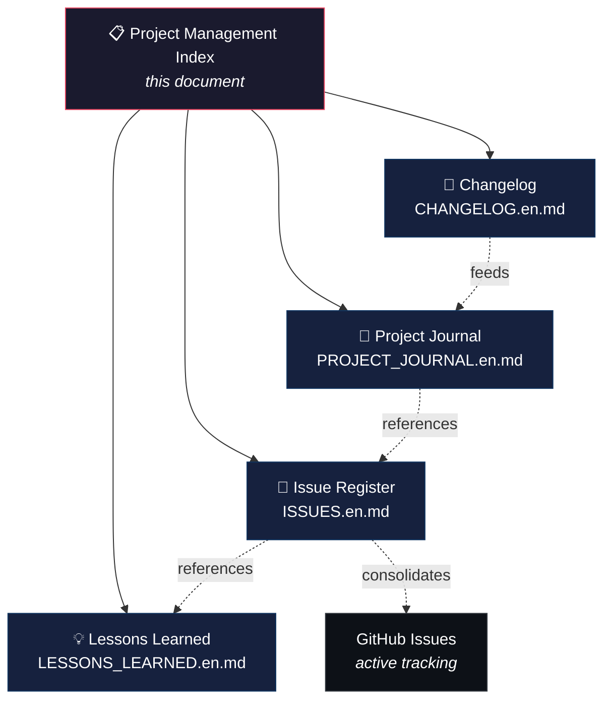
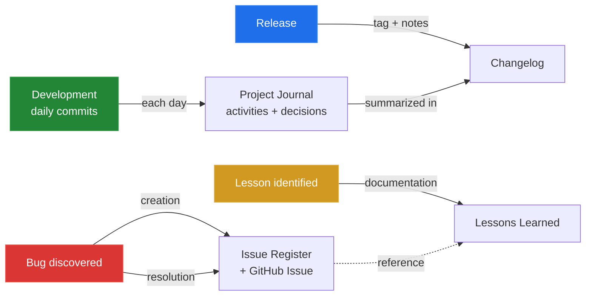
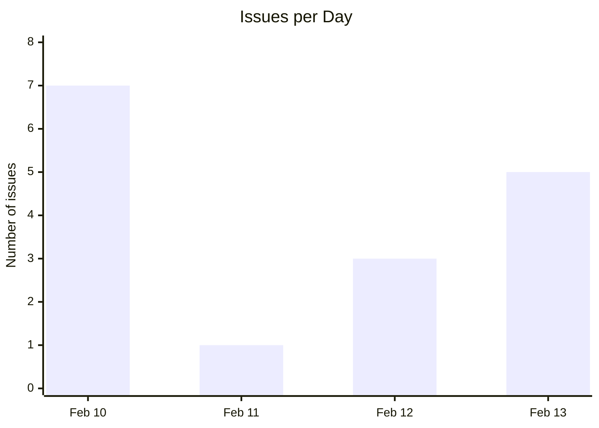
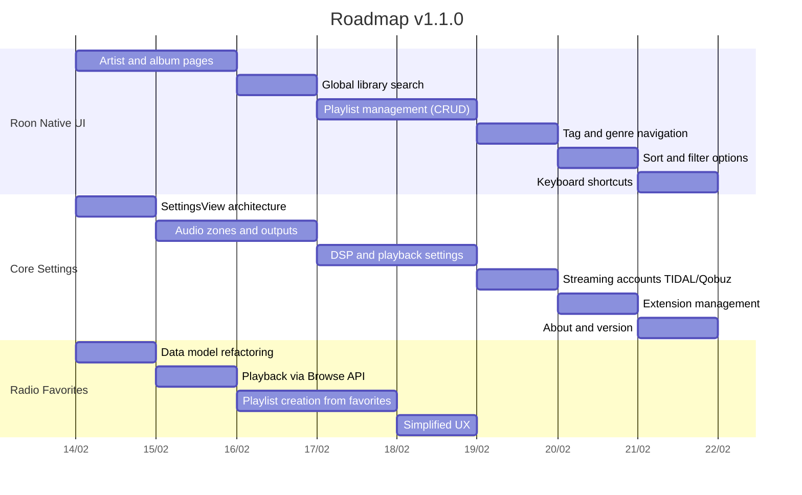
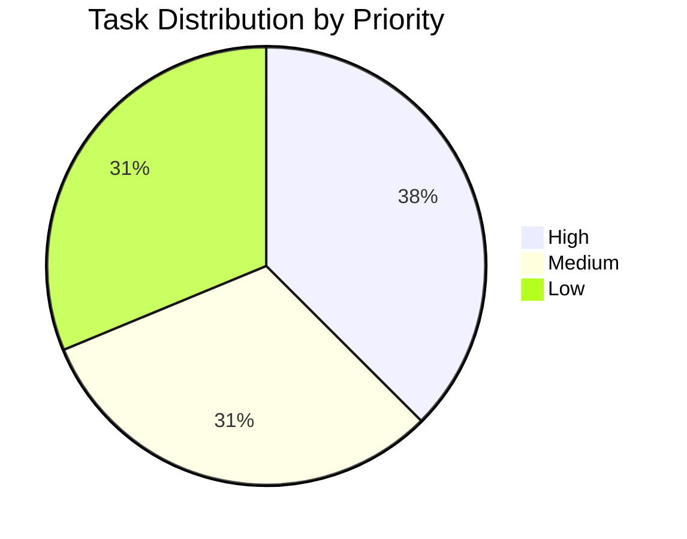

> English | **[Version francaise](PROJECT_MANAGEMENT.md)**

# Project Management — Lightweight PRINCE2 Methodology

This document is the project management documentation index. It explains the PRINCE2 adaptation applied to Roon Controller and provides access to all management artifacts.

## Why PRINCE2?

[PRINCE2](https://www.axelos.com/certifications/promos/prince2-702) (PRojects IN Controlled Environments) is a structured project management framework, widely adopted in Europe. It provides processes, themes, and documentary artifacts suitable for projects of any size.

For a personal project like Roon Controller, a **full** PRINCE2 implementation would be disproportionate. We therefore apply a **lightweight adaptation**: we keep the most useful documentation artifacts, without the formal governance (steering committee, dedicated project manager, budget tolerance, etc.).

## PRINCE2 Principles Retained

| PRINCE2 Principle | Application in This Project |
|---|---|
| **Continued business justification** | Each version delivers concrete user value (critical fix, new feature, UX improvement) |
| **Learn from experience** | Register of 19 lessons learned, organized by theme, populated retroactively then continuously |
| **Defined roles and responsibilities** | Single developer + AI assistant (Claude). Review by community beta testers |
| **Manage by stages** | Each version (v1.0.x) constitutes a management stage with its objectives and deliverables |
| **Manage by exception** | Critical issues (ISS-001, ISS-008, ISS-013) are addressed immediately; minor ones are planned |
| **Focus on products** | User-oriented specifications, regression tests (203), native Roon theme |
| **Tailor to suit the project** | 4 documentary artifacts instead of PRINCE2's full 26; no formal steering committee |

## Management Artifacts

### PRINCE2 → Project Mapping

| Official PRINCE2 Artifact | Local Adaptation | File | Description |
|---|---|---|---|
| Product Status Account | **Changelog** | [CHANGELOG.en.md](CHANGELOG.en.md) | Structured history of changes per version (Keep a Changelog format) |
| Daily Log | **Project Journal** | [PROJECT_JOURNAL.en.md](PROJECT_JOURNAL.en.md) | Daily entries: activities, decisions, issues encountered |
| Issue Register | **Issue Register** | [ISSUES.en.md](ISSUES.en.md) | Table of 16 issues with severity, status, resolution, and cross-references |
| Lessons Log | **Lessons Learned** | [LESSONS_LEARNED.en.md](LESSONS_LEARNED.en.md) | 19 lessons in 5 themes: protocols, Swift, macOS, CI/CD, methodology |

> All documents are available in French (`.md`) and English (`.en.md`).

### PRINCE2 Artifacts Not Retained

The following artifacts are not suited to a personal project of this size:

| Artifact | Reason for Exclusion |
|---|---|
| Business Case | Personal project, no formal economic justification |
| Project Initiation Document (PID) | README and ARCHITECTURE.md cover this need |
| Communication Management Strategy | Single developer + community forum |
| Risk Register | Covered by the issue register (risks are potential issues) |
| Work Packages | Each commit/PR is an implicit work package |
| Highlight Reports | The project journal replaces progress reports |
| End Stage Reports | The changelog per version serves this role |
| End Project Report | To be created at project end if needed |

## Tracking Workflow

1. **Daily**: each work session is recorded in the project journal (activities, decisions, issues)
2. **Incident**: every bug or blocker is logged in the issue register with severity and resolution, and created as a GitHub Issue for active tracking
3. **Lesson**: every significant discovery (technical, methodological, organizational) feeds the lessons learned register
4. **Release**: the changelog is updated with the version's changes, referencing commits

## Project Metrics

| Metric | Value |
|---|---|
| Project duration | 4 days (Feb 10-13, 2026) |
| Versions released | 4 (v1.0.0 to v1.0.3) |
| Issues recorded | 16 (3 critical, 6 major, 7 minor) |
| Issues resolved | 16/16 (100%) |
| Lessons documented | 19 in 5 themes |
| Unit tests | 203 |
| External dependencies | 0 |

## Roadmap — v1.1.0

The next major version (v1.1.0) covers 3 workstreams. Each is broken down into concrete tasks with priority and complexity.

### Workstream 1 — Finish Roon.app UI Reproduction

The app already reproduces the core Roon UI (home, now playing, queue, history, playlists, browse). What remains are secondary screens and advanced interactions.

| ID | Task | Priority | Complexity | Description |
|---|---|---|---|---|
| UI-01 | Artist and album pages | High | Medium | Artist detail view with discography, bio, albums. Album detail view with track list and hero header |
| UI-02 | Global search | High | Medium | Unified search across the entire library (artists, albums, tracks, composers) via Browse API |
| UI-03 | Playlist management | Medium | High | Create, rename, delete playlists. Add/remove tracks. Drag-and-drop reordering |
| UI-04 | Tag/genre navigation | Low | Low | Browse library by tags and genres from the sidebar |
| UI-05 | Sort and filters | Low | Low | Sort options (date, name, artist) and filters in grid/list views |
| UI-06 | Keyboard shortcuts | Low | Low | Space (play/pause), arrows (prev/next), Cmd+F (search), Cmd+L (queue) |

### Workstream 2 — Core Settings UI

The current Settings screen only offers connection (auto/manual) and theme selection. The goal is to expose Core settings via the Roon API.

| ID | Task | Priority | Complexity | Description |
|---|---|---|---|---|
| SET-01 | SettingsView architecture | High | Low | Refactor SettingsView into tabs: Connection, Zones, Playback, Streaming, Extensions, About |
| SET-02 | Audio zones and outputs | High | High | List zones, show outputs (endpoints), group/ungroup, configure volume (fixed/variable) |
| SET-03 | DSP and playback settings | Medium | High | Show DSP chain per zone (EQ, room correction, upsampling). Enable/disable modules |
| SET-04 | Streaming accounts | Medium | Medium | Show TIDAL/Qobuz account status linked to Core. Link to configuration (redirects to Core) |
| SET-05 | Extension management | Low | Medium | List installed extensions, enable/disable, show permissions |
| SET-06 | About and version | Low | Low | App version, Core version, system info, documentation link |

### Workstream 3 — Improve Radio Favorites

The current system is functional but limited: radio-only favorites, local storage, text-search playback. The goal is to simplify and make it more reliable.

| ID | Task | Priority | Complexity | Description |
|---|---|---|---|---|
| FAV-01 | Model refactoring | High | Medium | Simplify `RadioFavorite`: store Browse hierarchy for reliable replay, separate station and track |
| FAV-02 | Playback via Browse API | High | Medium | Replace text search with Browse API `internet_radio` hierarchy navigation |
| FAV-03 | Playlist creation | Medium | High | Create a Roon playlist from radio favorites (if Browse API supports it for extensions) |
| FAV-04 | Simplified UX | Medium | Low | Swipe-to-delete, sort by station/date/artist, filter by station, visual duplicate indicator |

### Summary

| Workstream | Tasks | High | Medium | Low |
|---|---|---|---|---|
| Roon Native UI | 6 | 2 | 1 | 3 |
| Core Settings | 6 | 2 | 2 | 2 |
| Radio Favorites | 4 | 2 | 2 | 0 |
| **Total** | **16** | **6** | **5** | **5** |

## Documentation Conventions

- **Language**: each document exists in French (`.md`) and English (`.en.md`)
- **Accents**: no accents in French `.md` files (ASCII compatibility)
- **Bilingual header**: link to the other version at the top of each file
- **Cross-references**: issues reference lessons (`Ref.` → `L-xxx`) and vice versa
- **Commits**: referenced by short hash (7 characters)
- **Format**: GitHub-Flavored Markdown with Mermaid diagrams
- **Active tracking**: GitHub Issues for real-time tracking, markdown files for consolidation
