> English | **[Version francaise](PROJECT_MANAGEMENT.md)**

# Project Management — Lightweight PRINCE2 Methodology

This document is the project management documentation index. It explains the PRINCE2 adaptation applied to Roon Controller and provides access to all management artifacts.

## Why PRINCE2?

[PRINCE2](https://www.axelos.com/certifications/promos/prince2-702) (PRojects IN Controlled Environments) is a structured project management framework, widely adopted in Europe. It provides processes, themes, and documentary artifacts suitable for projects of any size.

For a personal project like Roon Controller, a **full** PRINCE2 implementation would be disproportionate. We therefore apply a **lightweight adaptation**: we keep the most useful documentation artifacts, without the formal governance (steering committee, dedicated project manager, budget tolerance, etc.).

## PRINCE2 Principles Retained

| PRINCE2 Principle | Application in This Project |
|---|---|
| **Continued business justification** | Each version delivers concrete user value (critical fix, new feature, UX improvement) |
| **Learn from experience** | Register of 19 lessons learned, organized by theme, populated retroactively then continuously |
| **Defined roles and responsibilities** | Single developer + AI assistant (Claude). Review by community beta testers |
| **Manage by stages** | Each version (v1.0.x) constitutes a management stage with its objectives and deliverables |
| **Manage by exception** | Critical issues (ISS-001, ISS-008, ISS-013) are addressed immediately; minor ones are planned |
| **Focus on products** | User-oriented specifications, regression tests (203), native Roon theme |
| **Tailor to suit the project** | 4 documentary artifacts instead of PRINCE2's full 26; no formal steering committee |

## Management Artifacts

```mermaid
graph TB
    PM["📋 Project Management Index<br/><i>this document</i>"]

    CL["📝 Changelog<br/>CHANGELOG.en.md"]
    PJ["📅 Project Journal<br/>PROJECT_JOURNAL.en.md"]
    IR["🔴 Issue Register<br/>ISSUES.en.md"]
    LL["💡 Lessons Learned<br/>LESSONS_LEARNED.en.md"]

    PM --> CL
    PM --> PJ
    PM --> IR
    PM --> LL

    IR -.->|"references"| LL
    PJ -.->|"references"| IR
    CL -.->|"feeds"| PJ

    GH["GitHub Issues<br/><i>active tracking</i>"]
    IR -.->|"consolidates"| GH

    style PM fill:#1a1a2e,stroke:#e94560,color:#fff
    style CL fill:#16213e,stroke:#0f3460,color:#fff
    style PJ fill:#16213e,stroke:#0f3460,color:#fff
    style IR fill:#16213e,stroke:#0f3460,color:#fff
    style LL fill:#16213e,stroke:#0f3460,color:#fff
    style GH fill:#0d1117,stroke:#30363d,color:#fff
```

### PRINCE2 → Project Mapping

| Official PRINCE2 Artifact | Local Adaptation | File | Description |
|---|---|---|---|
| Product Status Account | **Changelog** | [CHANGELOG.en.md](CHANGELOG.en.md) | Structured history of changes per version (Keep a Changelog format) |
| Daily Log | **Project Journal** | [PROJECT_JOURNAL.en.md](PROJECT_JOURNAL.en.md) | Daily entries: activities, decisions, issues encountered |
| Issue Register | **Issue Register** | [ISSUES.en.md](ISSUES.en.md) | Table of 16 issues with severity, status, resolution, and cross-references |
| Lessons Log | **Lessons Learned** | [LESSONS_LEARNED.en.md](LESSONS_LEARNED.en.md) | 19 lessons in 5 themes: protocols, Swift, macOS, CI/CD, methodology |

> All documents are available in French (`.md`) and English (`.en.md`).

### PRINCE2 Artifacts Not Retained

The following artifacts are not suited to a personal project of this size:

| Artifact | Reason for Exclusion |
|---|---|
| Business Case | Personal project, no formal economic justification |
| Project Initiation Document (PID) | README and ARCHITECTURE.md cover this need |
| Communication Management Strategy | Single developer + community forum |
| Risk Register | Covered by the issue register (risks are potential issues) |
| Work Packages | Each commit/PR is an implicit work package |
| Highlight Reports | The project journal replaces progress reports |
| End Stage Reports | The changelog per version serves this role |
| End Project Report | To be created at project end if needed |

## Tracking Workflow

1. **Daily**: each work session is recorded in the project journal (activities, decisions, issues)
2. **Incident**: every bug or blocker is logged in the issue register with severity and resolution, and created as a GitHub Issue for active tracking
3. **Lesson**: every significant discovery (technical, methodological, organizational) feeds the lessons learned register
4. **Release**: the changelog is updated with the version's changes, referencing commits

## Project Metrics

| Metric | Value |
|---|---|
| Project duration | 4 days (Feb 10-13, 2026) |
| Versions released | 4 (v1.0.0 to v1.0.3) |
| Issues recorded | 16 (3 critical, 6 major, 7 minor) |
| Issues resolved | 16/16 (100%) |
| Lessons documented | 19 in 5 themes |
| Unit tests | 203 |
| External dependencies | 0 |

## Documentation Conventions

- **Language**: each document exists in French (`.md`) and English (`.en.md`)
- **Accents**: no accents in French `.md` files (ASCII compatibility)
- **Bilingual header**: link to the other version at the top of each file
- **Cross-references**: issues reference lessons (`Ref.` → `L-xxx`) and vice versa
- **Commits**: referenced by short hash (7 characters)
- **Format**: GitHub-Flavored Markdown with Mermaid diagrams
- **Active tracking**: GitHub Issues for real-time tracking, markdown files for consolidation
