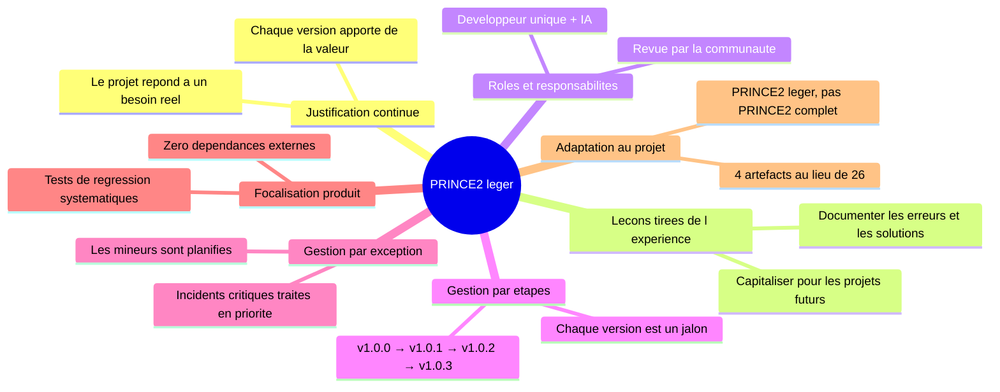
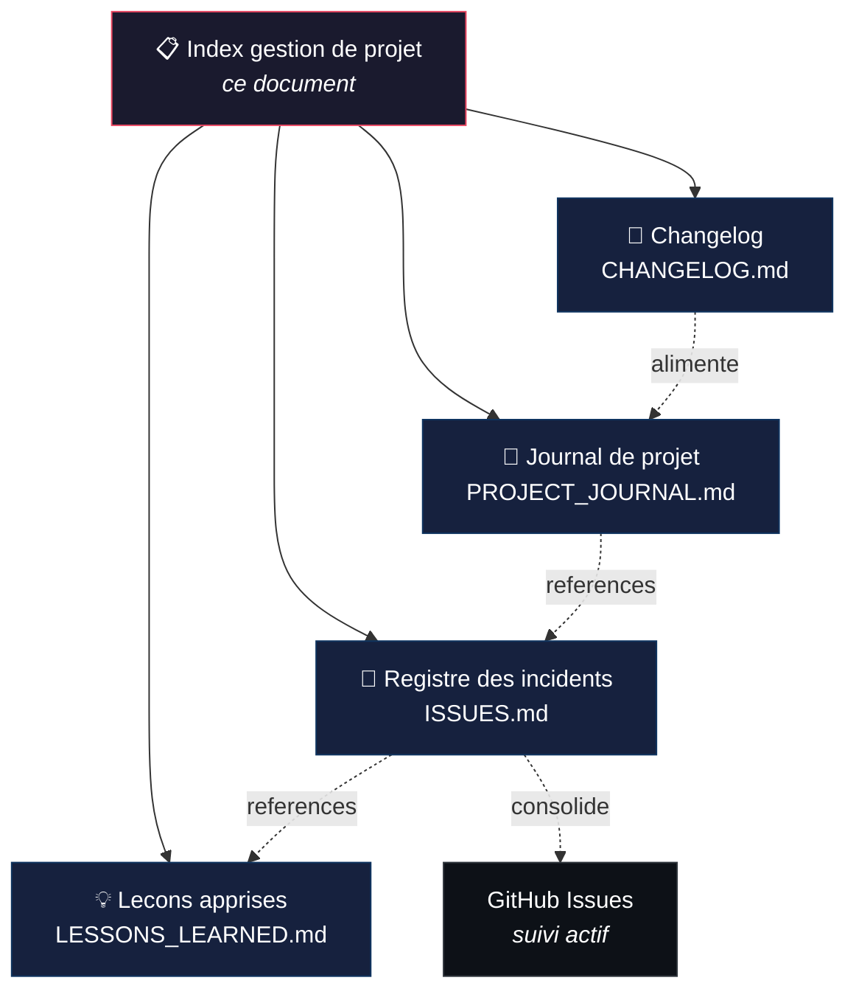
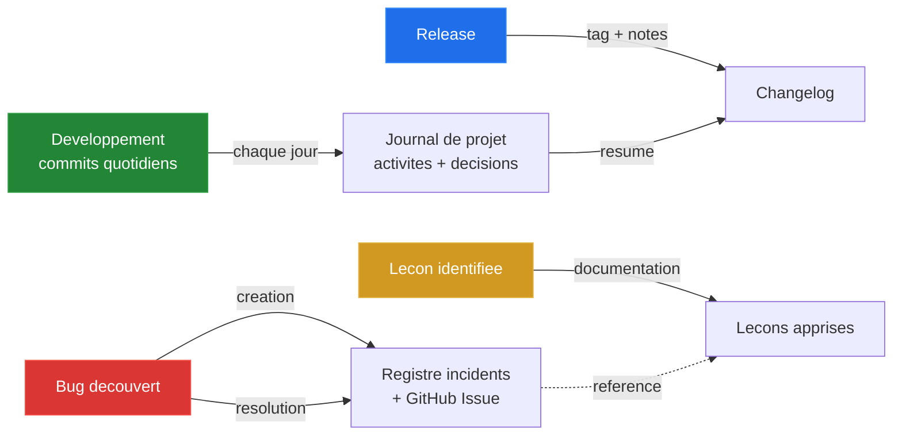
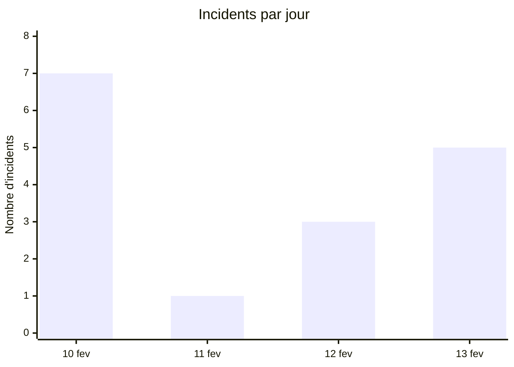

> **[English version](PROJECT_MANAGEMENT.en.md)** | Francais

# Gestion de projet — Methodologie PRINCE2 legere

Ce document est l'index de la documentation de suivi de projet. Il explique l'adaptation de PRINCE2 appliquee a Roon Controller et donne acces a tous les artefacts de gestion.

## Pourquoi PRINCE2 ?

[PRINCE2](https://www.axelos.com/certifications/promos/prince2-702) (PRojects IN Controlled Environments) est un referentiel de gestion de projet structure, largement adopte en Europe. Il propose des processus, des themes et des artefacts documentaires adaptes a toute taille de projet.

Pour un projet personnel comme Roon Controller, une application **integrale** de PRINCE2 serait disproportionnee. On applique donc une **adaptation legere** : on conserve les artefacts de documentation les plus utiles, sans la gouvernance formelle (comite de pilotage, chef de projet dedie, tolerance budgetaire, etc.).

## Principes PRINCE2 retenus

| Principe PRINCE2 | Application dans ce projet |
|---|---|
| **Justification continue** | Chaque version apporte une valeur d'usage concrete (fix critique, nouvelle fonctionnalite, amelioration UX) |
| **Lecons tirees de l'experience** | Registre de 19 lecons apprises, organise par theme, alimente retroactivement puis en continu |
| **Roles et responsabilites definis** | Developpeur unique + assistant IA (Claude). Revue par beta-testeurs communautaires |
| **Gestion par etapes** | Chaque version (v1.0.x) constitue une etape de gestion avec ses objectifs et livrables |
| **Gestion par exception** | Les incidents critiques (ISS-001, ISS-008, ISS-013) sont traites immediatement ; les mineurs sont planifies |
| **Focalisation produit** | Specifications orientees utilisateur, tests de regression (203), theme Roon natif |
| **Adaptation au contexte** | 4 artefacts documentaires au lieu des 26 de PRINCE2 complet ; pas de comite de pilotage formel |

## Artefacts de gestion

### Correspondance PRINCE2 → projet

| Artefact PRINCE2 officiel | Adaptation locale | Fichier | Description |
|---|---|---|---|
| Product Status Account | **Changelog** | [CHANGELOG.md](CHANGELOG.md) | Historique structure des changements par version (format Keep a Changelog) |
| Daily Log | **Journal de projet** | [PROJECT_JOURNAL.md](PROJECT_JOURNAL.md) | Entrees quotidiennes : activites, decisions, problemes rencontres |
| Issue Register | **Registre des incidents** | [ISSUES.md](ISSUES.md) | Tableau des 16 incidents avec severite, statut, resolution et references croisees |
| Lessons Log | **Lecons apprises** | [LESSONS_LEARNED.md](LESSONS_LEARNED.md) | 19 lecons en 5 themes : protocoles, Swift, macOS, CI/CD, methodologie |

> Tous les documents existent en version francaise (`.md`) et anglaise (`.en.md`).

### Artefacts PRINCE2 non retenus

Les artefacts suivants ne sont pas adaptes a un projet personnel de cette taille :

| Artefact | Raison de l'exclusion |
|---|---|
| Business Case | Projet personnel, pas de justification economique formelle |
| Project Initiation Document (PID) | Le README et ARCHITECTURE.md couvrent ce besoin |
| Communication Management Strategy | Un seul developpeur + forum communautaire |
| Risk Register | Couvert par le registre des incidents (les risques sont des incidents potentiels) |
| Work Packages | Chaque commit/PR est un work package implicite |
| Highlight Reports | Le journal de projet remplace les rapports d'avancement |
| End Stage Reports | Le changelog par version joue ce role |
| End Project Report | A creer en fin de projet si necessaire |

## Workflow de suivi

1. **Quotidien** : chaque session de travail est consignee dans le journal de projet (activites, decisions, problemes)
2. **Incident** : tout bug ou blocage est enregistre dans le registre des incidents avec severite et resolution, et cree comme GitHub Issue pour le suivi actif
3. **Lecon** : chaque decouverte significative (technique, methodologique, organisationnelle) alimente le registre des lecons apprises
4. **Release** : le changelog est mis a jour avec les changements de la version, en referençant les commits

## Metriques du projet

| Metrique | Valeur |
|---|---|
| Duree du projet | 4 jours (10-13 fev. 2026) |
| Versions publiees | 4 (v1.0.0 a v1.0.3) |
| Incidents enregistres | 16 (3 critiques, 6 majeurs, 7 mineurs) |
| Incidents resolus | 16/16 (100%) |
| Lecons documentees | 19 en 5 themes |
| Tests unitaires | 203 |
| Dependances externes | 0 |

## Conventions documentaires

- **Langue** : chaque document existe en francais (`.md`) et anglais (`.en.md`)
- **Accents** : pas d'accents dans les fichiers `.md` francais (compatibilite ASCII)
- **Header bilingue** : lien vers l'autre version en haut de chaque fichier
- **References croisees** : les incidents referencent les lecons (`Ref.` → `L-xxx`) et inversement
- **Commits** : references par hash court (7 caracteres)
- **Format** : GitHub-Flavored Markdown avec diagrammes Mermaid
- **Suivi actif** : GitHub Issues pour le suivi en temps reel, fichiers markdown pour la consolidation
