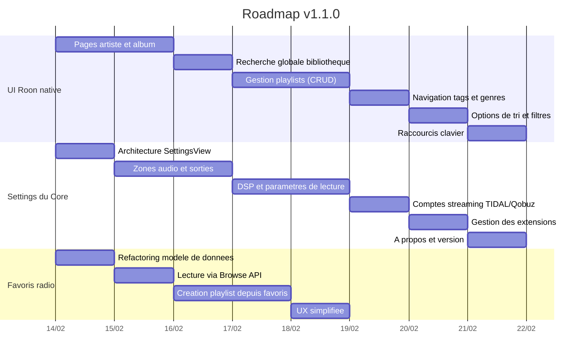
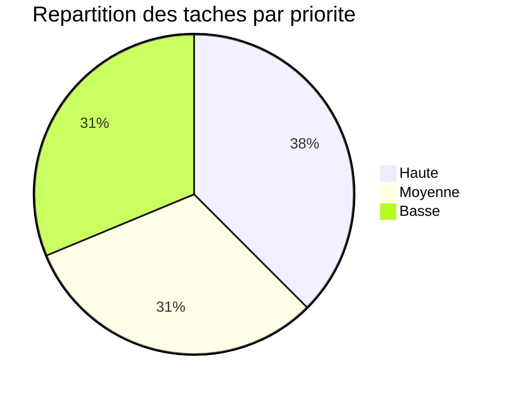

> **[English version](PROJECT_MANAGEMENT.en.md)** | Francais

# Gestion de projet — Methodologie PRINCE2 legere

Ce document est l'index de la documentation de suivi de projet. Il explique l'adaptation de PRINCE2 appliquee a Roon Controller et donne acces a tous les artefacts de gestion.

## Pourquoi PRINCE2 ?

[PRINCE2](https://www.axelos.com/certifications/promos/prince2-702) (PRojects IN Controlled Environments) est un referentiel de gestion de projet structure, largement adopte en Europe. Il propose des processus, des themes et des artefacts documentaires adaptes a toute taille de projet.

Pour un projet personnel comme Roon Controller, une application **integrale** de PRINCE2 serait disproportionnee. On applique donc une **adaptation legere** : on conserve les artefacts de documentation les plus utiles, sans la gouvernance formelle (comite de pilotage, chef de projet dedie, tolerance budgetaire, etc.).

## Principes PRINCE2 retenus

| Principe PRINCE2 | Application dans ce projet |
|---|---|
| **Justification continue** | Chaque version apporte une valeur d'usage concrete (fix critique, nouvelle fonctionnalite, amelioration UX) |
| **Lecons tirees de l'experience** | Registre de 19 lecons apprises, organise par theme, alimente retroactivement puis en continu |
| **Roles et responsabilites definis** | Developpeur unique + assistant IA (Claude). Revue par beta-testeurs communautaires |
| **Gestion par etapes** | Chaque version (v1.0.x) constitue une etape de gestion avec ses objectifs et livrables |
| **Gestion par exception** | Les incidents critiques (ISS-001, ISS-008, ISS-013) sont traites immediatement ; les mineurs sont planifies |
| **Focalisation produit** | Specifications orientees utilisateur, tests de regression (203), theme Roon natif |
| **Adaptation au contexte** | 4 artefacts documentaires au lieu des 26 de PRINCE2 complet ; pas de comite de pilotage formel |

## Artefacts de gestion

```mermaid
graph TB
    PM["📋 Index gestion de projet<br/><i>ce document</i>"]

    CL["📝 Changelog<br/>CHANGELOG.md"]
    PJ["📅 Journal de projet<br/>PROJECT_JOURNAL.md"]
    IR["🔴 Registre des incidents<br/>ISSUES.md"]
    LL["💡 Lecons apprises<br/>LESSONS_LEARNED.md"]

    PM --> CL
    PM --> PJ
    PM --> IR
    PM --> LL

    IR -.->|"references"| LL
    PJ -.->|"references"| IR
    CL -.->|"alimente"| PJ

    GH["GitHub Issues<br/><i>suivi actif</i>"]
    IR -.->|"consolide"| GH

    style PM fill:#1a1a2e,stroke:#e94560,color:#fff
    style CL fill:#16213e,stroke:#0f3460,color:#fff
    style PJ fill:#16213e,stroke:#0f3460,color:#fff
    style IR fill:#16213e,stroke:#0f3460,color:#fff
    style LL fill:#16213e,stroke:#0f3460,color:#fff
    style GH fill:#0d1117,stroke:#30363d,color:#fff
```

### Correspondance PRINCE2 → projet

| Artefact PRINCE2 officiel | Adaptation locale | Fichier | Description |
|---|---|---|---|
| Product Status Account | **Changelog** | [CHANGELOG.md](CHANGELOG.md) | Historique structure des changements par version (format Keep a Changelog) |
| Daily Log | **Journal de projet** | [PROJECT_JOURNAL.md](PROJECT_JOURNAL.md) | Entrees quotidiennes : activites, decisions, problemes rencontres |
| Issue Register | **Registre des incidents** | [ISSUES.md](ISSUES.md) | Tableau des 16 incidents avec severite, statut, resolution et references croisees |
| Lessons Log | **Lecons apprises** | [LESSONS_LEARNED.md](LESSONS_LEARNED.md) | 19 lecons en 5 themes : protocoles, Swift, macOS, CI/CD, methodologie |

> Tous les documents existent en version francaise (`.md`) et anglaise (`.en.md`).

### Artefacts PRINCE2 non retenus

Les artefacts suivants ne sont pas adaptes a un projet personnel de cette taille :

| Artefact | Raison de l'exclusion |
|---|---|
| Business Case | Projet personnel, pas de justification economique formelle |
| Project Initiation Document (PID) | Le README et ARCHITECTURE.md couvrent ce besoin |
| Communication Management Strategy | Un seul developpeur + forum communautaire |
| Risk Register | Couvert par le registre des incidents (les risques sont des incidents potentiels) |
| Work Packages | Chaque commit/PR est un work package implicite |
| Highlight Reports | Le journal de projet remplace les rapports d'avancement |
| End Stage Reports | Le changelog par version joue ce role |
| End Project Report | A creer en fin de projet si necessaire |

## Workflow de suivi

1. **Quotidien** : chaque session de travail est consignee dans le journal de projet (activites, decisions, problemes)
2. **Incident** : tout bug ou blocage est enregistre dans le registre des incidents avec severite et resolution, et cree comme GitHub Issue pour le suivi actif
3. **Lecon** : chaque decouverte significative (technique, methodologique, organisationnelle) alimente le registre des lecons apprises
4. **Release** : le changelog est mis a jour avec les changements de la version, en referençant les commits

## Metriques du projet

| Metrique | Valeur |
|---|---|
| Duree du projet | 4 jours (10-13 fev. 2026) |
| Versions publiees | 4 (v1.0.0 a v1.0.3) |
| Incidents enregistres | 16 (3 critiques, 6 majeurs, 7 mineurs) |
| Incidents resolus | 16/16 (100%) |
| Lecons documentees | 19 en 5 themes |
| Tests unitaires | 203 |
| Dependances externes | 0 |

## Roadmap — v1.1.0

La prochaine version majeure (v1.1.0) couvre 3 chantiers. Chaque chantier est decompose en taches concretes avec priorite et complexite.

### Chantier 1 — Finir la reproduction de l'UI Roon.app

L'app reproduit deja l'essentiel de l'UI Roon (home, now playing, queue, historique, playlists, browse). Il reste les ecrans secondaires et les interactions avancees.

| ID | Tache | Priorite | Complexite | Description |
|---|---|---|---|---|
| UI-01 | Pages artiste et album | Haute | Moyenne | Vue detail artiste avec discographie, bio, albums. Vue detail album avec liste de pistes et header hero |
| UI-02 | Recherche globale | Haute | Moyenne | Recherche unifiee dans toute la bibliotheque (artistes, albums, pistes, compositeurs) via Browse API |
| UI-03 | Gestion playlists | Moyenne | Haute | Creer, renommer, supprimer des playlists. Ajouter/retirer des pistes. Reordonner par drag-and-drop |
| UI-04 | Navigation tags/genres | Basse | Faible | Parcourir la bibliotheque par tags et genres depuis la sidebar |
| UI-05 | Tri et filtres | Basse | Faible | Options de tri (date, nom, artiste) et filtres dans les vues grille/liste |
| UI-06 | Raccourcis clavier | Basse | Faible | Espace (play/pause), fleches (prev/next), Cmd+F (recherche), Cmd+L (queue) |

### Chantier 2 — UI des settings du Core

L'ecran Settings actuel ne propose que la connexion (auto/manuelle) et le choix du theme. L'objectif est d'exposer les parametres du Core via l'API Roon.

| ID | Tache | Priorite | Complexite | Description |
|---|---|---|---|---|
| SET-01 | Architecture SettingsView | Haute | Faible | Refactorer SettingsView en onglets : Connexion, Zones, Lecture, Streaming, Extensions, A propos |
| SET-02 | Zones audio et sorties | Haute | Haute | Lister les zones, afficher les sorties (endpoints), grouper/degrouper, configurer le volume (fixe/variable) |
| SET-03 | DSP et parametres lecture | Moyenne | Haute | Afficher la chaine DSP par zone (EQ, room correction, upsampling). Activer/desactiver les modules |
| SET-04 | Comptes streaming | Moyenne | Moyenne | Afficher l'etat des comptes TIDAL/Qobuz lies au Core. Lien vers la configuration (redirige sur le Core) |
| SET-05 | Gestion extensions | Basse | Moyenne | Lister les extensions installees, activer/desactiver, afficher les permissions |
| SET-06 | A propos et version | Basse | Faible | Version de l'app, version du Core, infos systeme, lien documentation |

### Chantier 3 — Ameliorer les favoris radio

Le systeme actuel est fonctionnel mais limite : favoris radio uniquement, stockage local, lecture par recherche textuelle. L'objectif est de simplifier et fiabiliser.

| ID | Tache | Priorite | Complexite | Description |
|---|---|---|---|---|
| FAV-01 | Refactoring modele | Haute | Moyenne | Simplifier `RadioFavorite` : stocker la hierarchie Browse pour un replay fiable, separer station et morceau |
| FAV-02 | Lecture via Browse API | Haute | Moyenne | Remplacer la recherche textuelle par navigation dans la hierarchie `internet_radio` du Browse API |
| FAV-03 | Creation playlist | Moyenne | Haute | Creer une playlist Roon depuis les favoris radio (si le Browse API le supporte pour les extensions) |
| FAV-04 | UX simplifiee | Moyenne | Faible | Swipe-to-delete, tri par station/date/artiste, filtre par station, indicateur visuel de doublons |

### Synthese

| Chantier | Taches | Haute | Moyenne | Basse |
|---|---|---|---|---|
| UI Roon native | 6 | 2 | 1 | 3 |
| Settings Core | 6 | 2 | 2 | 2 |
| Favoris radio | 4 | 2 | 2 | 0 |
| **Total** | **16** | **6** | **5** | **5** |

## Conventions documentaires

- **Langue** : chaque document existe en francais (`.md`) et anglais (`.en.md`)
- **Accents** : pas d'accents dans les fichiers `.md` francais (compatibilite ASCII)
- **Header bilingue** : lien vers l'autre version en haut de chaque fichier
- **References croisees** : les incidents referencent les lecons (`Ref.` → `L-xxx`) et inversement
- **Commits** : references par hash court (7 caracteres)
- **Format** : GitHub-Flavored Markdown avec diagrammes Mermaid
- **Suivi actif** : GitHub Issues pour le suivi en temps reel, fichiers markdown pour la consolidation
